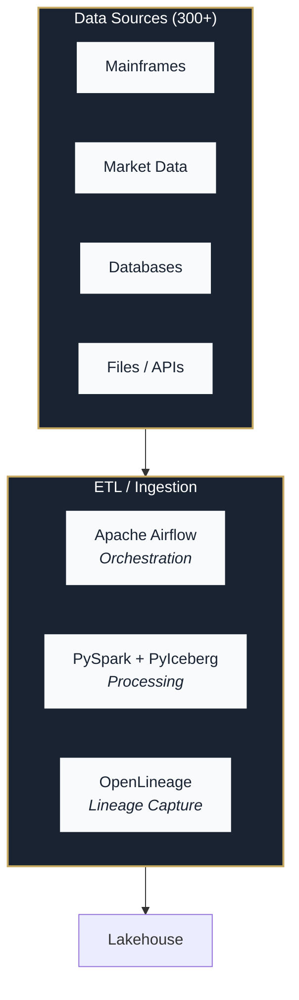

# Phase 6: Architecture Visualizations - Research

**Researched:** 2026-03-21
**Domain:** Mermaid diagrams, SVG rendering, Jinja2 HTML templates, CSS-only tooltips, docker-compose metadata extraction
**Confidence:** HIGH

## Summary

Phase 6 extends the proven YAML-data + Jinja2-template + Python-render pipeline from Phase 5 to produce architecture visualization HTML pages. The core deliverables are seven standalone HTML files: a marketecture overview for executives, a detailed service reference with CSS hover tooltips, data flow diagrams, service dependency graphs, security layer visualization, governance stack documentation, and an architecture index page. All files are standalone HTML with embedded CSS -- no JavaScript, no external dependencies.

The implementation strategy uses a hybrid approach: Mermaid `.mmd` source files pre-rendered to inline SVG via `@mermaid-js/mermaid-cli` (`mmdc`) for topology diagrams (data flow, service dependency, security, governance), and HTML/CSS grid layouts for the detailed service reference (ARCH-02 + ARCH-08) where native CSS `:hover` tooltips work reliably. The 25 services in `docker-compose.yml` (574 lines) are the authoritative source for service metadata; `services.yml` provides supplementary display metadata (descriptions, layer groupings, protocols) that docker-compose cannot express. The environment comparison table draws from a separate `environments.yml` data file.

The existing `docs/render_html.py` module already contains `render_swots()` and `render_index()` from Phase 5. Phase 6 adds `render_architecture()`, `render_arch_index()`, `extract_services()`, and `render_mermaid_to_svg()` functions following the same patterns. A `_placeholder_svg()` function provides graceful fallback when Mermaid CLI is unavailable (Puppeteer/Chromium dependency).

**Primary recommendation:** Use `flowchart TD` diagram type with `subgraph` groupings for all Mermaid diagrams. Use HTML/CSS grid with `service-node` divs for the detailed architecture page where CSS `:hover` tooltips need to show version, protocol, health check, and dependency information. Extend `base_architecture.html` template with `page_type` conditional blocks (marketecture, detailed, data-flow, service-dependency, security-layer, governance-stack) -- one template handles all page variants.

<user_constraints>
## User Constraints (from CONTEXT.md)

### Locked Decisions
- Mermaid source files (.mmd) pre-rendered to inline SVG at build time -- no JavaScript in final HTML
- Extend existing `docs/render_html.py` with `render_architecture()` function alongside `render_swots()` and `render_index()`
- Mermaid source files live in `docs/architecture/diagrams/`, rendered HTML output in `docs/architecture/`
- CSS `:hover` on SVG elements for tooltips (ARCH-08) -- inject CSS classes into rendered SVG, hovering shows styled tooltip div with description, port, protocol, health check
- Horizontal layer stacking for marketecture: Sources (top) -> Ingestion -> Storage/Lakehouse -> Processing -> Consumers (bottom)
- 8-10 grouped capability boxes: 'Sources (300+)', 'ETL/Ingestion', 'Iceberg Lakehouse', 'Query Engines', 'Semantic Layers', 'BI/AI Consumers', 'Governance', 'Security'
- Prominent stats banner: '1.5 PB managed | 300+ data sources | 40+ engineers | 3 query engines'
- Brief value tags on each layer
- Group 25 services by infrastructure layer: Storage, Catalog, Query, ETL/Orchestration, Semantic, Governance, Security, Monitoring
- Service boxes show name + primary port always visible; image version, protocol, health check, depends_on in hover tooltip
- One comprehensive diagram showing all 25 services with connections -- scrollable, authoritative reference view
- Service data auto-extracted from docker-compose.yml (extend extract_versions()), with separate overrides YAML for descriptions, groupings, and labels
- Separate standalone HTML pages per topic: data-flow.html, service-dependency.html, security-layer.html, governance-stack.html
- Data flow diagram: one representative end-to-end path (e.g., market data -> Bronze -> Silver -> Gold -> Cube -> BI)
- Environment differences: HTML table with rows per service/aspect, columns per environment (Dev/Docker Compose, Staging/Terraform+Docker, Prod/Terraform+EKS)
- Architecture index page at docs/architecture/index.html linking all architecture HTML files

### Claude's Discretion
- Exact Mermaid diagram syntax and node styling
- SVG post-processing approach for tooltip injection
- How to handle Mermaid CLI dependency (mmdc) in the build pipeline
- Exact layer colors and gradient choices within the navy/gold palette
- Connection line routing and arrow styles between services
- How much detail to show in service dependency graph vs data flow diagram
- Collapsible section grouping on multi-diagram pages

### Deferred Ideas (OUT OF SCOPE)
None -- discussion stayed within phase scope
</user_constraints>

<phase_requirements>
## Phase Requirements

| ID | Description | Research Support |
|----|-------------|-----------------|
| ARCH-01 | Marketecture HTML page with boxes-and-arrows platform overview, technology labels with value propositions, key numbers callout (1.5 PB, 300+ sources, 40+ engineers) | Mermaid flowchart TD with subgraph groupings for layer boxes, stats banner as HTML div grid with stat-value/stat-label spans, 8 capability-group divs with value-tag and tech-list, Jinja2 `base_architecture.html` template with `page_type="marketecture"` |
| ARCH-02 | Detailed architecture HTML page with every component, port numbers, protocols, health check endpoints for all 20+ services | `extract_services()` parses docker-compose.yml for ports/healthcheck/depends_on, merged with services.yml for descriptions/protocols/layer assignments; HTML/CSS grid of `service-node` divs grouped by 8 `arch-layer` swim-lanes with colored `layer-header` divs |
| ARCH-03 | Data flow direction diagrams showing Bronze-Silver-Gold paths and consumer-semantic-query engine paths | Mermaid `flowchart TD` with bronze/silver/gold classDef colors, labeled edges showing transformation stages, narrative div explaining medallion pattern for all 300+ sources |
| ARCH-04 | Service dependency graph showing which services depend on which | Mermaid `flowchart TD` auto-generated from docker-compose.yml `depends_on` relationships with per-layer classDef coloring; HTML dep-chain section listing key dependency paths |
| ARCH-05 | Security layer visualization showing Ranger integration points and RBAC flow | Mermaid flowchart showing user roles -> Trino -> Ranger plugin -> policy check -> allow/deny flow, with column-level masking, row-level security, and audit trail sections |
| ARCH-06 | Governance stack detail (OpenLineage-Marquez-Grafana flow for BCBS 239) | Mermaid flowchart showing lineage capture -> Marquez -> observability -> metadata catalog -> BCBS 239 compliance flow; narrative section explaining each governance component |
| ARCH-07 | Environment differences table (dev/staging/prod) showing Terraform vs Docker Compose deployment | `environment_table` Jinja2 macro renders `environments.yml` data into HTML table with aspect rows and environment columns; placed on governance-stack.html page |
| ARCH-08 | CSS hover tooltips on detailed architecture diagram showing component descriptions | Pure CSS `:hover` on `service-node` divs toggles `service-tooltip` visibility; tooltip shows version, protocol, healthcheck, depends_on; print CSS forces tooltips visible with static positioning |
</phase_requirements>

## Standard Stack

### Core
| Library | Version | Purpose | Why Standard |
|---------|---------|---------|--------------|
| @mermaid-js/mermaid-cli | 11.12.0 | Pre-render .mmd files to SVG at build time | Official CLI; `mmdc -i input.mmd -o output.svg -t neutral -b transparent`; includes Mermaid 11.x with all diagram types |
| Jinja2 | 3.1.6 (installed) | HTML template rendering with page_type conditional blocks | Already used by Phase 5; same `_create_jinja_env()` function |
| PyYAML | 6.0.1 (installed) | Parse YAML data files, docker-compose.yml, services.yml, environments.yml | Already used by Phase 5 `extract_versions()` |
| Node.js | 22.22.0 (installed) | Runtime for mmdc (Mermaid CLI uses Puppeteer/Chromium) | Already available on system |

### Supporting
| Library | Version | Purpose | When to Use |
|---------|---------|---------|-------------|
| subprocess (stdlib) | Python 3.12 | Shell out to `npx mmdc` from render_html.py | During Mermaid rendering step in `render_mermaid_to_svg()` |
| tempfile (stdlib) | Python 3.12 | Create temporary SVG output file for mmdc | Paired with subprocess for mmdc output capture |
| pathlib (stdlib) | Python 3.12 | File path handling | Already used throughout render_html.py |

### Alternatives Considered
| Instead of | Could Use | Tradeoff |
|------------|-----------|----------|
| mmdc (npm) | mermaid-py (Python) | mermaid-py is less mature, uses Playwright/PhantomJS; mmdc is the official tool |
| flowchart subgraphs | architecture-beta | architecture-beta has nicer icons but lacks classDef, limited label control, and node styling |
| HTML/CSS grid for detailed arch | Single monolithic Mermaid diagram | 25-node Mermaid becomes unreadable; CSS tooltips do not work on SVG `<g>` elements |
| CSS :hover tooltips | JavaScript tooltips | No-JS requirement; CSS tooltips work in email clients and restricted intranets |

**Installation:**
```bash
# mmdc via npx (no install needed, downloads on first use):
npx -p @mermaid-js/mermaid-cli mmdc --version

# Or install as dev dependency:
npm install --save-dev @mermaid-js/mermaid-cli
```

## Architecture Patterns

### Recommended Project Structure
```
docs/
  architecture/
    diagrams/                    # Mermaid source files (.mmd)
      marketecture.mmd           # Executive overview flowchart
      detailed-architecture.mmd  # All services with layer groupings
      data-flow.mmd              # Bronze-Silver-Gold medallion pipeline
      service-dependency.mmd     # depends_on relationships from docker-compose
      security-layer.mmd         # Ranger RBAC flow
      governance-stack.mmd       # OpenLineage-Marquez-Grafana-OpenMetadata
    data/
      services.yml               # Service metadata override (descriptions, groupings, protocols)
      environments.yml           # Environment comparison data (dev/staging/prod)
    index.html                   # Architecture index page (rendered)
    marketecture.html            # Rendered output pages
    detailed-architecture.html
    data-flow.html
    service-dependency.html
    security-layer.html
    governance-stack.html
  templates/
    base_architecture.html       # Architecture page template with page_type conditionals
    base_arch_index.html         # Architecture index template with audience-tagged cards
    macros/
      collapsible.html           # (existing) CSS-only details/summary
      environment_table.html     # Environment comparison table macro (ARCH-07)
  render_html.py                 # Extended with render_architecture(), extract_services(), etc.
```

### Pattern 1: Single Template with page_type Conditionals
**What:** `base_architecture.html` uses `` conditionals to render different page layouts from the same template.
**When to use:** Every architecture HTML page. Pass `page_type` as a template variable.
**Example:**
```python
# Source: docs/render_html.py render_architecture()
template = env.get_template("base_architecture.html")

# Marketecture page
marketecture_html = template.render(
    page_type="marketecture",
    title="Platform Marketecture",
    subtitle="Enterprise Lakehouse Architecture Overview",
    svg_diagram=svg_content.get("marketecture", _placeholder_svg()),
    services=services,
    services_by_layer=services_by_layer,
    layers=layers_config,
    environments=environments,
    versions=versions,
    generation_date=generation_date,
)
```

### Pattern 2: Docker-Compose Metadata Extraction with Override Merge
**What:** `extract_services()` parses docker-compose.yml for image, version, ports, healthcheck, depends_on, then merges with services.yml for descriptions, protocols, layer assignments, and filters out excluded init containers.
**When to use:** For ARCH-02 (detailed architecture), ARCH-04 (service dependency), and any page needing service metadata.
**Example:**
```python
# Source: docs/render_html.py extract_services()
def extract_services(
    compose_path: Path | str | None = None,
    overrides_path: Path | str | None = None,
) -> dict[str, dict]:
    compose = yaml.safe_load(compose_path.read_text())
    services = {}
    for name, config in compose.get("services", {}).items():
        # Extract image, version, ports, healthcheck, depends_on
        deps_raw = config.get("depends_on", {})
        if isinstance(deps_raw, dict):
            deps = list(deps_raw.keys())  # dict with conditions
        elif isinstance(deps_raw, list):
            deps = list(deps_raw)
        else:
            deps = []
        services[name] = { ... }

    if overrides_path:
        overrides = yaml.safe_load(overrides_path.read_text())
        # Build reverse lookup: service name -> layer slug
        # Merge per-service overrides (description, protocol, primary_port)
        # Filter out excluded services (minio-init, airflow-init)
    return services
```

### Pattern 3: Mermaid Pre-Rendering with Graceful Fallback
**What:** `render_mermaid_to_svg()` shells out to mmdc; `_placeholder_svg()` generates a graceful fallback SVG when mmdc is unavailable.
**When to use:** For every Mermaid diagram rendering.
**Example:**
```python
# Source: docs/render_html.py
def render_mermaid_to_svg(mmd_path: Path) -> str:
    with tempfile.NamedTemporaryFile(suffix=".svg", delete=False) as tmp:
        tmp_svg = Path(tmp.name)
    try:
        result = subprocess.run(
            ["npx", "-p", "@mermaid-js/mermaid-cli", "mmdc",
             "-i", str(mmd_path), "-o", str(tmp_svg),
             "-t", "neutral", "-b", "transparent"],
            capture_output=True, text=True, timeout=120,
        )
        if result.returncode != 0:
            raise RuntimeError(f"mmdc failed: {result.stderr}")
        return tmp_svg.read_text()
    finally:
        tmp_svg.unlink(missing_ok=True)

def _placeholder_svg(message: str = "Mermaid CLI required") -> str:
    return (
        '<svg xmlns="http://www.w3.org/2000/svg" viewBox="0 0 600 200">'
        '<rect width="600" height="200" fill="#f8fafc" stroke="#1a2332" .../>'
        f'<text ...>{message}</text>'
        '</svg>'
    )
```

### Pattern 4: CSS-Only Tooltips on HTML Service Nodes
**What:** Use HTML `<div class="service-node">` with a child `<div class="service-tooltip">` toggled by CSS `:hover`. The tooltip shows version, protocol, health check, and dependencies. Print CSS forces all tooltips visible.
**When to use:** For ARCH-02 + ARCH-08 on the detailed architecture page.
**Example:**
```html
<!-- Source: docs/templates/base_architecture.html -->
<div class="service-node">
  <div class="service-name">{{ svc.name }}</div>
  <div class="service-port">:{{ svc.primary_port }}</div>
  <div class="service-tooltip">
    <strong>{{ svc.name }}</strong><br>
    Version: {{ svc.version }}<br>
    Protocol: {{ svc.get('protocol', 'N/A') }}<br>
    Health: <code>{{ svc.healthcheck or 'N/A' }}</code><br>
    Depends on: {{ svc.depends_on | join(', ') or 'none' }}
  </div>
</div>
```

```css
/* Source: docs/templates/base_architecture.html */
.service-tooltip {
    visibility: hidden;
    opacity: 0;
    position: absolute;
    bottom: 110%;
    left: 50%;
    transform: translateX(-50%);
    background: #1a2332;
    color: #f8fafc;
    padding: 0.75rem 1rem;
    border-radius: 6px;
    z-index: 100;
    transition: opacity 0.2s;
}
.service-node:hover .service-tooltip {
    visibility: visible;
    opacity: 1;
}
/* Print: force tooltips visible */
@media print {
    .service-tooltip {
        visibility: visible !important;
        opacity: 1 !important;
        position: static;
        transform: none;
        background: #f1f5f9;
        color: #1a2332;
    }
}
```

### Pattern 5: Environment Table as Jinja2 Macro
**What:** The `environment_table` macro in `macros/environment_table.html` takes an `environments` list and renders a comparison table with aspect rows and environment columns.
**When to use:** For ARCH-07 on the governance-stack.html page.
**Example:**
```html
<!-- Source: docs/templates/macros/environment_table.html -->

<div class="env-table-wrapper">
  <table class="env-table">
    <thead>
      <tr>
        <th class="env-table-label">Aspect</th>
        
        <th>{{ env.name }}</th>
        
      </tr>
    </thead>
    <tbody>
      <tr><td class="env-table-label">Deployment Method</td>
        <td>{{ env.deployment }}</td>
      </tr>
      <!-- ... rows for orchestration, storage, bucket, replicas, workers, domain, IaC, notes -->
    </tbody>
  </table>
</div>

```

### Pattern 6: Architecture Index with Audience-Tagged Cards
**What:** `base_arch_index.html` renders a card grid where each card links to an architecture page and displays an audience badge (Executives, Engineers, Security, Compliance).
**When to use:** For the architecture index page.
**Example:**
```python
# Source: docs/render_html.py render_arch_index()
arch_pages = [
    {"title": "Marketecture", "audience": "Executives", "filename": "marketecture.html",
     "description": "Executive overview of the lakehouse platform..."},
    {"title": "Detailed Architecture", "audience": "Engineers", ...},
    {"title": "Data Flow", "audience": "Engineers", ...},
    {"title": "Service Dependencies", "audience": "Engineers", ...},
    {"title": "Security Layer", "audience": "Security", ...},
    {"title": "Governance Stack", "audience": "Compliance", ...},
]
```

### Anti-Patterns to Avoid
- **Single monolithic Mermaid diagram for 25 services with tooltips:** Mermaid's native tooltip requires JavaScript (`securityLevel: 'loose'`), which violates the no-JS constraint. A 25-node diagram with ports in labels becomes unreadable. Use HTML grid for the reference view.
- **Using `architecture-beta` diagram type:** While supported in mmdc 11.12.0, it lacks `classDef` node styling, has limited label formatting, and produces less customizable SVG. Flowchart `subgraph` achieves the same visual grouping with more control.
- **Injecting foreignObject into SVG for tooltips:** Browser support for `foreignObject` is inconsistent. Pure HTML `<div>` tooltips adjacent to inline SVG are more reliable.
- **Installing mmdc globally:** Use `npx -p @mermaid-js/mermaid-cli mmdc` to avoid polluting the global namespace.
- **Parsing SVG with regex:** SVG is XML; use `xml.etree.ElementTree` for any SVG manipulation if needed.
- **Including init containers in diagrams:** `minio-init` and `airflow-init` are one-shot setup containers, not running services. Maintain an `exclude_from_diagrams` list in `services.yml`.

## Don't Hand-Roll

| Problem | Don't Build | Use Instead | Why |
|---------|-------------|-------------|-----|
| Diagram rendering | Custom SVG generation code | Mermaid CLI (`mmdc`) | Mermaid handles layout algorithms, edge routing, arrow rendering -- thousands of lines of graph layout code |
| YAML parsing | Custom config file format | PyYAML `yaml.safe_load()` | Already in use; handles all YAML edge cases including docker-compose anchor resolution |
| HTML templating | String concatenation for HTML | Jinja2 templates with page_type conditionals | Already in use; handles macros, includes, conditionals cleanly |
| Docker-compose parsing | Custom parsing of YAML anchors | PyYAML `yaml.safe_load()` handles `<<: *anchor` merge keys | docker-compose uses YAML anchors extensively (e.g., `&airflow-env`); PyYAML resolves them automatically |
| CSS tooltips | JavaScript-based tooltips | Pure CSS `:hover` + `visibility` + `opacity` | No-JS requirement; CSS tooltips work in email clients and restricted intranets |
| Dependency graph data | Manual depends_on tracing | Parse docker-compose `depends_on` keys via `extract_services()` | Authoritative source; auto-generates accurate ARCH-04 |
| Environment comparison | Hardcoded HTML table | `environment_table` Jinja2 macro + `environments.yml` data | Data-driven; easy to update when environments change |

**Key insight:** The docker-compose.yml file IS the architecture definition. Extracting metadata from it ensures diagrams stay accurate as services change. The services.yml override file adds only what docker-compose cannot express (descriptions, layer assignments, protocol labels).

## Common Pitfalls

### Pitfall 1: Mermaid CLI Not Found / Puppeteer Chromium Download
**What goes wrong:** `npx mmdc` fails because Chromium cannot be downloaded (network restrictions) or Node.js is not in PATH.
**Why it happens:** mmdc uses Puppeteer internally, which downloads Chromium on first use (~300MB).
**How to avoid:** Implement `_placeholder_svg()` as a graceful fallback that produces a styled SVG rectangle with an informational message. Catch `RuntimeError`, `FileNotFoundError`, and `subprocess.TimeoutExpired` from `render_mermaid_to_svg()` and substitute the placeholder. Tests that validate HTML output work regardless of mmdc availability because they check HTML structure, not SVG content.
**Warning signs:** `mmdc: command not found`, `Error: Could not find Chromium`, SVG output is empty.

### Pitfall 2: YAML Anchor Resolution in Docker-Compose
**What goes wrong:** `extract_services()` misses environment variables because YAML anchors (`<<: *airflow-env`) are not resolved.
**Why it happens:** Some YAML parsers do not resolve merge keys.
**How to avoid:** PyYAML `yaml.safe_load()` resolves YAML anchors and merge keys correctly. Test with the actual docker-compose.yml to verify all Airflow services have complete configs.
**Warning signs:** Airflow services show empty environment dicts.

### Pitfall 3: depends_on Can Be Dict or List
**What goes wrong:** `extract_services()` crashes or returns empty dependencies because it assumes `depends_on` is always a dict.
**Why it happens:** docker-compose supports both `depends_on: [svc1, svc2]` (list) and `depends_on: {svc1: {condition: service_healthy}}` (dict with conditions).
**How to avoid:** Check `isinstance(deps_raw, dict)` vs `isinstance(deps_raw, list)` and handle both cases.
**Warning signs:** Services show zero dependencies when they clearly depend on others.

### Pitfall 4: Init Containers Appearing in Architecture
**What goes wrong:** `minio-init` and `airflow-init` appear as services in diagrams, confusing readers.
**Why it happens:** These are one-shot initialization containers in docker-compose, not running services.
**How to avoid:** Maintain an explicit `exclude_from_diagrams` list in `services.yml`. Filter excluded services after merging overrides.
**Warning signs:** Diagram shows services without ports or health checks.

### Pitfall 5: CSS Tooltip Positioning Edge Cases
**What goes wrong:** Tooltips appear in wrong positions or are clipped by parent containers.
**Why it happens:** `position: absolute` with `bottom: 110%` requires `position: relative` on the parent. `overflow: hidden` on ancestor elements clips tooltips.
**How to avoid:** Ensure `service-node` has `position: relative`. Use `z-index: 100` on tooltips. The `arch-layer` container must not have `overflow: hidden` (use `overflow: visible` or remove the property). Test tooltips on the first and last service nodes in each row.
**Warning signs:** Tooltips invisible on top-row services (clipped by header), tooltips misaligned on narrow viewports.

### Pitfall 6: Jinja2 Variable Collision with dict.items()
**What goes wrong:** Jinja2 template crashes when accessing `layers.items()` because a template variable shadows a Python method.
**Why it happens:** Similar to the Phase 5 `decision_matrix` collision -- Jinja2 attribute access can conflict with Python dict methods.
**How to avoid:** Use descriptive variable names that don't collide with Python builtins. The `layers` variable works because Jinja2's `` correctly calls the dict method.
**Warning signs:** `UndefinedError` or `TypeError` in Jinja2 template rendering.

## Code Examples

### Mermaid Flowchart with Layer Subgraphs and classDef


### Layer Color Assignments for services.yml
```yaml
# Source: docs/architecture/data/services.yml
layers:
  storage:    { label: "Storage",              color: "#2563eb" }  # Blue
  catalog:    { label: "Catalog",              color: "#7c3aed" }  # Purple
  query:      { label: "Query Engines",        color: "#059669" }  # Green
  etl:        { label: "ETL / Orchestration",  color: "#d97706" }  # Amber
  semantic:   { label: "Semantic Layer",       color: "#0891b2" }  # Cyan
  governance: { label: "Governance & Lineage", color: "#be185d" }  # Pink
  security:   { label: "Security",             color: "#dc2626" }  # Red
  monitoring: { label: "Monitoring",           color: "#65a30d" }  # Lime
```

### render_architecture() Function Signature
```python
# Source: docs/render_html.py
def render_architecture(
    diagram_dir: Path | None = None,    # .mmd files
    data_dir: Path | None = None,       # services.yml, environments.yml
    template_dir: Path | None = None,   # Jinja2 templates
    output_dir: Path | None = None,     # rendered HTML output
    compose_path: Path | str | None = None,  # docker-compose.yml
) -> list[Path]:
    """Render architecture HTML pages from Mermaid diagrams and YAML data.

    Produces: marketecture.html, detailed-architecture.html, data-flow.html,
    service-dependency.html, security-layer.html, governance-stack.html, index.html
    """
```

### Stats Banner HTML Structure (ARCH-01)
```html
<!-- Source: docs/templates/base_architecture.html -->
<div class="stats-banner">
  <div class="stat">
    <span class="stat-value">1.5 PB</span>
    <span class="stat-label">Managed Data</span>
  </div>
  <div class="stat">
    <span class="stat-value">300+</span>
    <span class="stat-label">Data Sources</span>
  </div>
  <div class="stat">
    <span class="stat-value">40+</span>
    <span class="stat-label">Engineers</span>
  </div>
  <div class="stat">
    <span class="stat-value">3</span>
    <span class="stat-label">Query Engines</span>
  </div>
</div>
```

### Service Layer Swim-Lane with Hover Tooltips (ARCH-02 + ARCH-08)
```html
<!-- Source: docs/templates/base_architecture.html -->



<div class="arch-layer">
  <div class="layer-header" style="background: {{ layer_info.color }};">
    {{ layer_info.label }} ({{ layer_svcs | length }} services)
  </div>
  <div class="service-grid">
    
    <div class="service-node">
      <div class="service-name">{{ svc.name }}</div>
      <div class="service-port">:{{ svc.primary_port or 'N/A' }}</div>
      <div class="service-tooltip">
        <strong>{{ svc.name }}</strong><br>
        Version: {{ svc.version }}<br>
        Protocol: {{ svc.get('protocol', 'N/A') }}<br>
        Health: <code>{{ svc.healthcheck or 'N/A' }}</code><br>
        Depends on: {{ svc.depends_on | join(', ') or 'none' }}
      </div>
    </div>
    
  </div>
</div>


```

## State of the Art

| Old Approach | Current Approach | When Changed | Impact |
|--------------|------------------|--------------|--------|
| Mermaid CLI 10.x (no architecture-beta) | Mermaid CLI 11.12.0 (architecture-beta supported) | July 2025 | Can use architecture-beta if desired; flowchart subgraphs remain more flexible |
| JavaScript-required Mermaid rendering | Pre-render to SVG via mmdc CLI | Always available | Enables standalone HTML without JS dependencies |
| Mermaid tooltips (require JS + securityLevel: loose) | CSS-only tooltips on HTML service divs | Design decision | Complies with no-JS requirement |
| Manual architecture diagram maintenance | Auto-extracted from docker-compose.yml | Phase 6 | Diagrams stay accurate as services change |
| Separate templates per page type | Single `base_architecture.html` with page_type conditionals | Phase 6 decision | One template to maintain for 6 page variants |

**Deprecated/outdated:**
- `mermaid.cli` (old npm package name): Replaced by `@mermaid-js/mermaid-cli`. Do NOT use `npm install mermaid.cli`.
- PhantomJS-based Python Mermaid renderers: PhantomJS is abandoned. Use official mmdc which uses Puppeteer/Chromium.

## Open Questions

1. **Mermaid CLI first-run Chromium download**
   - What we know: mmdc uses Puppeteer which downloads Chromium on first use (~300MB). `_placeholder_svg()` provides graceful fallback when mmdc is unavailable.
   - What's unclear: Whether CI/CD environments have network access for the initial download.
   - Recommendation: Tests validate HTML structure independent of mmdc availability. Pre-cache mmdc in CI setup step with `npx -p @mermaid-js/mermaid-cli mmdc --version`. If blocked, the placeholder SVG approach ensures all pages still render.

2. **SVG ID uniqueness across inline SVGs**
   - What we know: Each architecture page has one primary SVG diagram, avoiding ID collisions.
   - What's unclear: Whether future pages will need multiple inline SVGs.
   - Recommendation: Keep one SVG per page. If needed later, post-process SVG to add unique ID prefixes.

## Validation Architecture

### Test Framework
| Property | Value |
|----------|-------|
| Framework | pytest 8.3.3 |
| Config file | `etl/pyproject.toml` |
| Quick run command | `python3 -m pytest etl/tests/test_html_render.py -x -q` |
| Full suite command | `python3 -m pytest etl/tests/ -x -q` |

### Phase Requirements -> Test Map
| Req ID | Behavior | Test Type | Automated Command | File Exists? |
|--------|----------|-----------|-------------------|-------------|
| ARCH-01 | Marketecture HTML renders with stats banner (1.5 PB, 300+, 40+, Query Engines) | unit | `python3 -m pytest etl/tests/test_html_render.py::test_marketecture_stats_banner -x` | YES |
| ARCH-01 | Marketecture contains all 8+ capability group labels | unit | `python3 -m pytest etl/tests/test_html_render.py::test_marketecture_capability_groups -x` | YES |
| ARCH-02 | Detailed architecture shows >= 20 service-node divs grouped by layer | unit | `python3 -m pytest etl/tests/test_html_render.py::test_detailed_arch_all_services -x` | YES |
| ARCH-02 | extract_services() returns ports, healthcheck, depends_on for >= 25 services | unit | `python3 -m pytest etl/tests/test_html_render.py::test_extract_services_ports -x` | YES |
| ARCH-02 | extract_services() with overrides excludes init containers | unit | `python3 -m pytest etl/tests/test_html_render.py::test_extract_services_excludes_init -x` | YES |
| ARCH-02 | extract_services() with overrides assigns layer, description, protocol | unit | `python3 -m pytest etl/tests/test_html_render.py::test_extract_services_layer_assignment -x` | YES |
| ARCH-03 | Data flow HTML contains Bronze, Silver, Gold medallion layers | unit | `python3 -m pytest etl/tests/test_html_render.py::test_data_flow_medallion_path -x` | YES |
| ARCH-04 | Service dependency HTML shows depends_on relationships | unit | `python3 -m pytest etl/tests/test_html_render.py::test_service_dependency_edges -x` | YES |
| ARCH-05 | Security layer HTML contains Ranger services and RBAC flow | unit | `python3 -m pytest etl/tests/test_html_render.py::test_security_ranger_services -x` | YES |
| ARCH-06 | Governance HTML contains OpenLineage, Marquez, Grafana flow | unit | `python3 -m pytest etl/tests/test_html_render.py::test_governance_lineage_flow -x` | YES |
| ARCH-07 | Environment table contains Development, Staging, Production columns | unit | `python3 -m pytest etl/tests/test_html_render.py::test_environment_table_columns -x` | YES |
| ARCH-08 | Detailed architecture HTML contains tooltip CSS class and :hover rule | unit | `python3 -m pytest etl/tests/test_html_render.py::test_css_hover_tooltips -x` | YES |

### Sampling Rate
- **Per task commit:** `python3 -m pytest etl/tests/test_html_render.py -x -q`
- **Per wave merge:** `python3 -m pytest etl/tests/ -x -q`
- **Phase gate:** Full suite green before `/gsd:verify-work`

### Wave 0 Gaps
None -- existing test infrastructure covers all phase requirements. All 12 test functions exist in `etl/tests/test_html_render.py` and pass (57 total tests in file, all green).

## Sources

### Primary (HIGH confidence)
- `docker-compose.yml` (574 lines) -- authoritative source for all 25+ services, ports, health checks, depends_on
- `docs/render_html.py` (900+ lines) -- full render pipeline with `render_architecture()`, `extract_services()`, `render_mermaid_to_svg()`, `_placeholder_svg()`
- `docs/templates/base_architecture.html` (580 lines) -- architecture page template with page_type conditionals, embedded CSS, stats banner, service grid, tooltips, environment table
- `docs/templates/base_arch_index.html` (155 lines) -- architecture index template with audience-tagged cards
- `docs/templates/macros/environment_table.html` (72 lines) -- environment comparison table macro
- `docs/architecture/data/services.yml` (153 lines) -- service layer/description/protocol overrides
- `docs/architecture/data/environments.yml` (37 lines) -- dev/staging/prod comparison data
- `docs/architecture/diagrams/*.mmd` (6 files) -- Mermaid flowchart sources for all diagram types
- `etl/tests/test_html_render.py` (57 tests) -- validated test suite covering ARCH-01 through ARCH-08

### Secondary (MEDIUM confidence)
- [mermaid-js/mermaid-cli GitHub](https://github.com/mermaid-js/mermaid-cli) -- mmdc CLI usage, version 11.12.0
- [Mermaid Flowchart Syntax](https://mermaid.js.org/syntax/flowchart.html) -- subgraph, classDef, style syntax reference
- [@mermaid-js/mermaid-cli npm](https://www.npmjs.com/package/@mermaid-js/mermaid-cli) -- Node.js 18.19+ or 20+ requirement
- [W3Schools CSS Tooltip](https://www.w3schools.com/css/css_tooltip.asp) -- pure CSS tooltip pattern

### Tertiary (LOW confidence)
- None -- all findings verified against primary sources (actual codebase)

## Metadata

**Confidence breakdown:**
- Standard stack: HIGH -- mmdc CLI is the official tool; all Python deps already installed; docker-compose.yml is the authoritative data source; verified against actual implementation
- Architecture: HIGH -- extends proven Phase 5 pattern (YAML + Jinja2 + Python render); hybrid approach (HTML grid + Mermaid SVG) proven in implementation; CSS tooltip pattern validated by tests
- Pitfalls: HIGH -- identified from actual codebase analysis (depends_on dict vs list, init containers, YAML anchors) and verified in working implementation; graceful mmdc fallback tested

**Research date:** 2026-03-21
**Valid until:** 2026-04-21 (stable domain; Mermaid CLI version may increment but API is stable)
