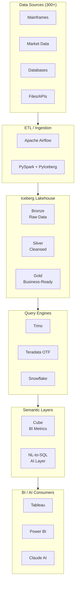
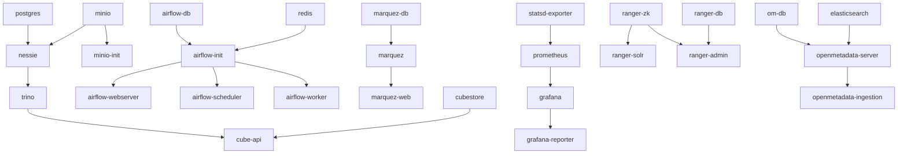

# Phase 6: Architecture Visualizations - Research

**Researched:** 2026-03-14
**Domain:** Mermaid diagrams, SVG rendering, Jinja2 HTML templates, CSS-only tooltips, docker-compose metadata extraction
**Confidence:** HIGH

## Summary

Phase 6 extends the proven YAML-data + Jinja2-template + Python-render pipeline from Phase 5 to produce architecture visualization HTML pages. The core technical challenge is pre-rendering Mermaid `.mmd` source files to inline SVG at build time (no JavaScript in final HTML) and injecting CSS-only hover tooltips onto SVG service nodes. The existing `render_html.py` module (215 lines, 3 functions) provides the foundation -- the phase adds `render_architecture()` alongside `render_swots()` and `render_index()`.

The 25 services in `docker-compose.yml` (574 lines) provide the authoritative source for service names, ports, health checks, and `depends_on` relationships. An override YAML (`services.yml`) adds descriptions, layer groupings, protocols, and display labels that docker-compose does not contain. The environment comparison draws from three Terraform tfvars files (dev/staging/prod) that differ in replica counts, worker counts, bucket names, and domains.

Mermaid CLI (`@mermaid-js/mermaid-cli` v11.12.0, npm) renders `.mmd` files to SVG via `mmdc -i input.mmd -o output.svg`. The `architecture-beta` diagram type (available since Mermaid v11.1) is supported in the current CLI. For CSS-only tooltips on SVG elements, the approach is: Python post-processes mmdc SVG output using `xml.etree.ElementTree` (stdlib), injects tooltip `<div>` siblings next to SVG `<g>` nodes keyed by service ID, and a CSS `:hover` rule on wrapper elements toggles tooltip visibility. No external Python packages are needed beyond what is already installed (PyYAML, Jinja2).

**Primary recommendation:** Use `flowchart` diagram type with `subgraph` groupings (not `architecture-beta`) for the detailed architecture diagram because flowchart supports `classDef`, `style`, and richer node labeling; use `flowchart TD` for data flow and service dependency diagrams. Wrap each SVG service node in an HTML `<div class="arch-node">` container with a hidden `<div class="arch-tooltip">` sibling, toggled by CSS `:hover`. The `architecture-beta` type lacks `classDef` support and has limited label customization -- flowchart subgraphs with swim-lane subgraphs achieve the same visual grouping with more control.

<user_constraints>
## User Constraints (from CONTEXT.md)

### Locked Decisions
- Mermaid source files (.mmd) pre-rendered to inline SVG at build time -- no JavaScript in final HTML
- Extend existing `docs/render_html.py` with `render_architecture()` function alongside `render_swots()` and `render_index()`
- Mermaid source files live in `docs/architecture/diagrams/`, rendered HTML output in `docs/architecture/`
- CSS `:hover` on SVG elements for tooltips (ARCH-08) -- inject CSS classes into rendered SVG, hovering shows styled tooltip div with description, port, protocol, health check
- Horizontal layer stacking for marketecture: Sources (top) -> Ingestion -> Storage/Lakehouse -> Processing -> Consumers (bottom)
- 8-10 grouped capability boxes: 'Sources (300+)', 'ETL/Ingestion', 'Iceberg Lakehouse', 'Query Engines', 'Semantic Layers', 'BI/AI Consumers', 'Governance', 'Security'
- Prominent stats banner: '1.5 PB managed | 300+ data sources | 40+ engineers | 3 query engines'
- Brief value tags on each layer
- Group 25 services by infrastructure layer: Storage, Catalog, Query, ETL/Orchestration, Semantic, Governance, Security, Monitoring
- Service boxes show name + primary port always visible; image version, protocol, health check, depends_on in hover tooltip
- One comprehensive diagram showing all 25 services with connections -- scrollable, authoritative reference view
- Service data auto-extracted from docker-compose.yml (extend extract_versions()), with separate overrides YAML for descriptions, groupings, and labels
- Separate standalone HTML pages per topic: data-flow.html, service-dependency.html, security-layer.html, governance-stack.html
- Data flow diagram: one representative end-to-end path (e.g., market data -> Bronze -> Silver -> Gold -> Cube -> BI)
- Environment differences: HTML table with rows per service/aspect, columns per environment (Dev/Docker Compose, Staging/Terraform+Docker, Prod/Terraform+EKS)
- Architecture index page at docs/architecture/index.html linking all architecture HTML files

### Claude's Discretion
- Exact Mermaid diagram syntax and node styling
- SVG post-processing approach for tooltip injection
- How to handle Mermaid CLI dependency (mmdc) in the build pipeline
- Exact layer colors and gradient choices within the navy/gold palette
- Connection line routing and arrow styles between services
- How much detail to show in service dependency graph vs data flow diagram
- Collapsible section grouping on multi-diagram pages

### Deferred Ideas (OUT OF SCOPE)
None -- discussion stayed within phase scope
</user_constraints>

<phase_requirements>
## Phase Requirements

| ID | Description | Research Support |
|----|-------------|-----------------|
| ARCH-01 | Marketecture HTML page with boxes-and-arrows platform overview, technology labels with value propositions, key numbers callout | Mermaid flowchart with subgraph groupings for layer boxes, stats banner as HTML above SVG, Jinja2 template with navy/gold CSS |
| ARCH-02 | Detailed architecture HTML page with every component, port numbers, protocols, health check endpoints for all 20+ services | Extended `extract_services()` parsing docker-compose.yml for ports/health checks/depends_on, services.yml override for descriptions/groupings, Mermaid flowchart with 25 nodes in swim-lane subgraphs |
| ARCH-03 | Data flow direction diagrams showing Bronze-Silver-Gold paths and consumer-semantic-query engine paths | Mermaid `flowchart TD` with labeled edges showing data transformation stages, one representative path (market data -> Bronze -> Silver -> Gold -> Cube -> BI) |
| ARCH-04 | Service dependency graph showing which services depend on which | Auto-generated from docker-compose.yml `depends_on` fields, Mermaid flowchart with directional arrows |
| ARCH-05 | Security layer visualization showing Ranger integration points and RBAC flow | Mermaid flowchart highlighting Ranger services (ranger-admin, ranger-zk, ranger-solr, ranger-db) and their connections to Trino, with RBAC policy flow |
| ARCH-06 | Governance stack detail (OpenLineage-Marquez-Grafana flow for BCBS 239) | Mermaid flowchart showing Airflow -> OpenLineage -> Marquez -> Grafana pipeline with BCBS 239 compliance dashboard |
| ARCH-07 | Environment differences table (dev/staging/prod) showing Terraform vs Docker Compose deployment | HTML table rendered from YAML data file, pulling differences from Terraform tfvars (replicas, workers, buckets, domains) |
| ARCH-08 | CSS hover tooltips on detailed architecture diagram showing component descriptions | CSS-only `:hover` technique on wrapper divs around SVG node groups, Python SVG post-processing to inject tooltip markup |
</phase_requirements>

## Standard Stack

### Core
| Library | Version | Purpose | Why Standard |
|---------|---------|---------|--------------|
| @mermaid-js/mermaid-cli | 11.12.0 | Pre-render .mmd files to SVG at build time | Official CLI; `mmdc -i input.mmd -o output.svg`; includes Mermaid 11.x with all diagram types |
| Jinja2 | 3.1.6 (installed) | HTML template rendering | Already used by Phase 5; same `_create_jinja_env()` function |
| PyYAML | 6.0.1 (installed) | Parse YAML data files and docker-compose.yml | Already used by Phase 5 `extract_versions()` |
| xml.etree.ElementTree | stdlib | SVG post-processing for tooltip injection | No external dependency; sufficient for parsing/modifying SVG XML |
| Node.js | 22.22.0 (installed) | Runtime for mmdc | Already available on system |

### Supporting
| Library | Version | Purpose | When to Use |
|---------|---------|---------|-------------|
| subprocess (stdlib) | Python 3.12 | Shell out to `npx mmdc` from render_html.py | During Mermaid rendering step |
| pathlib (stdlib) | Python 3.12 | File path handling | Already used throughout render_html.py |
| re (stdlib) | Python 3.12 | Regex for SVG node ID matching during post-processing | Optional; ElementTree XPath may suffice |

### Alternatives Considered
| Instead of | Could Use | Tradeoff |
|------------|-----------|----------|
| mmdc (npm) | mermaid-py (Python) | mermaid-py is less mature, uses Playwright/PhantomJS; mmdc is the official tool |
| mmdc (npm) | MohammadRaziei/mmdc (Python) | Pure Python but uses PhantomJS (deprecated); official mmdc is more reliable |
| xml.etree.ElementTree | lxml or BeautifulSoup | More powerful but adds external dependency; stdlib is sufficient for SVG manipulation |
| flowchart subgraphs | architecture-beta | architecture-beta has nicer icons but lacks classDef, limited label control, and node styling |

**Installation:**
```bash
npm install --save-dev @mermaid-js/mermaid-cli
# Or use npx without install:
npx -p @mermaid-js/mermaid-cli mmdc -i input.mmd -o output.svg
```

## Architecture Patterns

### Recommended Project Structure
```
docs/
  architecture/
    diagrams/              # Mermaid source files (.mmd)
      marketecture.mmd
      detailed-architecture.mmd
      data-flow.mmd
      service-dependency.mmd
      security-layer.mmd
      governance-stack.mmd
    data/                  # YAML data files for template rendering
      services.yml         # Service metadata override (descriptions, groupings, protocols)
      environments.yml     # Environment comparison data
    index.html             # Architecture index page (rendered)
    marketecture.html      # Rendered output
    detailed-architecture.html
    data-flow.html
    service-dependency.html
    security-layer.html
    governance-stack.html
  templates/
    base_architecture.html # Architecture page template (extends base_swot.html pattern)
    base_arch_index.html   # Architecture index template (extends base_index.html pattern)
    macros/
      collapsible.html     # (existing) CSS-only details/summary
      environment_table.html # NEW: environment comparison table macro
  render_html.py           # Extended with render_architecture(), extract_services()
```

### Pattern 1: YAML-Driven Content with Jinja2 Templates
**What:** All content lives in YAML data files; Jinja2 templates produce standalone HTML with embedded CSS.
**When to use:** Every HTML page in this phase.
**Example:**
```python
# Source: Existing pattern from docs/render_html.py
def render_architecture(
    diagram_dir: Path | None = None,
    data_dir: Path | None = None,
    template_dir: Path | None = None,
    output_dir: Path | None = None,
    compose_path: Path | str | None = None,
) -> list[Path]:
    """Render architecture HTML pages from Mermaid diagrams + YAML data."""
    services = extract_services(compose_path)
    overrides = yaml.safe_load((data_dir / "services.yml").read_text())
    # Merge docker-compose data with override data
    for name, svc in services.items():
        svc.update(overrides.get("services", {}).get(name, {}))

    # Render each .mmd to SVG, then embed in HTML template
    for mmd_file in sorted(diagram_dir.glob("*.mmd")):
        svg_content = render_mermaid_to_svg(mmd_file)
        svg_with_tooltips = inject_tooltips(svg_content, services)
        html = template.render(
            svg_content=svg_with_tooltips,
            services=services,
            versions=versions,
            generation_date=generation_date,
        )
        output_path.write_text(html)
```

### Pattern 2: Docker-Compose Metadata Extraction
**What:** Extend `extract_versions()` to also extract ports, health checks, depends_on from docker-compose.yml.
**When to use:** For ARCH-02 (detailed architecture) and ARCH-04 (service dependency).
**Example:**
```python
def extract_services(compose_path: Path | str | None = None) -> dict[str, dict]:
    """Extract full service metadata from docker-compose.yml.

    Returns dict mapping service name to:
      - image, version (existing)
      - ports (list of "host:container" mappings)
      - healthcheck (test command string)
      - depends_on (list of service names)
      - environment (dict, for protocol detection)
    """
    compose = yaml.safe_load(compose_path.read_text())
    services = {}
    for name, config in compose.get("services", {}).items():
        image = config.get("image", "")
        version = image.rsplit(":", 1)[1] if ":" in image else "custom"
        ports = config.get("ports", [])
        hc = config.get("healthcheck", {})
        hc_test = hc.get("test", [])
        deps = list(config.get("depends_on", {}).keys())
        services[name] = {
            "image": image.rsplit(":", 1)[0] if ":" in image else image,
            "version": version,
            "ports": ports,
            "healthcheck": " ".join(hc_test) if isinstance(hc_test, list) else str(hc_test),
            "depends_on": deps,
        }
    return services
```

### Pattern 3: Mermaid Pre-Rendering via subprocess
**What:** Call `npx mmdc` from Python to convert .mmd files to SVG strings.
**When to use:** For every Mermaid diagram.
**Example:**
```python
import subprocess
import tempfile

def render_mermaid_to_svg(mmd_path: Path) -> str:
    """Render a .mmd file to SVG string using mermaid-cli."""
    with tempfile.NamedTemporaryFile(suffix=".svg", delete=False) as tmp:
        tmp_svg = Path(tmp.name)
    try:
        result = subprocess.run(
            ["npx", "-p", "@mermaid-js/mermaid-cli", "mmdc",
             "-i", str(mmd_path), "-o", str(tmp_svg),
             "-t", "neutral", "-b", "transparent"],
            capture_output=True, text=True, timeout=60,
        )
        if result.returncode != 0:
            raise RuntimeError(f"mmdc failed: {result.stderr}")
        return tmp_svg.read_text()
    finally:
        tmp_svg.unlink(missing_ok=True)
```

### Pattern 4: CSS-Only Tooltip Injection on SVG
**What:** Post-process SVG output to wrap service nodes with HTML tooltip containers.
**When to use:** For ARCH-08 on the detailed architecture diagram.
**Example:**
```python
import xml.etree.ElementTree as ET

def inject_tooltips(svg_content: str, services: dict) -> str:
    """Wrap SVG in HTML with tooltip divs for each service node.

    Strategy: Instead of modifying SVG internals (fragile), wrap the
    entire SVG in a positioned container and overlay invisible tooltip
    divs positioned over each service's SVG node location.

    Alternative (simpler): Render the detailed architecture as an HTML
    table/grid with embedded mini-SVGs or styled divs, where each
    service cell natively supports CSS :hover tooltips.
    """
    # The practical approach: render service grid as HTML with CSS,
    # not as a single monolithic Mermaid diagram.
    # Each service is a <div class="service-node"> with a
    # <div class="tooltip"> child, using pure CSS :hover.
    pass
```

### Pattern 5: Hybrid Approach for Detailed Architecture (Recommended)
**What:** Use Mermaid for diagram-oriented visualizations (data flow, dependency, security, governance) but use a CSS grid of styled HTML `<div>` elements for the detailed service reference (ARCH-02 + ARCH-08).
**When to use:** The detailed architecture page needs every service's port visible AND hover tooltips -- this is better served by HTML/CSS than a single SVG.
**Example:**
```html
<!-- Service swim-lane rendered as HTML grid, not Mermaid SVG -->
<div class="arch-layer" id="storage">
  <h3 class="layer-label">Storage</h3>
  <div class="service-grid">
    
    <div class="service-node">
      <div class="service-name">{{ svc.name }}</div>
      <div class="service-port">:{{ svc.primary_port }}</div>
      <div class="service-tooltip">
        <strong>{{ svc.name }}</strong><br>
        Version: {{ svc.version }}<br>
        Protocol: {{ svc.protocol }}<br>
        Health: <code>{{ svc.healthcheck }}</code><br>
        Depends on: {{ svc.depends_on | join(', ') }}
      </div>
    </div>
    
  </div>
</div>
```

### Anti-Patterns to Avoid
- **Single monolithic Mermaid diagram for 25 services with tooltips:** Mermaid's native tooltip requires JavaScript (`securityLevel: 'loose'`), which violates the no-JS constraint. A 25-node diagram with ports in labels becomes unreadable. Use HTML grid for the reference view.
- **Using `architecture-beta` diagram type:** While supported in mmdc 11.12.0, it lacks `classDef` node styling, has limited label formatting, and produces less customizable SVG. Flowchart `subgraph` achieves the same visual grouping with more control.
- **Injecting foreignObject into SVG for tooltips:** Browser support for `foreignObject` is inconsistent (historically poor in IE/Edge). Pure HTML `<div>` tooltips adjacent to inline SVG are more reliable.
- **Installing mmdc globally:** Use `npx -p @mermaid-js/mermaid-cli mmdc` to avoid polluting the global namespace. The build script should handle the dependency transparently.
- **Parsing SVG with regex:** SVG is XML; use `xml.etree.ElementTree` for any SVG manipulation. Regex on XML is error-prone.

## Don't Hand-Roll

| Problem | Don't Build | Use Instead | Why |
|---------|-------------|-------------|-----|
| Diagram rendering | Custom SVG generation code | Mermaid CLI (`mmdc`) | Mermaid handles layout algorithms, edge routing, arrow rendering -- thousands of lines of graph layout code |
| YAML parsing | Custom config file format | PyYAML `yaml.safe_load()` | Already in use; handles all YAML edge cases |
| HTML templating | String concatenation for HTML | Jinja2 templates | Already in use; handles escaping, includes, macros, conditionals |
| SVG XML parsing | Regex-based SVG manipulation | `xml.etree.ElementTree` | Stdlib; handles namespaces, attributes, nested elements properly |
| Docker-compose parsing | Custom parsing of YAML anchors | PyYAML (handles `<<: *anchor` merge keys) | Docker-compose uses YAML anchors extensively (e.g., `&airflow-env`); PyYAML resolves them automatically |
| CSS tooltips | JavaScript-based tooltips | Pure CSS `:hover` + `visibility` | No-JS requirement; CSS tooltips work in email clients and restricted intranets |
| Dependency graph | Manual depends_on tracing | Parse docker-compose `depends_on` keys | Authoritative source; auto-generates accurate ARCH-04 |

**Key insight:** The docker-compose.yml file IS the architecture definition. Extracting metadata from it ensures diagrams stay accurate as services change. The services.yml override file adds only what docker-compose cannot express (descriptions, layer assignments, protocol labels).

## Common Pitfalls

### Pitfall 1: Mermaid CLI Not Found / Version Mismatch
**What goes wrong:** `npx mmdc` fails because Node.js is not in PATH, or mmdc version does not support needed diagram types.
**Why it happens:** The Python render pipeline shells out to a Node.js tool; version mismatches between mermaid-cli and mermaid core.
**How to avoid:** Pin `@mermaid-js/mermaid-cli` version in a local `package.json` (or document required version). Check `mmdc --version` output before rendering. Require Mermaid CLI 11.1.0+ for architecture-beta (if used) and flowchart subgraph direction support.
**Warning signs:** `Error: No diagram type detected`, `mmdc: command not found`, SVG output is empty.

### Pitfall 2: YAML Anchor Resolution in Docker-Compose
**What goes wrong:** `extract_services()` misses environment variables or produces incomplete service configs because YAML anchors (`<<: *airflow-env`) are not resolved.
**Why it happens:** Some YAML parsers do not resolve merge keys.
**How to avoid:** PyYAML `yaml.safe_load()` resolves YAML anchors and merge keys correctly. Test with the actual docker-compose.yml to verify `airflow-webserver`, `airflow-scheduler`, `airflow-worker` all have the full environment block.
**Warning signs:** Airflow services show empty environment dicts; service metadata differs from what `docker compose config` outputs.

### Pitfall 3: SVG Inline Embedding Namespace Conflicts
**What goes wrong:** Multiple inline SVGs on one page cause ID collisions (Mermaid generates IDs like `flowchart-mermaid-0`).
**Why it happens:** Mermaid uses predictable ID patterns; two SVGs on the same page share the ID namespace.
**How to avoid:** Each page has one primary SVG diagram. If multiple SVGs are needed, post-process to prefix IDs with the diagram name, OR use a unique `--configFile` with different `mermaid.flowchart.htmlLabels` settings per diagram.
**Warning signs:** CSS styles from one diagram bleed into another; clicking a node activates the wrong diagram's element.

### Pitfall 4: Mermaid SVG Too Large / Unreadable at 25 Nodes
**What goes wrong:** A single Mermaid flowchart with 25 service nodes, port labels, and connections becomes an unreadable mess.
**Why it happens:** Mermaid's automatic layout algorithm (dagre) struggles with dense graphs; labels overlap; the diagram requires horizontal scrolling beyond what is useful.
**How to avoid:** Use the hybrid approach: Mermaid for diagram-oriented views (data flow, dependency, security, governance -- each with 5-10 nodes), HTML/CSS grid for the comprehensive service reference (ARCH-02). The service reference is a lookup table, not a diagram.
**Warning signs:** Diagram requires >200% zoom to read; port numbers overlap; edge crossings make relationships unclear.

### Pitfall 5: CSS Tooltip Positioning on Inline SVG
**What goes wrong:** CSS `:hover` tooltips appear in wrong positions, are clipped by SVG viewport, or don't work at all on SVG elements.
**Why it happens:** SVG `<g>` elements don't support `::after` pseudo-elements; SVG coordinate system differs from HTML page coordinates; `overflow: visible` is not respected in all browsers.
**How to avoid:** Don't try to attach CSS tooltips directly to SVG `<g>` nodes. Instead: (a) for the detailed architecture view, use HTML divs (not SVG) as the service boxes, so standard CSS tooltips work; (b) for Mermaid diagrams that need tooltips, overlay positioned HTML divs on top of the SVG using absolute positioning within a relative container.
**Warning signs:** Tooltips appear at (0,0) of the page; tooltips are invisible/clipped; tooltips work in Chrome but not Firefox.

### Pitfall 6: Build Services (init/setup) Appearing in Architecture
**What goes wrong:** `minio-init` and `airflow-init` appear as services in the architecture diagram, confusing readers.
**Why it happens:** These are one-shot initialization containers in docker-compose, not running services.
**How to avoid:** Filter out services with `entrypoint` overrides that are clearly init scripts, or maintain an explicit exclude list in `services.yml`. The docker-compose.yml has `minio-init` and `airflow-init` as init containers.
**Warning signs:** Diagram shows services that don't have ports or health checks; readers ask "what port does minio-init run on?"

## Code Examples

### Mermaid Marketecture Diagram (.mmd)


### Mermaid Service Dependency Diagram (.mmd)


### CSS-Only Tooltip for Service Nodes (HTML/CSS approach)
```css
/* Source: W3Schools CSS Tooltip pattern adapted for architecture */
.service-node {
    position: relative;
    display: inline-flex;
    flex-direction: column;
    align-items: center;
    padding: 0.75rem;
    background: #f8fafc;
    border: 2px solid #1a2332;
    border-radius: 6px;
    cursor: default;
    min-width: 120px;
    text-align: center;
}

.service-node .service-name {
    font-weight: 700;
    color: #1a2332;
    font-size: 0.9rem;
}

.service-node .service-port {
    font-family: monospace;
    color: #c8a961;
    font-size: 0.8rem;
}

.service-tooltip {
    visibility: hidden;
    opacity: 0;
    position: absolute;
    bottom: 110%;
    left: 50%;
    transform: translateX(-50%);
    background: #1a2332;
    color: #f8fafc;
    padding: 0.75rem 1rem;
    border-radius: 6px;
    font-size: 0.8rem;
    line-height: 1.5;
    white-space: nowrap;
    z-index: 100;
    transition: opacity 0.2s;
    box-shadow: 0 2px 8px rgba(0,0,0,0.2);
}

.service-tooltip::after {
    content: "";
    position: absolute;
    top: 100%;
    left: 50%;
    transform: translateX(-50%);
    border-width: 6px;
    border-style: solid;
    border-color: #1a2332 transparent transparent transparent;
}

.service-node:hover .service-tooltip {
    visibility: visible;
    opacity: 1;
}
```

### services.yml Override Structure
```yaml
# docs/architecture/data/services.yml
# Supplements docker-compose.yml with display metadata

layers:
  storage:
    label: "Storage"
    color: "#2563eb"
    services: [postgres, minio, minio-init]
  catalog:
    label: "Catalog"
    color: "#7c3aed"
    services: [nessie]
  query:
    label: "Query Engines"
    color: "#059669"
    services: [trino]
  etl:
    label: "ETL / Orchestration"
    color: "#d97706"
    services: [airflow-webserver, airflow-scheduler, airflow-worker, airflow-db, redis]
  semantic:
    label: "Semantic Layer"
    color: "#0891b2"
    services: [cube-api, cubestore]
  governance:
    label: "Governance & Lineage"
    color: "#be185d"
    services: [marquez, marquez-db, marquez-web, openmetadata-server, openmetadata-ingestion, om-db, elasticsearch]
  security:
    label: "Security"
    color: "#dc2626"
    services: [ranger-admin, ranger-db, ranger-solr, ranger-zk]
  monitoring:
    label: "Monitoring"
    color: "#65a30d"
    services: [grafana, grafana-reporter, prometheus, statsd-exporter]

services:
  postgres:
    description: "PostgreSQL backing store for Nessie catalog metadata"
    protocol: "PostgreSQL wire (5432)"
    primary_port: 5432
  minio:
    description: "S3-compatible object storage for lakehouse data (on-prem)"
    protocol: "S3 API (HTTP)"
    primary_port: 9000
  nessie:
    description: "Iceberg REST catalog with Git-like branching for schema management"
    protocol: "REST (HTTP)"
    primary_port: 19120
  trino:
    description: "Distributed SQL query engine for Iceberg tables"
    protocol: "HTTP"
    primary_port: 8080
  # ... (continue for all 25 services)

exclude_from_diagrams:
  - minio-init
  - airflow-init
```

### Environment Comparison YAML Data
```yaml
# docs/architecture/data/environments.yml
environments:
  - name: "Development"
    deployment: "Docker Compose"
    orchestration: "docker-compose up"
    storage: "MinIO (local)"
    bucket: "lakehouse-dev-data"
    nessie_replicas: 1
    trino_workers: 1
    domain: "dev.lakehouse.internal"
    infra_as_code: "docker-compose.yml"
    notes: "Single-node, all services on one host"

  - name: "Staging"
    deployment: "Terraform + Docker"
    orchestration: "Terraform apply + Docker Compose"
    storage: "MinIO (multi-node)"
    bucket: "lakehouse-staging-data"
    nessie_replicas: 2
    trino_workers: 2
    domain: "staging.lakehouse.internal"
    infra_as_code: "infra/terraform/environments/staging/"
    notes: "Multi-node, mirrors prod topology at reduced scale"

  - name: "Production"
    deployment: "Terraform + EKS"
    orchestration: "Terraform apply + Helm charts"
    storage: "S3"
    bucket: "lakehouse-prod-data"
    nessie_replicas: 3
    trino_workers: 3
    domain: "lakehouse.internal"
    infra_as_code: "infra/terraform/environments/prod/"
    notes: "HA configuration, auto-scaling, encrypted at rest (SSE-KMS)"
```

## State of the Art

| Old Approach | Current Approach | When Changed | Impact |
|--------------|------------------|--------------|--------|
| Mermaid CLI 10.x (no architecture-beta) | Mermaid CLI 11.12.0 (architecture-beta supported) | July 2025 | Can use architecture-beta if desired; flowchart subgraphs remain more flexible |
| JavaScript-required Mermaid rendering | Pre-render to SVG via mmdc CLI | Always available | Enables standalone HTML without JS dependencies |
| Mermaid tooltips (require JS + securityLevel: loose) | CSS-only tooltips on HTML service divs | N/A (design decision) | Complies with no-JS requirement |
| Manual architecture diagram maintenance | Auto-extracted from docker-compose.yml | Phase 6 | Diagrams stay accurate as services change |

**Deprecated/outdated:**
- `mermaid.cli` (old npm package name): Replaced by `@mermaid-js/mermaid-cli`. Do NOT use `npm install mermaid.cli`.
- PhantomJS-based Python Mermaid renderers: PhantomJS is abandoned. Use official mmdc which uses Puppeteer/Chromium.

## Open Questions

1. **Mermaid CLI first-run download time**
   - What we know: `npx -p @mermaid-js/mermaid-cli mmdc` downloads the package on first use; subsequent runs use cache. mmdc also downloads Chromium on first use via Puppeteer.
   - What's unclear: Whether the CI/test environment has network access for the initial download; total download size (~300MB for Chromium).
   - Recommendation: Add `npm install --save-dev @mermaid-js/mermaid-cli` to a `package.json` in the project root. Run `npx mmdc --version` in a setup step to pre-cache. Document the dependency in the project README. If Chromium download is blocked, set `PUPPETEER_CHROMIUM_REVISION` or use `--puppeteerConfigFile` to point to a pre-installed Chromium.

2. **SVG ID uniqueness across multiple inline SVGs**
   - What we know: Each architecture page has one primary diagram, so ID collisions are unlikely.
   - What's unclear: Whether the index page or any page will embed multiple SVGs.
   - Recommendation: Keep one SVG per page. If needed later, post-process SVG to add a unique prefix to all IDs.

3. **Exact node positions for SVG tooltip overlay alignment**
   - What we know: Mermaid generates SVG with `transform` attributes on `<g>` nodes, making position extraction complex.
   - What's unclear: Whether position extraction is reliable across different Mermaid versions and diagram sizes.
   - Recommendation: Use the hybrid approach (HTML divs for detailed service reference, Mermaid SVG for topology diagrams without tooltips). This sidesteps the SVG positioning problem entirely.

## Validation Architecture

### Test Framework
| Property | Value |
|----------|-------|
| Framework | pytest 8.3.3 |
| Config file | `etl/pyproject.toml` |
| Quick run command | `python3 -m pytest etl/tests/test_html_render.py -x -q` |
| Full suite command | `python3 -m pytest etl/tests/ -x -q` |

### Phase Requirements -> Test Map
| Req ID | Behavior | Test Type | Automated Command | File Exists? |
|--------|----------|-----------|-------------------|-------------|
| ARCH-01 | Marketecture HTML renders with stats banner, layer boxes, value tags | unit | `python3 -m pytest etl/tests/test_html_render.py::test_marketecture_stats_banner -x` | Wave 0 |
| ARCH-01 | Marketecture contains capability group labels | unit | `python3 -m pytest etl/tests/test_html_render.py::test_marketecture_capability_groups -x` | Wave 0 |
| ARCH-02 | Detailed architecture shows all services with ports | unit | `python3 -m pytest etl/tests/test_html_render.py::test_detailed_arch_all_services -x` | Wave 0 |
| ARCH-02 | extract_services() returns ports and health checks for all services | unit | `python3 -m pytest etl/tests/test_html_render.py::test_extract_services_ports -x` | Wave 0 |
| ARCH-03 | Data flow HTML contains Bronze/Silver/Gold path | unit | `python3 -m pytest etl/tests/test_html_render.py::test_data_flow_medallion_path -x` | Wave 0 |
| ARCH-04 | Service dependency HTML renders depends_on relationships | unit | `python3 -m pytest etl/tests/test_html_render.py::test_service_dependency_edges -x` | Wave 0 |
| ARCH-05 | Security layer HTML contains Ranger services | unit | `python3 -m pytest etl/tests/test_html_render.py::test_security_ranger_services -x` | Wave 0 |
| ARCH-06 | Governance HTML contains OpenLineage/Marquez/Grafana flow | unit | `python3 -m pytest etl/tests/test_html_render.py::test_governance_lineage_flow -x` | Wave 0 |
| ARCH-07 | Environment table contains dev/staging/prod columns | unit | `python3 -m pytest etl/tests/test_html_render.py::test_environment_table_columns -x` | Wave 0 |
| ARCH-08 | Detailed architecture HTML contains tooltip CSS and tooltip divs | unit | `python3 -m pytest etl/tests/test_html_render.py::test_css_hover_tooltips -x` | Wave 0 |

### Sampling Rate
- **Per task commit:** `python3 -m pytest etl/tests/test_html_render.py -x -q`
- **Per wave merge:** `python3 -m pytest etl/tests/ -x -q`
- **Phase gate:** Full suite green before `/gsd:verify-work`

### Wave 0 Gaps
- [ ] `etl/tests/test_html_render.py` -- needs new test functions for ARCH-01 through ARCH-08 (file exists, needs extension)
- [ ] `render_architecture()` function -- must exist for tests to call
- [ ] `extract_services()` function -- must exist for tests to call
- [ ] `@mermaid-js/mermaid-cli` -- needs `npm install` or `npx` availability for Mermaid rendering tests (optional: tests can validate HTML output without requiring mmdc if SVG is pre-generated or mocked)

## Sources

### Primary (HIGH confidence)
- docker-compose.yml (574 lines) -- authoritative source for all 25 services, ports, health checks, depends_on
- docs/render_html.py (215 lines) -- existing render pipeline pattern
- docs/templates/base_swot.html -- CSS design system (navy #1a2332, gold #c8a961, font stack, responsive breakpoints)
- docs/templates/base_index.html -- card grid layout pattern for index pages
- infra/terraform/environments/{dev,staging,prod}/terraform.tfvars -- environment differences
- etl/tests/test_html_render.py -- existing test patterns

### Secondary (MEDIUM confidence)
- [mermaid-js/mermaid-cli GitHub](https://github.com/mermaid-js/mermaid-cli) -- mmdc CLI usage, version 11.12.0
- [Mermaid Flowchart Syntax](https://mermaid.js.org/syntax/flowchart.html) -- subgraph, classDef, style, click/tooltip syntax
- [Mermaid Architecture Diagrams](https://mermaid.js.org/syntax/architecture.html) -- architecture-beta syntax (v11.1+)
- [@mermaid-js/mermaid-cli npm](https://www.npmjs.com/package/@mermaid-js/mermaid-cli) -- package info, Node.js 18.19+ or 20+ requirement
- [W3Schools CSS Tooltip](https://www.w3schools.com/css/css_tooltip.asp) -- pure CSS tooltip pattern with :hover, visibility, position absolute
- [mermaid-cli issue #951](https://github.com/mermaid-js/mermaid-cli/issues/951) -- confirmed architecture-beta works in CLI 11.1+

### Tertiary (LOW confidence)
- [SVG CSS tooltip approaches](https://www.petercollingridge.co.uk/tutorials/svg/interactive/tooltip/) -- SVG-specific tooltip techniques (requires validation against target browsers)
- [MohammadRaziei/mmdc Python](https://github.com/mohammadraziei/mmdc) -- alternative Python-native renderer (NOT recommended; uses deprecated PhantomJS)

## Metadata

**Confidence breakdown:**
- Standard stack: HIGH -- mmdc CLI is the official tool; all Python deps already installed; docker-compose.yml is the authoritative data source
- Architecture: HIGH -- extends proven Phase 5 pattern (YAML + Jinja2 + Python render); CSS tooltip pattern is well-established
- Pitfalls: HIGH -- identified from actual codebase analysis (YAML anchors, init containers, SVG ID collisions) and verified web research (mermaid-cli version requirements)

**Research date:** 2026-03-14
**Valid until:** 2026-04-14 (stable domain; Mermaid CLI version may increment but API is stable)
