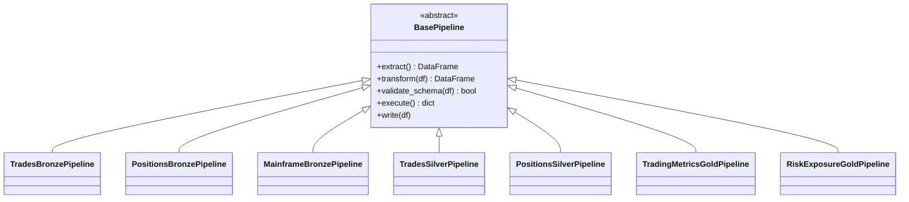

# Phase 7: Developer Documentation - Research

**Researched:** 2026-03-14
**Domain:** Developer documentation as standalone HTML pages using Jinja2/YAML rendering pipeline
**Confidence:** HIGH

## Summary

Phase 7 produces 12 developer-facing HTML documentation pages covering onboarding, API reference, testing, CI/CD, troubleshooting, and contributor guidelines. The project has a well-established rendering pipeline from Phases 5-6: YAML data files drive Jinja2 templates that produce standalone HTML with embedded CSS. This phase extends that pattern with a new `render_developer_docs()` function in `docs/render_html.py`, new templates, and new YAML data files.

The codebase is well-understood. The 8 ETL packages collectively contain 34 public classes and 59 public functions across 33 source files. API signatures are extractable via Python's `ast` module from source files, avoiding runtime import dependencies (PySpark, etc.). The existing `etl-patterns.md` (564 lines) provides ready-made content for DEV-04, and `docker-compose.yml` (574 lines) plus `services.yml` (153 lines) provide authoritative service metadata for DEV-07 and DEV-08.

The CI/CD pipeline consists of 5 GitHub Actions workflows (ci.yml, deploy-dev.yml, deploy-staging.yml, deploy-prod.yml, infra.yml) with a clear PR-to-production promotion path. Pre-commit hooks enforce ruff linting/formatting, trailing whitespace, YAML/TOML validation, terraform fmt, and detect-secrets. All of this content is already in the repo and needs to be documented, not discovered.

**Primary recommendation:** Follow the exact YAML-data + Jinja2-template + render-function pattern established in Phases 5-6. Use AST-based extraction for API reference signatures. Structure content as developer-facing YAML data files in `docs/developer/data/` with a `base_developer.html` template that inherits the navy/gold CSS from existing templates.

<user_constraints>
## User Constraints (from CONTEXT.md)

### Locked Decisions
- Standalone HTML page per DEV requirement (12 pages total) -- consistent with SWOT and architecture patterns
- Developer docs index page at `docs/developer/index.html` with audience-tagged cards: "New Engineers" (onboarding, checklist, first pipeline), "All Engineers" (testing, CI/CD, patterns, service URLs, troubleshooting), "Contributors" (PR process, code style, API reference)
- Class hierarchy visualization (DEV-11) uses Mermaid class diagram rendered to SVG -- same approach as Phase 6 architecture diagrams
- ETL patterns reference (DEV-04) converts existing `docs/etl-patterns.md` (564 lines) to HTML as-is -- content is already well-structured with code examples, minimal rewriting needed
- Concise and direct tone -- short paragraphs, bullet points, code-first ("Run this command. You should see this output."). Respects experienced engineers' time
- Onboarding guide (DEV-01) assumes competent Python engineers -- list prerequisites without install instructions, focus on project-specific setup (clone, docker-compose up, verify services)
- API reference (DEV-10) documents public API only -- signatures, parameters, return types, one usage example per function. Covers all 8 packages: pipelines, config, governance, quality, semantic, iceberg_utils, lineage, inventory
- Troubleshooting FAQ (DEV-08) uses Symptom-Fix-Why format -- engineers learn the system while fixing issues
- First pipeline tutorial (DEV-03) uses a new synthetic pipeline ("hello world" CSV to Bronze) -- clearly a teaching example, avoids coupling to production code
- All code examples show full import paths -- copy-paste-ready, zero ambiguity
- Service URL reference (DEV-07) auto-extracted from docker-compose.yml with manual annotations YAML override
- Testing guide (DEV-05) includes formatted pytest output snippets showing passing/failing examples
- Assume Python/PySpark proficiency throughout
- Day 1 checklist (DEV-09) is literally a single printed A4/Letter page -- compact checkboxes via @media print CSS
- Contributor guidelines (DEV-12) include rules with brief rationale
- CI/CD workflow (DEV-06) includes a Mermaid flowchart showing PR to CI checks to dev to staging to prod promotion path

### Claude's Discretion
- Exact page file naming convention within `docs/developer/`
- How to structure the Jinja2 templates for developer docs (new base template vs extend existing)
- Specific troubleshooting entries in the FAQ (derive from docker-compose.yml and common failure modes)
- How to extract public API signatures from Python source (inspect, AST, or manual)
- Section ordering within each individual page
- How many concrete pipelines to reference in the tutorial alongside the synthetic one

### Deferred Ideas (OUT OF SCOPE)
None -- discussion stayed within phase scope
</user_constraints>

<phase_requirements>
## Phase Requirements

| ID | Description | Research Support |
|----|-------------|-----------------|
| DEV-01 | Developer onboarding guide with prerequisites, local environment setup, and step-by-step Docker Compose stack launch | docker-compose.yml has 25+ services with health checks; services.yml has descriptions; conftest.py shows env vars and default ports |
| DEV-02 | Repository structure walkthrough explaining each directory and key files | Full repo tree mapped: etl/, docs/, infra/, semantic/, ci/, dbt/ directories identified with substructure |
| DEV-03 | "Write your first pipeline" hands-on tutorial | BasePipeline API fully documented; existing Bronze pipelines (trades, positions, mainframe) serve as reference; etl-patterns.md Section 2 has step-by-step |
| DEV-04 | ETL pattern reference incorporating etl-patterns.md content | etl-patterns.md (564 lines, 8 sections) is complete and well-structured; convert to HTML as-is |
| DEV-05 | Testing guide covering unit tests, integration tests, pytest markers, CI gate behavior | pyproject.toml has 4 markers (unit, integration, slow, snowflake); conftest.py has 5 session fixtures; ci.yml shows test gate |
| DEV-06 | CI/CD workflow explanation | 5 GitHub Actions workflows mapped: ci.yml (4 jobs), deploy-dev/staging/prod (terraform workspace flow), infra.yml |
| DEV-07 | Service URL reference table for all 10+ platform services | extract_services() already parses docker-compose.yml; services.yml has descriptions, protocols, primary_ports for all 28 services |
| DEV-08 | Common troubleshooting FAQ | docker-compose.yml health checks identify failure modes; services.yml maps dependencies; specific entries derivable from stack components |
| DEV-09 | Day 1 checklist -- printable single-page onboarding checklist | Combines DEV-01 setup + DEV-03 first pipeline + DEV-12 first PR into compact @media print format |
| DEV-10 | API/module reference with complete module listing, public API signatures, import paths, usage examples | 8 packages: 34 classes, 59 functions, 33 source files; AST extraction verified working; import paths documented in etl-patterns.md Quick Reference |
| DEV-11 | Class hierarchy visualization showing BasePipeline inheritance tree | 14 pipeline classes total: BasePipeline + 3 Bronze + 2 Silver + 2 Gold + IncrementalConfig + MedallionLayer + PipelineConfig + exceptions; Mermaid class diagram pattern established |
| DEV-12 | Contributor guidelines covering branch naming, PR process, testing, code style, commit format | .pre-commit-config.yaml (4 hook repos), pyproject.toml (ruff config), ci.yml (lint/test gates), 4 pytest markers documented |
</phase_requirements>

## Standard Stack

### Core
| Library | Version | Purpose | Why Standard |
|---------|---------|---------|--------------|
| Jinja2 | 3.1.6 | Template rendering for HTML pages | Already used by Phase 5-6; installed in environment |
| PyYAML | 6.0.1 | YAML data file loading | Already used by Phase 5-6; installed in environment |
| Python ast module | stdlib | API signature extraction from source | Zero dependencies; parses without importing (avoids PySpark requirement); verified working on all 8 packages |

### Supporting
| Library | Version | Purpose | When to Use |
|---------|---------|---------|-------------|
| @mermaid-js/mermaid-cli | (npx) | Mermaid diagram to SVG rendering | DEV-11 class hierarchy, DEV-06 CI/CD flowchart; already used by Phase 6 with graceful fallback |

### Alternatives Considered
| Instead of | Could Use | Tradeoff |
|------------|-----------|----------|
| ast module | Python inspect + runtime import | Would require all dependencies (PySpark, soda-core, etc.) installed; ast works on source text only |
| ast module | pdoc/Sphinx autodoc | Deferred to AUTO-01 (future requirement); too heavy for standalone HTML pages |
| Manual YAML content | Markdown-to-HTML conversion | Inconsistent with established YAML-driven pattern; less structured |

**Installation:**
```bash
# No new packages needed -- all dependencies already installed
pip install jinja2 pyyaml  # already present
```

## Architecture Patterns

### Recommended Project Structure
```
docs/
  developer/
    data/
      onboarding.yml         # DEV-01 structured content
      repo-structure.yml     # DEV-02 directory descriptions
      first-pipeline.yml     # DEV-03 tutorial steps
      testing.yml            # DEV-05 testing guide content
      cicd.yml               # DEV-06 workflow stages
      services.yml           # DEV-07 service annotations (or reuse architecture/data/services.yml)
      troubleshooting.yml    # DEV-08 FAQ entries
      checklist.yml          # DEV-09 Day 1 items
      api-reference.yml      # DEV-10 generated API data (from ast extraction)
      contributor.yml        # DEV-12 guidelines
    diagrams/
      class-hierarchy.mmd    # DEV-11 Mermaid source
      cicd-flow.mmd          # DEV-06 Mermaid source
    index.html               # Developer docs index (rendered)
    onboarding.html          # DEV-01 (rendered)
    repo-structure.html      # DEV-02 (rendered)
    first-pipeline.html      # DEV-03 (rendered)
    etl-patterns.html        # DEV-04 (rendered from etl-patterns.md)
    testing.html             # DEV-05 (rendered)
    cicd.html                # DEV-06 (rendered)
    service-urls.html        # DEV-07 (rendered)
    troubleshooting.html     # DEV-08 (rendered)
    day1-checklist.html      # DEV-09 (rendered)
    api-reference.html       # DEV-10 (rendered)
    class-hierarchy.html     # DEV-11 (rendered)
    contributor.html         # DEV-12 (rendered)
  templates/
    base_developer.html      # New template for developer docs
    macros/
      code_block.html        # Code example macro with syntax class
      checklist.html         # Checkbox list macro for DEV-09
```

### Pattern 1: YAML-Driven Content Rendering
**What:** Each documentation page is driven by a YAML data file loaded by a render function, merged with template context, and rendered to standalone HTML.
**When to use:** All 12 developer documentation pages.
**Example:**
```python
# Source: docs/render_html.py (established pattern from Phase 5-6)
def render_developer_docs(
    data_dir: Path | None = None,
    template_dir: Path | None = None,
    output_dir: Path | None = None,
    compose_path: Path | str | None = None,
) -> list[Path]:
    """Render all developer documentation pages from YAML data files."""
    # ... same pattern as render_swots() and render_architecture()
    env = _create_jinja_env(template_dir)
    versions = extract_versions(compose_path)
    services = extract_services(compose_path, overrides_path)

    rendered_files = []
    for data_file in sorted(data_dir.glob("*.yml")):
        doc_data = yaml.safe_load(data_file.read_text())
        template = env.get_template(doc_data.get("template", "base_developer.html"))
        html = template.render(**doc_data, versions=versions, services=services, generation_date=generation_date)
        output_path = output_dir / f"{data_file.stem}.html"
        output_path.write_text(html)
        rendered_files.append(output_path)
    return rendered_files
```

### Pattern 2: AST-Based API Extraction
**What:** Parse Python source files with `ast` to extract class definitions, function signatures, docstrings, and type annotations without importing modules.
**When to use:** DEV-10 API reference generation.
**Example:**
```python
import ast
from pathlib import Path

def extract_module_api(source_path: Path) -> dict:
    """Extract public API from a Python source file using AST."""
    tree = ast.parse(source_path.read_text())
    api = {"classes": [], "functions": []}

    for node in ast.iter_child_nodes(tree):
        if isinstance(node, ast.ClassDef) and not node.name.startswith("_"):
            docstring = ast.get_docstring(node) or ""
            methods = []
            for item in node.body:
                if isinstance(item, ast.FunctionDef) and not item.name.startswith("_"):
                    methods.append({
                        "name": item.name,
                        "args": [a.arg for a in item.args.args if a.arg != "self"],
                        "docstring": ast.get_docstring(item) or "",
                    })
            api["classes"].append({
                "name": node.name,
                "docstring": docstring,
                "methods": methods,
            })
        elif isinstance(node, ast.FunctionDef) and not node.name.startswith("_"):
            api["functions"].append({
                "name": node.name,
                "args": [a.arg for a in node.args.args],
                "docstring": ast.get_docstring(node) or "",
            })
    return api
```

### Pattern 3: Mermaid Class Hierarchy Diagram
**What:** Generate a Mermaid classDiagram .mmd file showing BasePipeline and all concrete implementations.
**When to use:** DEV-11 class hierarchy visualization.
**Example:**


### Pattern 4: Developer Docs Index with Audience Cards
**What:** Reuse the `base_arch_index.html` card grid pattern with audience tags for developer doc navigation.
**When to use:** Developer docs index page.
**Example (YAML data for index):**
```yaml
title: "Developer Documentation"
subtitle: "Guides, References, and Tools for Lakehouse Engineers"
pages:
  - title: "Getting Started"
    description: "Prerequisites, local setup, Docker Compose launch"
    audience: "New Engineers"
    filename: "onboarding.html"
  - title: "Testing Guide"
    description: "Unit tests, integration tests, pytest markers, CI gates"
    audience: "All Engineers"
    filename: "testing.html"
  - title: "API Reference"
    description: "All 8 packages with signatures, imports, and examples"
    audience: "Contributors"
    filename: "api-reference.html"
```

### Pattern 5: ETL Patterns Markdown-to-HTML Conversion
**What:** Convert `docs/etl-patterns.md` (564 lines) to structured YAML sections, then render via Jinja2 template. Alternatively, use Python's `markdown` library or manual conversion since the content is already well-structured.
**When to use:** DEV-04 only.
**Recommendation:** Parse the markdown sections into YAML blocks (title, content pairs) preserving code blocks as raw HTML `<pre><code>` blocks. The markdown is already well-organized into 8 numbered sections with tables and code examples.

### Anti-Patterns to Avoid
- **Do not use JavaScript for interactivity:** Locked out-of-scope decision. All collapsible sections use CSS-only `<details>/<summary>`.
- **Do not import PySpark/soda-core for API extraction:** Use `ast` module to parse source text without runtime dependencies.
- **Do not create a separate rendering script:** Extend `docs/render_html.py` with `render_developer_docs()` following the established pattern.
- **Do not duplicate service metadata:** Reuse `extract_services()` and `services.yml` from Phase 6 for DEV-07 and DEV-08.

## Don't Hand-Roll

| Problem | Don't Build | Use Instead | Why |
|---------|-------------|-------------|-----|
| HTML templating | String concatenation or f-strings | Jinja2 templates | Already established; macro system, template inheritance, consistent output |
| CSS styling | New color palette or design system | Existing navy (#1a2332) / gold (#c8a961) CSS from base templates | Brand consistency across all docs |
| Service metadata extraction | Manual JSON/dict of service ports | `extract_services()` from `render_html.py` | Already parses docker-compose.yml; merges services.yml overrides |
| Version stamps | Hardcoded version strings | `extract_versions()` from `render_html.py` | Automatically reads docker-compose.yml image tags |
| Collapsible sections | Custom accordion implementation | `collapsible` macro from `macros/collapsible.html` | CSS-only details/summary already built and tested |
| API documentation generation | Sphinx/pdoc/mkdocstrings pipeline | ast module + YAML serialization | Lightweight, no runtime deps, fits standalone HTML constraint |
| Mermaid SVG rendering | Manual SVG creation | `render_mermaid_to_svg()` with `_placeholder_svg()` fallback | Already handles mmdc unavailability gracefully |

**Key insight:** Phase 7 is a content authoring phase, not an infrastructure phase. The rendering pipeline exists. The task is creating YAML data files with the right content and extending the pipeline with one new render function and one new template.

## Common Pitfalls

### Pitfall 1: Over-Engineering the Template System
**What goes wrong:** Creating multiple specialized templates (one per doc type) instead of a flexible base template with conditional sections.
**Why it happens:** Each DEV requirement has different content structure (FAQ vs tutorial vs reference).
**How to avoid:** Create one `base_developer.html` template with block sections. Each YAML file specifies which sections to include. Use Jinja2 `` blocks for optional sections (code examples, FAQ entries, tables, Mermaid diagrams).
**Warning signs:** More than 2-3 template files for developer docs.

### Pitfall 2: Importing Production Code for API Extraction
**What goes wrong:** Attempting to `import` ETL packages to inspect their APIs fails because PySpark, soda-core, etc. are heavyweight dependencies.
**Why it happens:** `inspect` module requires imported objects; some modules have import-time side effects.
**How to avoid:** Use `ast.parse()` on source files. Verified: all 8 packages parse cleanly. Extract class names, function signatures, docstrings, and type hints from the AST.
**Warning signs:** ImportError for pyspark, soda-core, or boto3 during doc generation.

### Pitfall 3: Hardcoding Service URLs
**What goes wrong:** Service ports and URLs become stale when docker-compose.yml changes.
**Why it happens:** Manually listing "Airflow: http://localhost:8081" in YAML data files.
**How to avoid:** Use `extract_services()` to dynamically read from docker-compose.yml, with services.yml providing descriptions and friendly names. The DEV-07 page should render from this extracted data, not from hardcoded YAML.
**Warning signs:** Service URL table doesn't match docker-compose.yml ports.

### Pitfall 4: Day 1 Checklist Page Too Long for Print
**What goes wrong:** The checklist exceeds one printed page, defeating its purpose as a desk reference.
**Why it happens:** Including too much detail; duplicating onboarding guide content.
**How to avoid:** Checklist items are terse: "[ ] Docker Compose up (verify: `docker ps | wc -l` shows 25+)". Link to detailed pages for more info. Use `@media print` CSS with smaller font (8-9pt) and tight spacing.
**Warning signs:** Print preview shows more than one page.

### Pitfall 5: Inconsistent Code Example Import Paths
**What goes wrong:** Some examples use `from src.pipelines.base import ...` and others use `from lakehouse_etl.pipelines.base import ...`.
**Why it happens:** The codebase uses `src.` prefix for internal imports but `lakehouse_etl` is the package name in pyproject.toml.
**How to avoid:** Follow the existing convention in `etl-patterns.md` and `__init__.py` files: use `from src.` prefix consistently. The import paths in etl-patterns.md Quick Reference section are the authoritative list.
**Warning signs:** Mixed import prefixes in documentation.

### Pitfall 6: Forgetting @media print for All Pages
**What goes wrong:** Pages look good on screen but print with dark backgrounds, broken layouts.
**Why it happens:** Only the Day 1 checklist is explicitly required to be print-friendly, but all SWOT/arch pages already have print CSS.
**How to avoid:** The `base_developer.html` template should include the same `@media print` rules as `base_swot.html`: white background, black text, no border-radius, appropriate margins.
**Warning signs:** Print preview shows navy header background.

## Code Examples

### Render Pipeline Extension
```python
# Source: Extending docs/render_html.py (established pattern)
DEV_DATA_DIR = PROJECT_ROOT / "docs" / "developer" / "data"
DEV_DIAGRAM_DIR = PROJECT_ROOT / "docs" / "developer" / "diagrams"
DEV_OUTPUT_DIR = PROJECT_ROOT / "docs" / "developer"

def render_developer_docs(
    data_dir: Path | None = None,
    diagram_dir: Path | None = None,
    template_dir: Path | None = None,
    output_dir: Path | None = None,
    compose_path: Path | str | None = None,
) -> list[Path]:
    """Render all developer documentation pages from YAML data + Jinja2 templates."""
    if data_dir is None:
        data_dir = DEV_DATA_DIR
    if diagram_dir is None:
        diagram_dir = DEV_DIAGRAM_DIR
    if template_dir is None:
        template_dir = TEMPLATE_DIR
    if output_dir is None:
        output_dir = DEV_OUTPUT_DIR

    data_dir = Path(data_dir)
    output_dir = Path(output_dir)
    output_dir.mkdir(parents=True, exist_ok=True)

    env = _create_jinja_env(template_dir)
    versions = extract_versions(compose_path)
    generation_date = datetime.now(timezone.utc).strftime("%Y-%m-%d")

    # Extract services for DEV-07/DEV-08
    overrides_path = ARCH_DATA_DIR / "services.yml"
    services = extract_services(compose_path, overrides_path)

    # Render Mermaid diagrams for DEV-06/DEV-11
    svg_content = {}
    if diagram_dir.exists():
        for mmd_file in sorted(Path(diagram_dir).glob("*.mmd")):
            try:
                svg_content[mmd_file.stem] = render_mermaid_to_svg(mmd_file)
            except (RuntimeError, FileNotFoundError) as exc:
                svg_content[mmd_file.stem] = _placeholder_svg(str(exc))

    rendered_files = []
    template = env.get_template("base_developer.html")

    for data_file in sorted(data_dir.glob("*.yml")):
        doc_data = yaml.safe_load(data_file.read_text())
        if doc_data is None:
            continue
        html = template.render(
            **doc_data,
            versions=versions,
            services=services,
            svg_diagrams=svg_content,
            generation_date=generation_date,
        )
        output_name = doc_data.get("output_filename", f"{data_file.stem}.html")
        output_path = output_dir / output_name
        output_path.write_text(html)
        rendered_files.append(output_path)
        print(f"  Rendered: developer/{output_name}")

    return rendered_files
```

### YAML Data File Structure (Example: Troubleshooting FAQ)
```yaml
# docs/developer/data/troubleshooting.yml
title: "Troubleshooting FAQ"
subtitle: "Common Issues and Solutions"
page_type: "faq"
sections:
  - category: "Docker & Services"
    entries:
      - symptom: "Spark executor OOM killed during large Bronze ingest"
        fix: "Increase Docker memory to 8GB+: Docker Desktop > Settings > Resources > Memory"
        why: "Spark executors run inside Docker containers; default 2GB is insufficient for PySpark shuffle operations on datasets > 100K rows"
      - symptom: "Nessie health check fails on startup"
        fix: "Wait 30s for PostgreSQL init, then: `docker compose restart nessie`"
        why: "Nessie depends on PostgreSQL; race condition if postgres healthcheck passes before Nessie's JDBC connection pool initializes"
      - symptom: "Spark JAR conflict: NoSuchMethodError in Iceberg"
        fix: "Remove stale JARs: `docker compose down -v && docker compose up -d`"
        why: "Iceberg runtime JAR version must match catalog version; volume caching can retain old JARs"
```

### Test Pattern for Developer Docs
```python
# Source: Extending etl/tests/test_html_render.py (established pattern)
@pytest.mark.unit
def test_developer_docs_render(template_dir, tmp_path):
    """render_developer_docs() produces HTML files from YAML data."""
    data_dir = tmp_path / "data"
    data_dir.mkdir()
    (data_dir / "test-page.yml").write_text("""
title: "Test Page"
subtitle: "Test Subtitle"
page_type: "guide"
sections:
  - heading: "Section 1"
    content: "Test content"
""")
    output_dir = tmp_path / "output"
    output_dir.mkdir()
    results = render_developer_docs(
        data_dir=data_dir,
        template_dir=template_dir,
        output_dir=output_dir,
    )
    assert len(results) >= 1
    html = results[0].read_text()
    assert "<!DOCTYPE html>" in html
    assert "Test Page" in html
    assert "#1a2332" in html  # Navy branding
```

## State of the Art

| Old Approach | Current Approach | When Changed | Impact |
|--------------|------------------|--------------|--------|
| MkDocs/Sphinx static site generators | Standalone HTML via Jinja2/YAML | Phase 5 (2026-03-14) | No build tool dependencies; works in email/SharePoint; consistent with SWOT/arch pages |
| JavaScript-based API doc tools (TypeDoc, JSDoc) | AST-based extraction to YAML | This phase | No runtime dependencies; produces same standalone HTML format |
| Runtime `inspect` for API docs | `ast.parse()` on source files | This phase | Avoids importing PySpark/soda-core; works without full environment |

**Deprecated/outdated:**
- MkDocs Material was considered but ruled out: violates standalone HTML requirement (multi-page site with navigation, external CSS/JS)
- Sphinx autodoc requires full import chain; not feasible for PySpark-dependent packages without Docker services running

## Discretion Recommendations

### File Naming Convention
**Recommendation:** Use kebab-case matching the page purpose: `onboarding.html`, `repo-structure.html`, `first-pipeline.html`, `etl-patterns.html`, `testing.html`, `cicd.html`, `service-urls.html`, `troubleshooting.html`, `day1-checklist.html`, `api-reference.html`, `class-hierarchy.html`, `contributor.html`. YAML data files use the same stem name.
**Rationale:** Consistent with Phase 6 naming (e.g., `detailed-architecture.html`, `data-flow.html`).

### Template Strategy
**Recommendation:** Create a single `base_developer.html` template with conditional content blocks. The template accepts a `page_type` field from YAML data to control rendering:
- `guide`: sequential sections with headings and prose (DEV-01, DEV-02, DEV-03, DEV-05, DEV-06)
- `reference`: tables and structured data (DEV-04, DEV-07, DEV-10, DEV-12)
- `faq`: Symptom-Fix-Why collapsible entries (DEV-08)
- `checklist`: compact checkbox layout with @media print (DEV-09)
- `visualization`: Mermaid SVG with surrounding context (DEV-11)
**Rationale:** One flexible template is easier to maintain than 5+ specialized templates. The YAML `page_type` field drives conditional blocks.

### API Signature Extraction Method
**Recommendation:** Use Python `ast` module. Write a helper function `extract_package_api(package_dir: Path) -> dict` that walks all .py files in a package, extracts class/function definitions with docstrings and type annotations, and returns structured data. Serialize to YAML for the template. Run this as part of `render_developer_docs()`, not as a separate build step.
**Rationale:** Verified that all 8 packages parse cleanly with ast. Total: 34 classes, 59 functions across 33 files. No runtime imports needed.

### Troubleshooting FAQ Entries
**Recommendation:** Derive from docker-compose.yml health checks and known stack failure modes:
1. Docker memory for Spark (OOM on large datasets)
2. Nessie health check race condition with PostgreSQL
3. Spark JAR version conflicts (Iceberg runtime mismatch)
4. Airflow init sequence (airflow-init must complete before webserver)
5. Ranger startup dependency chain (ZK -> Solr -> DB -> Admin)
6. MinIO bucket initialization (minio-init must run first)
7. Trino worker restart after catalog config change
8. Cube pre-aggregation build failures (Trino connectivity)
9. OpenMetadata ingestion timeout (elasticsearch indexing lag)
10. pytest markers not recognized (missing `--strict-markers` or marker registration)

### Tutorial Pipeline References
**Recommendation:** The tutorial (DEV-03) should reference 1-2 existing concrete pipelines (TradesBronzePipeline, TradesSilverPipeline) as "what you'll build toward" after completing the synthetic hello-world example. This shows the progression from tutorial to production without coupling the tutorial to production code.

## Validation Architecture

### Test Framework
| Property | Value |
|----------|-------|
| Framework | pytest 8.0+ |
| Config file | `etl/pyproject.toml` [tool.pytest.ini_options] |
| Quick run command | `cd etl && python -m pytest tests/test_html_render.py -x --tb=short -m unit` |
| Full suite command | `cd etl && python -m pytest tests/ -x --tb=short -m unit` |

### Phase Requirements to Test Map
| Req ID | Behavior | Test Type | Automated Command | File Exists? |
|--------|----------|-----------|-------------------|-------------|
| DEV-01 | Onboarding HTML renders with embedded CSS, nav header, service list | unit | `pytest tests/test_html_render.py::test_developer_onboarding -x` | Wave 0 |
| DEV-02 | Repo structure HTML renders with directory tree and descriptions | unit | `pytest tests/test_html_render.py::test_developer_repo_structure -x` | Wave 0 |
| DEV-03 | First pipeline tutorial renders with code blocks and step numbers | unit | `pytest tests/test_html_render.py::test_developer_first_pipeline -x` | Wave 0 |
| DEV-04 | ETL patterns HTML renders all 8 sections from etl-patterns.md | unit | `pytest tests/test_html_render.py::test_developer_etl_patterns -x` | Wave 0 |
| DEV-05 | Testing guide renders with marker table and pytest output snippets | unit | `pytest tests/test_html_render.py::test_developer_testing_guide -x` | Wave 0 |
| DEV-06 | CI/CD page renders with Mermaid SVG or placeholder, workflow stages | unit | `pytest tests/test_html_render.py::test_developer_cicd -x` | Wave 0 |
| DEV-07 | Service URL table renders all services from docker-compose.yml | unit | `pytest tests/test_html_render.py::test_developer_service_urls -x` | Wave 0 |
| DEV-08 | Troubleshooting FAQ renders with collapsible Symptom/Fix/Why | unit | `pytest tests/test_html_render.py::test_developer_troubleshooting -x` | Wave 0 |
| DEV-09 | Day 1 checklist renders with @media print CSS and checkbox items | unit | `pytest tests/test_html_render.py::test_developer_day1_checklist -x` | Wave 0 |
| DEV-10 | API reference renders all 8 packages with class/function signatures | unit | `pytest tests/test_html_render.py::test_developer_api_reference -x` | Wave 0 |
| DEV-11 | Class hierarchy renders Mermaid SVG or placeholder | unit | `pytest tests/test_html_render.py::test_developer_class_hierarchy -x` | Wave 0 |
| DEV-12 | Contributor guidelines render with ruff config, branch naming, markers | unit | `pytest tests/test_html_render.py::test_developer_contributor -x` | Wave 0 |

### Sampling Rate
- **Per task commit:** `cd etl && python -m pytest tests/test_html_render.py -x --tb=short -m unit`
- **Per wave merge:** `cd etl && python -m pytest tests/ -x --tb=short -m unit`
- **Phase gate:** Full unit suite green before `/gsd:verify-work`

### Wave 0 Gaps
- [ ] `etl/tests/test_html_render.py` -- needs 12+ new test functions for developer docs rendering (file exists, needs new tests appended)
- [ ] `docs/templates/base_developer.html` -- new Jinja2 template
- [ ] `docs/developer/data/` -- new YAML data directory
- [ ] `docs/developer/diagrams/` -- new Mermaid source directory

## Existing Assets Inventory

### Content Ready for Conversion
| Asset | Path | Lines | Target DEV Requirement |
|-------|------|-------|----------------------|
| ETL patterns guide | `docs/etl-patterns.md` | 564 | DEV-04 (convert to HTML) |
| Services metadata | `docs/architecture/data/services.yml` | 153 | DEV-07 (reuse for service URLs) |
| Docker Compose | `docker-compose.yml` | 574 | DEV-01, DEV-07, DEV-08 |
| Pre-commit config | `.pre-commit-config.yaml` | 25 | DEV-12 (contributor guidelines) |
| CI workflow | `.github/workflows/ci.yml` | 123 | DEV-06 (CI/CD documentation) |
| Deploy workflows | `.github/workflows/deploy-*.yml` | ~50 each | DEV-06 (environment promotion) |
| Pytest config | `etl/pyproject.toml` | 60 | DEV-05, DEV-12 (testing/style config) |
| Test conftest | `etl/tests/conftest.py` | 166 | DEV-05 (test fixtures documentation) |
| BasePipeline | `etl/src/pipelines/base.py` | 263 | DEV-03, DEV-10, DEV-11 |
| Import paths reference | `docs/etl-patterns.md` (Quick Reference) | ~40 | DEV-10 (authoritative import paths) |

### Codebase API Size
| Package | Files | Classes | Functions | Key Exports |
|---------|-------|---------|-----------|-------------|
| config | 1 | 1 | 0 | Settings |
| governance | 8 | 9 | 20 | SensitivityLevel, classify_column, FreshnessSLA, FreshnessStatus, AuditRecord, etc. (27 exports) |
| iceberg_utils | 4 | 1 | 19 | get_spark_session, create_namespace, full_maintenance |
| inventory | 2 | 3 | 0 | DataStageJob, JobComplexity, JobInventory |
| lineage | 1 | 0 | 1 | get_openlineage_spark_config |
| pipelines | 9 | 14 | 4 | BasePipeline, PipelineConfig, MedallionLayer + 7 concrete pipelines |
| quality | 2 | 2 | 2 | run_soda_checks, reconcile_table |
| semantic | 6 | 4 | 13 | NLToSQLEngine, build_metric_context, evaluate_accuracy, etc. (16 exports) |
| **Total** | **33** | **34** | **59** | |

### Pipeline Class Hierarchy (for DEV-11)
```
BasePipeline (abstract)
  +-- TradesBronzePipeline (bronze/trades_ingest.py)
  +-- PositionsBronzePipeline (bronze/positions_ingest.py)
  +-- MainframeBronzePipeline (bronze/mainframe_ingest.py)
  +-- TradesSilverPipeline (silver/trades_clean.py)
  +-- PositionsSilverPipeline (silver/positions_clean.py)
  +-- TradingMetricsGoldPipeline (gold/trading_metrics.py)
  +-- RiskExposureGoldPipeline (gold/risk_exposure.py)

Supporting classes:
  PipelineConfig (frozen dataclass)
  MedallionLayer (enum: BRONZE, SILVER, GOLD)
  SchemaValidationError (exception)
  QualityGateError (exception)
  IncrementalConfig (incremental.py)
```

### CI/CD Workflow Summary (for DEV-06)
| Workflow | Trigger | Jobs | Purpose |
|----------|---------|------|---------|
| ci.yml | PR to main/staging/dev | python-lint, python-test, cube-yaml-validate, terraform-validate, terraform-fmt | Quality gates |
| deploy-dev.yml | Push to dev | deploy (terraform workspace dev) | Dev environment |
| deploy-staging.yml | Push to staging | deploy (terraform workspace staging) | Staging environment |
| deploy-prod.yml | Push to main | deploy (terraform workspace prod) + smoke tests | Production |
| infra.yml | (infrastructure) | (infrastructure tasks) | Infrastructure management |

### Promotion Path (for DEV-06 Mermaid diagram)
```
feature/TICKET-desc branch
  -> PR to dev (CI: lint + unit tests + validate)
  -> merge to dev (Deploy to dev)
  -> PR to staging (CI gates)
  -> merge to staging (Deploy to staging + integration tests)
  -> PR to main (CI gates)
  -> merge to main (Deploy to production + smoke tests)
```

## Open Questions

1. **ETL patterns markdown conversion approach**
   - What we know: `etl-patterns.md` has 8 sections with tables, code blocks, and lists. YAML-driven rendering is the established pattern.
   - What's unclear: Whether to parse markdown sections into YAML programmatically or manually restructure into YAML data format.
   - Recommendation: Manually structure the 8 sections into a YAML data file. The content is stable (last updated 2026-03-13) and the structure is clear. Manual conversion ensures proper handling of code blocks and tables.

2. **Service URL table: reuse services.yml or create developer-specific override**
   - What we know: `docs/architecture/data/services.yml` has descriptions, protocols, primary_ports for all services. `extract_services()` merges with docker-compose.yml.
   - What's unclear: Whether developer docs need additional annotations (default credentials, common actions, troubleshooting links).
   - Recommendation: Reuse existing `services.yml` via `extract_services()` for base data. Add a small developer-specific annotations section to the DEV-07 YAML data file for default credentials and "what you'd do with this service" notes. Do not duplicate the services.yml file.

## Sources

### Primary (HIGH confidence)
- `docs/render_html.py` - Complete rendering pipeline source code (647 lines)
- `docs/templates/base_swot.html` - Template CSS pattern and structure
- `docs/templates/base_arch_index.html` - Index card grid pattern
- `docs/templates/macros/collapsible.html` - CSS-only collapsible macro
- `docs/architecture/data/services.yml` - Service metadata with 28 service definitions
- `docs/etl-patterns.md` - ETL patterns content (564 lines, 8 sections)
- `etl/src/pipelines/base.py` - BasePipeline API (263 lines)
- `etl/pyproject.toml` - Pytest config, ruff config, dependencies
- `.pre-commit-config.yaml` - Pre-commit hook configuration
- `.github/workflows/*.yml` - CI/CD pipeline definitions (5 files)
- `etl/tests/test_html_render.py` - Test patterns for HTML rendering (518 lines, 26 tests)
- `etl/tests/conftest.py` - Test fixture patterns (166 lines)
- Python ast module verification - Confirmed all 8 packages parse cleanly

### Secondary (MEDIUM confidence)
- API size estimates (34 classes, 59 functions) via ast enumeration -- verified against source

### Tertiary (LOW confidence)
- None

## Metadata

**Confidence breakdown:**
- Standard stack: HIGH - All libraries already in use, no new dependencies
- Architecture: HIGH - Extending established YAML/Jinja2/render pattern from Phase 5-6
- Pitfalls: HIGH - Based on direct source code analysis and known Python/Jinja2 patterns
- Content inventory: HIGH - All source files enumerated and line counts verified

**Research date:** 2026-03-14
**Valid until:** 2026-04-14 (stable -- no external dependencies changing)
