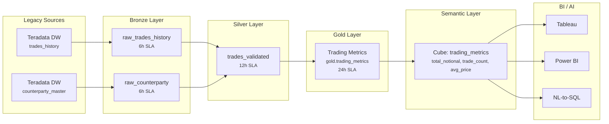

# Phase 8: Data Catalog and Glossary - Research

**Researched:** 2026-03-15
**Domain:** Business-facing data catalog HTML documentation (glossary, metrics, freshness SLAs, regulatory terms, lineage/relationship visualizations)
**Confidence:** HIGH

## Summary

Phase 8 produces business-facing data catalog HTML pages using the established Jinja2/YAML rendering pipeline from Phases 5-7. The primary challenge is extracting and presenting data from multiple existing sources -- glossary-seed.json, Cube YAML files, freshness_tracker.py, classification.py, lineage_stubs.py -- into a coherent set of HTML pages targeted at non-technical business users and compliance officers.

The codebase is exceptionally well-prepared for this phase. All infrastructure exists: Jinja2 environment setup (`_create_jinja_env()`), Mermaid-to-SVG rendering with fallback (`render_mermaid_to_svg()`, `_placeholder_svg()`), audience-tagged card index pages (`base_arch_index.html`), CSS-only collapsible sections (`macros/collapsible.html`), code block macros, and version-stamped footers. The CONTEXT.md decisions lock down a layered detail pattern (plain definition + expandable technical detail), multi-page organization by topic, traffic-light freshness badges, and Mermaid-based lineage diagrams.

**Primary recommendation:** Create a `base_catalog.html` template extending the project's CSS system with catalog-specific styles (traffic-light badges, term cards, domain grouping), add `render_catalog_docs()` and extraction functions (`extract_cube_metrics()`, `extract_freshness_slas()`, `extract_glossary_terms()`) to `render_html.py`, write YAML data files for glossary/regulatory/lineage content, and output 6-7 HTML pages under `docs/catalog/`.

<user_constraints>
## User Constraints (from CONTEXT.md)

### Locked Decisions
- Layered detail approach: one-line plain-language definition first, then expandable "Technical Detail" section with SQL/table references via CSS-only collapsible sections
- Metric definitions (total_notional, VaR, expected_shortfall) show human-readable formula by default with collapsible section revealing actual Cube SQL for analysts
- Medallion layer explanation uses light technical approach: Bronze/Silver/Gold with real table examples from the platform
- Regulatory terms (BCBS 239, PII, VaR, Expected Shortfall) paraphrase clearly with regulation name referenced but not quoted verbatim
- Terms grouped by business domain: Trading terms, Risk terms, Governance terms, Infrastructure terms
- Multi-page by topic: separate pages for glossary, metrics, regulatory, freshness, lineage -- each focused, with a catalog index page linking them
- Term-to-table mapping shown both ways: inline in each term definition AND a consolidated mapping table for quick reference
- Catalog index page uses audience-tagged cards consistent with Phase 7 developer docs index: "Business Users" (glossary, metrics, medallion), "Compliance" (regulatory, lineage), "Data Engineers" (freshness SLAs, term mapping)
- Lineage diagrams use Mermaid flowcharts rendered to SVG with graceful placeholder fallback -- same approach as Phase 6 architecture diagrams
- Term relationship graph shows domain clusters with cross-domain connections
- Per-domain focused lineage diagrams (~2-3) plus a simplified overview showing how domains connect at the Gold layer
- Diagram labels use both: friendly label as primary, table name in smaller text or tooltip
- Freshness SLA display uses dashboard-style traffic-light badges with color per layer
- SLA thresholds extracted from freshness_tracker.py's DEFAULT_SLAS at render time -- same pattern as extract_services()
- BCBS 239 compliance tracing shows full audit trail: term to Gold table to Silver source to Bronze ingestion
- OpenMetadata references included: each term shows "View in OpenMetadata: /glossary/term-name"

### Claude's Discretion
- Exact page file naming convention within `docs/catalog/`
- How to structure Jinja2 templates for catalog docs (new base_catalog.html vs extend base_developer.html)
- How to extract metric definitions from Cube YAML (parse YAML directly vs manual)
- How to extract freshness SLA thresholds from freshness_tracker.py (import vs AST parse)
- Section ordering within each individual page
- Exact number and scope of lineage diagrams per domain
- Mermaid diagram layout and styling choices

### Deferred Ideas (OUT OF SCOPE)
None -- discussion stayed within phase scope
</user_constraints>

<phase_requirements>
## Phase Requirements

| ID | Description | Research Support |
|----|-------------|-----------------|
| CAT-01 | Business glossary with plain-language definitions for all terms in glossary-seed.json | glossary-seed.json has 17 terms with descriptions, synonyms, relatedTerms, tags; transform to YAML data file grouped by domain |
| CAT-02 | Term-to-table mapping linking glossary terms to physical table locations in lakehouse.gold.* | Cube YAML measures have `meta.glossary_term` cross-references linking to glossary terms; lineage_stubs.py has Teradata/Snowflake source table definitions |
| CAT-03 | Medallion layer explanation for non-technical users (Bronze/Silver/Gold narrative) | glossary-seed.json has Bronze/Silver/Gold Layer terms with plain descriptions; render as standalone section on medallion page |
| CAT-04 | Data freshness SLA documentation with thresholds and RED/YELLOW/GREEN status definitions | freshness_tracker.py has DEFAULT_SLAS dict, FreshnessStatus enum, FreshnessSLA dataclass -- extract at render time |
| CAT-05 | Metric definitions with calculation logic pulled from Cube YAML measure definitions | trading_metrics.yml and risk_exposure.yml contain 8 measures total with SQL, type, description, meta.glossary_term |
| CAT-06 | Regulatory term definitions (BCBS 239, PII, VaR, Expected Shortfall) with compliance definitions | glossary-seed.json has BCBS 239, PII terms; VaR/ES are in risk measures; classification.py provides PII context |
| CAT-07 | Data lineage visualization showing end-to-end flow from source through Bronze-Silver-Gold to Cube to BI/AI per data domain | lineage_stubs.py defines Teradata (trades_history, positions_daily, counterparty_master) and Snowflake (risk_metrics, trading_summary) sources; Cube YAMLs define Gold table endpoints |
| CAT-08 | Glossary term relationship graph visualizing connections between related terms | glossary-seed.json relatedTerms field defines cross-term links; group by tags to create domain clusters |
</phase_requirements>

## Standard Stack

### Core
| Library | Version | Purpose | Why Standard |
|---------|---------|---------|--------------|
| Jinja2 | (already installed) | Template rendering for HTML pages | Established project pattern from Phase 5 |
| PyYAML | (already installed) | Parse YAML data files for glossary/catalog content | Established project pattern |
| Python ast module | stdlib | Parse freshness_tracker.py to extract DEFAULT_SLAS without importing PySpark deps | Established Phase 7 pattern (extract_package_api) |

### Supporting
| Library | Version | Purpose | When to Use |
|---------|---------|---------|-------------|
| json (stdlib) | stdlib | Parse glossary-seed.json | Loading OpenMetadata glossary seed |
| @mermaid-js/mermaid-cli | (already configured) | Render .mmd files to SVG | Lineage and relationship diagrams (CAT-07, CAT-08) |

### Alternatives Considered
| Instead of | Could Use | Tradeoff |
|------------|-----------|----------|
| AST parse of freshness_tracker.py | Direct import | Import pulls in logging/datetime but avoids PySpark; AST is safer and follows Phase 7 precedent |
| New base_catalog.html | Extend base_developer.html | base_developer.html has page_type branching but catalog needs distinct styling (traffic-light badges, term cards, domain sections); new template is cleaner |
| YAML data files for glossary | Parse glossary-seed.json directly | YAML allows restructuring into domain-grouped format with additional fields; glossary-seed.json is OpenMetadata-formatted, not doc-rendering-formatted |

**Recommendation for discretion areas:**

1. **Template approach:** Create a new `base_catalog.html` template. Rationale: catalog pages have fundamentally different CSS needs (traffic-light badges, term definition cards, domain-colored headers, inline mapping tables) that would over-complicate the already large base_developer.html (580 lines with 7 page_type branches). The new template reuses the same CSS reset, header/footer patterns, and color palette (#1a2332 navy, #c8a961 gold).

2. **Cube YAML extraction:** Parse YAML directly with `yaml.safe_load()`. Rationale: Cube YAML files are pure data (no Python to import), small (47 and 70 lines), and yaml is already a project dependency. Create `extract_cube_metrics()` function.

3. **Freshness SLA extraction:** Use AST parsing pattern from Phase 7. Rationale: `freshness_tracker.py` imports logging/datetime but the DEFAULT_SLAS dict is a module-level constant that can be safely extracted via `ast.parse()` and walking `ast.Call` nodes for FreshnessSLA constructor keyword arguments. This follows the established `extract_package_api()` precedent and avoids any runtime dependency issues.

4. **Page file naming:** Use descriptive kebab-case: `glossary.html`, `metrics.html`, `medallion.html`, `freshness-slas.html`, `regulatory.html`, `lineage.html`, `index.html`.

## Architecture Patterns

### Recommended Project Structure
```
docs/
  catalog/
    data/
      glossary.yml          # 17 terms grouped by domain (from glossary-seed.json)
      regulatory.yml        # BCBS 239, PII, compliance definitions
      medallion.yml         # Bronze/Silver/Gold narrative content
      lineage-paths.yml     # Known lineage paths for diagram content
    diagrams/
      trading-lineage.mmd   # Trading domain lineage (Teradata -> Bronze -> Silver -> Gold -> Cube)
      risk-lineage.mmd      # Risk domain lineage (Snowflake + Teradata -> Bronze -> Gold -> Cube)
      lineage-overview.mmd  # Simplified cross-domain overview at Gold layer
      term-relationships.mmd # Term relationship graph with domain clusters
    glossary.html           # (rendered output)
    metrics.html            # (rendered output)
    medallion.html          # (rendered output)
    freshness-slas.html     # (rendered output)
    regulatory.html         # (rendered output)
    lineage.html            # (rendered output)
    index.html              # (rendered output)
  templates/
    base_catalog.html       # New template for catalog pages
  render_html.py            # Extended with render_catalog_docs(), extraction functions
```

### Pattern 1: Extract-at-Render-Time
**What:** Source code and config files are parsed at render time to produce always-accurate documentation.
**When to use:** For freshness SLAs (from freshness_tracker.py) and metrics (from Cube YAML).
**Example:**
```python
# Source: established pattern from extract_services() in render_html.py
def extract_cube_metrics(
    cube_dir: Path | None = None,
) -> list[dict]:
    """Extract measure definitions from Cube YAML files.

    Returns list of dicts with keys: cube_name, sql_table, measure_name,
    measure_type, description, glossary_term, sql.
    """
    if cube_dir is None:
        cube_dir = PROJECT_ROOT / "semantic" / "model" / "cubes"

    metrics = []
    for yml_file in sorted(cube_dir.glob("*.yml")):
        data = yaml.safe_load(yml_file.read_text())
        for cube in data.get("cubes", []):
            for measure in cube.get("measures", []):
                metrics.append({
                    "cube_name": cube["name"],
                    "sql_table": cube.get("sql_table", ""),
                    "measure_name": measure["name"],
                    "measure_type": measure.get("type", ""),
                    "description": measure.get("description", "").strip(),
                    "glossary_term": measure.get("meta", {}).get("glossary_term", ""),
                    "sql": measure.get("sql", ""),
                })
    return metrics
```

### Pattern 2: AST-Based Constant Extraction
**What:** Parse Python source code with ast module to extract module-level constants without importing.
**When to use:** For extracting DEFAULT_SLAS from freshness_tracker.py.
**Example:**
```python
# Source: established pattern from extract_package_api() in render_html.py
def extract_freshness_slas(
    tracker_path: Path | None = None,
) -> dict[str, dict]:
    """Extract DEFAULT_SLAS from freshness_tracker.py using AST parsing.

    Returns dict mapping layer pattern (e.g., "gold.*") to SLA thresholds:
    {expected_hours, warning_hours, critical_hours}.
    """
    if tracker_path is None:
        tracker_path = PROJECT_ROOT / "etl" / "src" / "governance" / "freshness_tracker.py"

    source = tracker_path.read_text()
    tree = ast.parse(source)

    slas = {}
    for node in ast.iter_child_nodes(tree):
        if isinstance(node, ast.Assign):
            for target in node.targets:
                if isinstance(target, ast.Name) and target.id == "DEFAULT_SLAS":
                    # DEFAULT_SLAS is a dict with string keys and FreshnessSLA() calls
                    if isinstance(node.value, ast.Dict):
                        for key_node, val_node in zip(node.value.keys, node.value.values):
                            layer_key = ast.get_source_segment(source, key_node)
                            # Remove quotes from string literal
                            layer_key = layer_key.strip("'\"")
                            if isinstance(val_node, ast.Call):
                                kwargs = {}
                                for kw in val_node.keywords:
                                    # keyword values are numeric literals (floats)
                                    if isinstance(kw.value, ast.Constant):
                                        kwargs[kw.arg] = kw.value.value
                                slas[layer_key] = {
                                    "expected_hours": kwargs.get("expected_update_interval_hours", 0),
                                    "warning_hours": kwargs.get("warning_threshold_hours", 0),
                                    "critical_hours": kwargs.get("critical_threshold_hours", 0),
                                }
    return slas
```

### Pattern 3: Glossary-Seed Transformation
**What:** Transform OpenMetadata glossary-seed.json into domain-grouped YAML for rendering.
**When to use:** For the glossary.yml data file creation.
**Example:**
```python
def extract_glossary_terms(
    glossary_path: Path | None = None,
) -> dict[str, list[dict]]:
    """Load glossary-seed.json and group terms by business domain.

    Domain grouping is based on the 'tags' field:
    - Trading: tags containing 'trading'
    - Risk: tags containing 'risk'
    - Governance: tags containing 'governance', 'compliance', 'privacy'
    - Infrastructure: tags containing 'architecture', 'medallion', 'data-lake'
    """
    if glossary_path is None:
        glossary_path = PROJECT_ROOT / "infra" / "docker" / "openmetadata" / "glossary-seed.json"

    import json
    data = json.loads(glossary_path.read_text())

    domain_map = {
        "Trading": ["trading", "finance"],
        "Risk": ["risk"],
        "Governance": ["governance", "compliance", "privacy"],
        "Infrastructure": ["architecture", "medallion", "data-lake", "quality", "monitoring"],
    }

    grouped = {domain: [] for domain in domain_map}
    for term in data.get("terms", []):
        tags = set(term.get("tags", []))
        placed = False
        for domain, match_tags in domain_map.items():
            if tags & set(match_tags):
                grouped[domain].append(term)
                placed = True
                break
        if not placed:
            grouped.setdefault("Other", []).append(term)

    return grouped
```

### Pattern 4: Multi-Page Catalog Template with page_type Branching
**What:** A single base_catalog.html template with page_type conditionals for different catalog pages.
**When to use:** For all 6 catalog content pages.
**Rationale:** Follows the base_developer.html pattern but with catalog-specific CSS. page_type values: `glossary`, `metrics`, `medallion`, `freshness`, `regulatory`, `lineage`, `catalog-index`.

### Anti-Patterns to Avoid
- **Importing freshness_tracker.py at render time:** Creates dependency on PySpark/governance module initialization. Use AST extraction instead.
- **Building custom diagram rendering:** Mermaid CLI + placeholder fallback already works. Do not create a new SVG generation approach.
- **JavaScript-dependent features:** All interactivity must be CSS-only (`details/summary`). This is an explicit v1.1 out-of-scope constraint.
- **Separate templates per page:** Would duplicate CSS/footer/header. Use single template with page_type branching (established pattern).
- **Hard-coding SLA values:** Extract from freshness_tracker.py at render time so docs always match code (extract_services pattern).

## Don't Hand-Roll

| Problem | Don't Build | Use Instead | Why |
|---------|-------------|-------------|-----|
| Collapsible technical details | Custom CSS accordion | `macros/collapsible.html` details/summary macro | Already tested and styled consistently |
| Code blocks for SQL/formulas | Custom pre/code HTML | `macros/code_block.html` macro | Consistent syntax highlighting class |
| Mermaid diagram rendering | Custom SVG generation | `render_mermaid_to_svg()` + `_placeholder_svg()` | Graceful fallback, tested in Phase 6 |
| Audience-tagged cards for index | Custom card grid | base_arch_index.html card-grid pattern | Proven layout with hover effects and responsive breakpoints |
| Version-stamped footer | Custom footer HTML | Copy footer pattern from base_developer.html | Consistent branding across all doc pages |
| Term grouping/domain logic | Inline Python in templates | `extract_glossary_terms()` function in render_html.py | Keep logic in Python, data in templates |

**Key insight:** Phase 8 is an assembly task, not a creation task. Every visual component (collapsibles, cards, code blocks, diagrams, footers) already exists. The work is: (1) create extraction functions, (2) create data files, (3) create one template, (4) wire up rendering.

## Common Pitfalls

### Pitfall 1: AST Extraction of FreshnessSLA Dataclass Calls
**What goes wrong:** DEFAULT_SLAS values are `FreshnessSLA(...)` constructor calls, not plain dict literals. Standard approaches for evaluating literals do not work on Call nodes.
**Why it happens:** The pattern differs from simple dict/list constants.
**How to avoid:** Walk `ast.Call` nodes, extract keyword arguments individually. Each keyword value (the float threshold) IS a simple `ast.Constant` node with a `.value` attribute. Use `kw.value.value` to get the float directly.
**Warning signs:** `ValueError` from trying to evaluate the entire assignment value as a literal.

### Pitfall 2: Jinja2 dict.items() Method Collision
**What goes wrong:** Using a YAML key named `items` causes collision with Python dict's `.items()` method in Jinja2 templates.
**Why it happens:** Jinja2 resolves attribute access before key access. `data.items` calls the dict method instead of accessing the key.
**How to avoid:** Use `bullet_items` key name (established Phase 7 decision). Apply same principle to any key that shadows a dict method (keys, values, get, update, pop).
**Warning signs:** Template renders empty list or throws TypeError instead of showing content.

### Pitfall 3: Glossary Term Names as Identifiers
**What goes wrong:** glossary-seed.json term names like "BCBS 239" and "notional_value" use inconsistent casing/formatting. URL slugs and cross-references break.
**Why it happens:** OpenMetadata glossary terms use human-readable names, not slugs.
**How to avoid:** Normalize term names to kebab-case slugs for OpenMetadata links (`/glossary/bcbs-239`) and use a `slug` field in YAML data alongside the display `name`.
**Warning signs:** Broken OpenMetadata reference links, mismatched cross-references.

### Pitfall 4: Mermaid Diagram Complexity
**What goes wrong:** Mermaid diagrams with too many nodes/edges render as unreadable clutter or fail the mmdc renderer.
**Why it happens:** Lineage paths span 5+ layers (Source -> Bronze -> Silver -> Gold -> Cube -> BI).
**How to avoid:** Keep per-domain diagrams focused (3-5 horizontal layers, 2-4 nodes per layer). Use the overview diagram for cross-domain connections only. Limit to 2-3 per-domain diagrams.
**Warning signs:** SVG output exceeds viewport, text labels overlap, render timeout.

### Pitfall 5: Missing meta.glossary_term Cross-References
**What goes wrong:** Not all Cube measures may have `meta.glossary_term` defined. Term-to-table mapping has gaps.
**Why it happens:** Only 8 measures across 2 cubes have meta.glossary_term -- future cubes may not.
**How to avoid:** The extraction function should handle missing meta gracefully. The mapping table should show "N/A" for measures without glossary links. Currently all 8 measures DO have glossary_term, so this is a defensive measure.
**Warning signs:** KeyError on `meta.glossary_term` access, empty mapping table cells.

### Pitfall 6: OpenMetadata URL Format
**What goes wrong:** Generating incorrect OpenMetadata deep links.
**Why it happens:** OpenMetadata glossary URL format may differ from simple `/glossary/term-name`.
**How to avoid:** Use the pattern from docker-compose.yml: OpenMetadata server is at `localhost:8585`. Glossary terms are accessed via `http://localhost:8585/glossary/term/<slug>`. Keep URLs as informational references ("View in OpenMetadata") rather than guaranteed working links, since the static docs may be viewed offline.
**Warning signs:** 404 errors when clicking OpenMetadata links (acceptable for offline viewing).

## Code Examples

### Glossary YAML Data File Structure
```yaml
# docs/catalog/data/glossary.yml
# Source: transformed from infra/docker/openmetadata/glossary-seed.json
title: "Business Glossary"
subtitle: "Plain-language definitions for lakehouse data terms"
page_type: "glossary"
output_filename: "glossary.html"

domains:
  - name: "Trading"
    color: "#059669"
    terms:
      - name: "Trade"
        slug: "trade"
        definition: "A financial transaction involving buying or selling a security."
        technical_detail: "Raw trade data arrives in <code>bronze.raw_trades_history</code>, is cleaned in silver, and aggregated to <code>gold.trading_metrics</code>."
        synonyms: ["transaction", "deal", "execution"]
        related_terms: ["Position", "Counterparty", "Settlement"]
        table_mapping: "gold.trading_metrics"
        openmetadata_path: "/glossary/trade"
      # ... more terms

  - name: "Risk"
    color: "#dc2626"
    terms:
      # var_95, var_99, expected_shortfall, market_value, position_count

  - name: "Governance"
    color: "#7c3aed"
    terms:
      # BCBS 239, PII, SLA, Data Freshness

  - name: "Infrastructure"
    color: "#2563eb"
    terms:
      # Bronze Layer, Silver Layer, Gold Layer

# Consolidated term-to-table mapping (CAT-02 quick reference)
term_table_mapping:
  - term: "Trade"
    tables: ["bronze.raw_trades_history", "silver.trades_validated", "gold.trading_metrics"]
  - term: "notional_value"
    tables: ["gold.trading_metrics"]
    cube_measure: "total_notional"
```

### Traffic-Light Badge CSS
```css
/* Source: design decision from CONTEXT.md -- dashboard-style traffic-light badges */
.freshness-badge {
  display: inline-flex;
  align-items: center;
  padding: 0.3rem 0.8rem;
  border-radius: 20px;
  font-weight: 600;
  font-size: 0.85rem;
  letter-spacing: 0.02em;
}
.badge-green { background: #dcfce7; color: #166534; border: 1px solid #86efac; }
.badge-yellow { background: #fef9c3; color: #854d0e; border: 1px solid #fde047; }
.badge-red { background: #fecaca; color: #991b1b; border: 1px solid #fca5a5; }

.sla-card {
  border: 1px solid #e2e8f0;
  border-radius: 8px;
  padding: 1.25rem;
  margin-bottom: 1rem;
}
.sla-card .layer-name {
  font-size: 1.1rem;
  font-weight: 700;
  color: #1a2332;
}
.sla-thresholds {
  display: flex;
  gap: 1rem;
  margin-top: 0.75rem;
  flex-wrap: wrap;
}
.threshold-item {
  display: flex;
  flex-direction: column;
  align-items: center;
  min-width: 100px;
}
```

### Mermaid Lineage Diagram (Trading Domain)


### render_catalog_docs() Function Signature
```python
# Source: follows render_developer_docs() pattern in render_html.py
CATALOG_DATA_DIR = PROJECT_ROOT / "docs" / "catalog" / "data"
CATALOG_DIAGRAM_DIR = PROJECT_ROOT / "docs" / "catalog" / "diagrams"
CATALOG_OUTPUT_DIR = PROJECT_ROOT / "docs" / "catalog"

def render_catalog_docs(
    data_dir: Path | None = None,
    diagram_dir: Path | None = None,
    template_dir: Path | None = None,
    output_dir: Path | None = None,
    compose_path: Path | str | None = None,
) -> list[Path]:
    """Render all catalog documentation pages from YAML data + Jinja2 templates.

    Iterates YAML files in data_dir, renders each through base_catalog.html
    template, and writes standalone HTML to output_dir. Injects extracted
    Cube metrics, freshness SLAs, and glossary terms at render time.

    Args:
        data_dir: Directory containing catalog docs YAML data files.
        diagram_dir: Directory containing .mmd Mermaid source files.
        template_dir: Directory containing Jinja2 templates.
        output_dir: Directory for rendered HTML output.
        compose_path: Path to docker-compose.yml for version extraction.

    Returns:
        List of Paths to rendered HTML files.
    """
```

### Data Inventory: What Exists and Where

**glossary-seed.json** (17 terms):
- Trading domain: Trade, notional_value, trade_count, average_price
- Risk domain: Position, market_value, var_95, var_99, expected_shortfall, position_count
- Governance domain: PII, BCBS 239, SLA, Data Freshness, Business Unit
- Infrastructure domain: Bronze Layer, Silver Layer, Gold Layer

**Cube YAML measures** (8 total):
- trading_metrics.yml (3): total_notional, trade_count, avg_price -> gold.trading_metrics
- risk_exposure.yml (5): total_market_value, total_var_95, total_var_99, total_expected_shortfall, position_count -> gold.risk_exposure

**Freshness SLAs** (3 layers):
- gold.*: expected=24h, warning=26h, critical=48h
- silver.*: expected=12h, warning=14h, critical=24h
- bronze.*: expected=6h, warning=8h, critical=12h

**Legacy sources** (5 tables):
- Teradata: trades_history, positions_daily, counterparty_master
- Snowflake: risk_metrics, trading_summary

**OpenMetadata**: server v1.6.0 at localhost:8585

## State of the Art

| Old Approach | Current Approach | When Changed | Impact |
|--------------|------------------|--------------|--------|
| Hard-coded docs content | YAML data files + Jinja2 rendering | Phase 5 (2026-03-14) | All content in structured data, templates handle presentation |
| Import Python modules for doc extraction | AST parsing (no runtime imports) | Phase 7 (2026-03-14) | Avoids PySpark dependency, safer extraction |
| Monolithic single-page docs | Multi-page topic-focused docs with index | Phase 7 (2026-03-14) | Better navigation, audience-specific pages |
| Single template file | page_type branching in shared template | Phase 7 (2026-03-14) | One template serves multiple page layouts |

**Nothing deprecated/outdated in the current stack.** All Phase 5-7 patterns are current and should be followed.

## Validation Architecture

### Test Framework
| Property | Value |
|----------|-------|
| Framework | pytest (already configured) |
| Config file | etl/pyproject.toml |
| Quick run command | `cd /home/azureuser/lakehouse && python -m pytest etl/tests/test_html_render.py -x -q --tb=short` |
| Full suite command | `cd /home/azureuser/lakehouse && python -m pytest etl/tests/test_html_render.py -q --tb=short` |

### Phase Requirements to Test Map
| Req ID | Behavior | Test Type | Automated Command | File Exists? |
|--------|----------|-----------|-------------------|-------------|
| CAT-01 | Glossary page renders with all 17 terms, grouped by domain, with plain-language definitions | unit | `python -m pytest etl/tests/test_html_render.py::test_catalog_glossary -x` | Wave 0 |
| CAT-02 | Term-to-table mapping appears inline in terms AND as consolidated mapping table | unit | `python -m pytest etl/tests/test_html_render.py::test_catalog_term_mapping -x` | Wave 0 |
| CAT-03 | Medallion layer explanation page renders with Bronze/Silver/Gold narrative and real table examples | unit | `python -m pytest etl/tests/test_html_render.py::test_catalog_medallion -x` | Wave 0 |
| CAT-04 | Freshness SLA page shows traffic-light badges with thresholds extracted from freshness_tracker.py | unit | `python -m pytest etl/tests/test_html_render.py::test_catalog_freshness_slas -x` | Wave 0 |
| CAT-05 | Metrics page shows Cube measure definitions with SQL formulas in collapsible sections | unit | `python -m pytest etl/tests/test_html_render.py::test_catalog_metrics -x` | Wave 0 |
| CAT-06 | Regulatory page has BCBS 239, PII, VaR, Expected Shortfall definitions with compliance framing | unit | `python -m pytest etl/tests/test_html_render.py::test_catalog_regulatory -x` | Wave 0 |
| CAT-07 | Lineage page renders Mermaid SVG diagrams showing source-to-consumer flow per domain | unit | `python -m pytest etl/tests/test_html_render.py::test_catalog_lineage -x` | Wave 0 |
| CAT-08 | Term relationship graph renders domain clusters with cross-domain connections | unit | `python -m pytest etl/tests/test_html_render.py::test_catalog_term_relationships -x` | Wave 0 |

### Sampling Rate
- **Per task commit:** `python -m pytest etl/tests/test_html_render.py -x -q --tb=short`
- **Per wave merge:** `python -m pytest etl/tests/test_html_render.py -q --tb=short`
- **Phase gate:** Full suite green before `/gsd:verify-work`

### Wave 0 Gaps
- [ ] `etl/tests/test_html_render.py` -- needs catalog test functions (test_catalog_glossary, test_catalog_term_mapping, test_catalog_medallion, test_catalog_freshness_slas, test_catalog_metrics, test_catalog_regulatory, test_catalog_lineage, test_catalog_term_relationships, test_catalog_index)
- [ ] Test fixtures for catalog rendering (SAMPLE_GLOSSARY_YAML, SAMPLE_METRICS_YAML, etc.)
- [ ] Test for extract_cube_metrics() function
- [ ] Test for extract_freshness_slas() function
- [ ] Test for extract_glossary_terms() function
- [ ] Real-data fixture rendering all catalog pages (similar to `rendered_developer_pages` fixture)

## Open Questions

1. **OpenMetadata glossary URL format**
   - What we know: Server at `localhost:8585`, glossary terms exist in glossary-seed.json
   - What's unclear: Exact URL path for deep-linking to individual glossary terms in OpenMetadata UI
   - Recommendation: Use `http://localhost:8585/glossary` as base URL. Show as informational reference, not guaranteed link (may be offline). Format: `http://localhost:8585/glossary/term/<term-slug>`

2. **Lineage path accuracy for Silver layer**
   - What we know: lineage_stubs.py defines Bronze source tables; Cube YAML defines Gold tables; Bronze to Gold path is clear
   - What's unclear: Exact Silver table names between Bronze and Gold (e.g., `silver.trades_validated` is inferred, not explicitly defined)
   - Recommendation: Use logical Silver table names that follow the project's naming convention (`silver.<entity>_<quality_stage>`). These are documentation artifacts, not schema definitions.

## Sources

### Primary (HIGH confidence)
- `/home/azureuser/lakehouse/docs/render_html.py` -- existing render pipeline with established patterns (extract_services, render_developer_docs, AST extraction)
- `/home/azureuser/lakehouse/infra/docker/openmetadata/glossary-seed.json` -- 17 glossary terms with descriptions, synonyms, relatedTerms, tags
- `/home/azureuser/lakehouse/semantic/model/cubes/trading_metrics.yml` -- 3 measures (total_notional, trade_count, avg_price) with meta.glossary_term
- `/home/azureuser/lakehouse/semantic/model/cubes/risk_exposure.yml` -- 5 measures (total_market_value, total_var_95, total_var_99, total_expected_shortfall, position_count) with meta.glossary_term
- `/home/azureuser/lakehouse/etl/src/governance/freshness_tracker.py` -- DEFAULT_SLAS dict with FreshnessSLA dataclass (gold: 24/26/48h, silver: 12/14/24h, bronze: 6/8/12h), FreshnessStatus enum (GREEN/YELLOW/RED)
- `/home/azureuser/lakehouse/etl/src/governance/classification.py` -- SensitivityLevel enum (PUBLIC/INTERNAL/CONFIDENTIAL/RESTRICTED), CLASSIFICATION_RULES for PII context
- `/home/azureuser/lakehouse/etl/src/governance/lineage_stubs.py` -- Teradata sources (trades_history, positions_daily, counterparty_master) and Snowflake sources (risk_metrics, trading_summary)
- `/home/azureuser/lakehouse/docs/templates/base_developer.html` -- template pattern with page_type branching, CSS palette, footer
- `/home/azureuser/lakehouse/docs/templates/base_arch_index.html` -- audience-tagged card grid pattern
- `/home/azureuser/lakehouse/docs/templates/macros/collapsible.html` -- CSS-only details/summary macro
- `/home/azureuser/lakehouse/docs/templates/macros/code_block.html` -- code block rendering macro
- `/home/azureuser/lakehouse/etl/tests/test_html_render.py` -- 1095-line test file with established patterns for HTML render testing
- `/home/azureuser/lakehouse/docker-compose.yml` -- OpenMetadata server at localhost:8585, version 1.6.0

### Secondary (MEDIUM confidence)
- Phase 8 CONTEXT.md decisions -- locked design choices verified against codebase capabilities
- ROADMAP.md Phase 8 plan breakdown -- 2 plans mapped to requirement groups

### Tertiary (LOW confidence)
- OpenMetadata glossary URL format -- inferred from API conventions, not verified against running instance
- Silver layer table names -- inferred from naming convention, not from schema definitions

## Metadata

**Confidence breakdown:**
- Standard stack: HIGH - all libraries already in use, no new dependencies
- Architecture: HIGH - follows established Phase 5-7 patterns exactly
- Pitfalls: HIGH - based on direct code analysis of actual source files
- Extraction patterns: HIGH - AST parsing and YAML loading are proven project patterns
- OpenMetadata URL format: LOW - inferred, not verified against running instance

**Research date:** 2026-03-15
**Valid until:** 2026-04-15 (stable -- all source files are project-internal, no external API changes)
