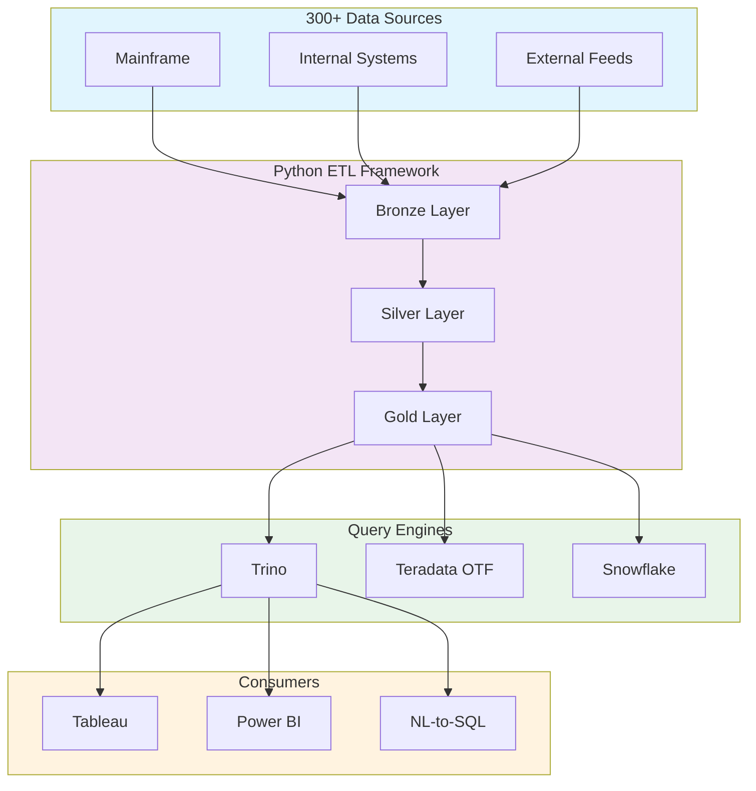

# Architecture Research: Documentation Deliverables Integration

**Domain:** Documentation build system for an enterprise data platform mono-repo
**Researched:** 2026-03-14
**Confidence:** HIGH (tools are mature, patterns well-established; this is solved-problem territory)

## System Overview

The documentation system produces seven categories of deliverables from source material already in the repo (Markdown SWOT files, Python docstrings, Jinja2 templates, diagram-as-code definitions, OpenMetadata API). All output is static HTML, committed to the repo or published via CI/CD.

```
+----------------------------------------------------------------------+
|                     DOCUMENTATION CONSUMERS                          |
|                                                                      |
|  +----------+  +-----------+  +----------+  +-------------------+    |
|  |Leadership|  |Data Eng   |  |New Hires |  |Business Users     |    |
|  |(SWOTs,   |  |(API ref,  |  |(Onboard  |  |(Data catalog,     |    |
|  | arch viz)|  | patterns) |  | guide)   |  | glossary)         |    |
|  +----+-----+  +-----+-----+  +----+-----+  +---------+---------+   |
+-------+--------------+-------------+--------------------+-----------+
        |              |             |                    |
+-------+--------------+-------------+--------------------+-----------+
|                  PRESENTATION LAYER (Static HTML)                    |
|                                                                      |
|  +----------+  +-----------+  +----------------------------------+   |
|  |Standalone|  |MkDocs     |  |OpenMetadata UI                   |   |
|  |HTML pages|  |Material   |  |(glossary, catalog, lineage)      |   |
|  |(SWOTs,   |  |site       |  |                                  |   |
|  | arch viz)|  |(dev docs) |  |                                  |   |
|  +----+-----+  +-----+-----+  +----------------------------------+   |
+-------+--------------+----------------------------------------------+
        |              |
+-------+--------------+----------------------------------------------+
|                    BUILD LAYER                                        |
|                                                                      |
|  +-----------+  +----------+  +----------+  +--------------------+   |
|  |Jinja2     |  |MkDocs +  |  |Mermaid   |  |OpenMetadata        |   |
|  |+ Python   |  |mkdocstr- |  |CLI       |  |Python SDK          |   |
|  |render     |  |ings      |  |(mmdc)    |  |(glossary export)   |   |
|  |scripts    |  |          |  |          |  |                    |   |
|  +-----+-----+  +----+-----+  +----+-----+  +----------+---------+  |
+--------+-------------+-----------+----------------------+-----------+
         |             |           |                      |
+--------+-------------+-----------+----------------------+-----------+
|                    SOURCE LAYER                                      |
|                                                                      |
|  +-----------+  +----------+  +----------+  +--------------------+   |
|  |docs/swot/ |  |etl/src/  |  |docs/arch/|  |OpenMetadata        |   |
|  |*.md       |  |**/*.py   |  |*.mmd     |  |server API          |   |
|  |(Markdown  |  |(Python   |  |(Mermaid  |  |(glossary,          |   |
|  | content)  |  | modules) |  | diagrams)|  | table metadata)    |   |
|  +-----------+  +----------+  +----------+  +--------------------+   |
|                                                                      |
|  +-----------+  +----------+  +----------+                           |
|  |docs/      |  |semantic/ |  |infra/    |                           |
|  |*.md       |  |model/    |  |docker/   |                           |
|  |(guides,   |  |(Cube     |  |(compose, |                           |
|  | contrib)  |  | YAML)    |  | configs) |                           |
|  +-----------+  +----------+  +----------+                           |
+----------------------------------------------------------------------+
        ^
        |
+-------+--------------------------------------------------------------+
|                    CI/CD LAYER (GitHub Actions)                       |
|                                                                      |
|  +------------------------------------------------------------+     |
|  | docs.yml workflow                                           |     |
|  | Trigger: push to main (docs/** or etl/src/**)               |     |
|  | Steps: render SWOTs -> build MkDocs -> export glossary ->   |     |
|  |        generate diagrams -> upload artifact                 |     |
|  +------------------------------------------------------------+     |
+----------------------------------------------------------------------+
```

### Component Responsibilities

| Component | Responsibility | New or Modified | Talks To |
|-----------|---------------|-----------------|----------|
| **Jinja2 render scripts** | Convert SWOT Markdown + HTML template into standalone HTML pages | NEW | Reads `docs/swot/*.md`, writes `docs/_build/swot/*.html` |
| **MkDocs + Material** | Build developer documentation site from Markdown + Python docstrings | NEW | Reads `docs/`, `etl/src/`, writes `docs/_build/site/` |
| **mkdocstrings** | Auto-generate API reference from Python docstrings in `etl/src/` | NEW (MkDocs plugin) | Reads `etl/src/**/*.py` |
| **Mermaid CLI (mmdc)** | Render `.mmd` diagram files to SVG for embedding in HTML | NEW | Reads `docs/architecture/*.mmd`, writes SVGs |
| **Python diagrams lib** | Generate cloud architecture diagrams from Python code | NEW | Reads `docs/architecture/*.py`, writes PNGs |
| **OpenMetadata SDK** | Export glossary terms and table metadata for static doc pages | NEW (script) | Calls OpenMetadata REST API, writes JSON/Markdown |
| **GitHub Actions docs.yml** | Build and publish all documentation on merge to main | NEW (workflow) | Triggers Jinja2, MkDocs, Mermaid builds |
| **docs/ directory** | Source content for all documentation deliverables | MODIFIED (restructured) | Read by all build tools |
| **etl/pyproject.toml** | Add `docs` optional dependency group | MODIFIED (add dep group) | Used by pip/hatch |

---

## Recommended Project Structure

The `docs/` directory is restructured to separate source content, build configuration, templates, and output. Everything outside `docs/_build/` is committed to git. The `_build/` directory is gitignored and produced by CI/CD.

```
docs/
|-- mkdocs.yml                     # MkDocs configuration (site entry point)
|-- swot/                          # SWOT analysis source content (Markdown)
|   |-- iceberg-catalog.md
|   |-- snowflake-strategy.md
|   |-- datastage-migration.md
|   |-- data-model-strategy.md
|   |-- bi-semantic-layer.md
|   |-- ai-semantic-layer.md
|   +-- _template.html             # Jinja2 HTML template for SWOT pages
|-- architecture/                  # Architecture diagram sources
|   |-- marketecture.mmd           # Mermaid: exec-friendly overview
|   |-- detailed-architecture.mmd  # Mermaid: verbose component diagram
|   |-- data-flow.mmd              # Mermaid: medallion data flow
|   |-- cloud-infra.py             # Python diagrams: cloud infrastructure
|   +-- _template.html             # Jinja2 HTML template for arch pages
|-- guides/                        # Developer documentation (Markdown)
|   |-- index.md                   # Documentation home page
|   |-- getting-started.md         # Environment setup, first pipeline
|   |-- repo-structure.md          # Mono-repo layout explanation
|   |-- pipeline-authoring.md      # How to write a new ETL pipeline
|   |-- testing.md                 # Unit + integration test patterns
|   +-- contributing.md            # PR process, code standards
|-- reference/                     # API reference (auto-generated markers)
|   |-- index.md                   # API reference overview
|   |-- pipelines.md               # ::: src.pipelines (mkdocstrings)
|   |-- quality.md                 # ::: src.quality
|   |-- governance.md              # ::: src.governance
|   |-- iceberg-utils.md           # ::: src.iceberg_utils
|   |-- inventory.md               # ::: src.inventory
|   +-- semantic.md                # ::: src.semantic
|-- catalog/                       # Data catalog documentation
|   |-- glossary.md                # Business glossary (from OpenMetadata)
|   +-- data-dictionary.md         # Table/column reference
|-- adr/                           # Architecture Decision Records (existing)
|   +-- 001-teradata-otf-nessie-feasibility.md
|-- benchmarks/                    # Benchmark reports (existing)
|   +-- benchmark_template.md
|-- etl-patterns.md                # ETL patterns reference (existing)
|-- _scripts/                      # Build scripts (not published)
|   |-- render_swots.py            # Jinja2 SWOT renderer
|   |-- render_architecture.py     # Architecture page renderer
|   |-- export_glossary.py         # OpenMetadata glossary exporter
|   +-- generate_diagrams.py       # Mermaid + Python diagrams runner
|-- _static/                       # Shared static assets for HTML pages
|   |-- style.css                  # Shared CSS for standalone HTML
|   +-- logo.svg                   # Company/project logo
|-- _build/                        # BUILD OUTPUT (gitignored)
|   |-- swot/                      # Standalone SWOT HTML pages
|   |-- architecture/              # Standalone architecture HTML pages
|   +-- site/                      # MkDocs-generated site
+-- overrides/                     # MkDocs Material theme overrides
    +-- main.html                  # Custom header/footer
```

### Structure Rationale

- **`swot/` with `_template.html`:** SWOT content stays in Markdown for easy editing by architects. The Jinja2 template converts to polished standalone HTML. Analysts and leadership receive the HTML files directly -- no static site deployment needed.
- **`architecture/` with `.mmd` files:** Mermaid diagram-as-code files are version-controlled, diffable, and renderable in GitHub Markdown preview. The build step produces high-quality SVGs for the standalone HTML pages.
- **`guides/` as MkDocs content:** Developer docs live as standard Markdown consumed by MkDocs Material. Proximity to the code they document (same repo) keeps them current.
- **`reference/` with mkdocstrings markers:** API reference pages contain only `:::` directives that mkdocstrings expands from actual Python docstrings. Zero manual duplication -- if code changes, docs update on next build.
- **`catalog/` from OpenMetadata:** Business glossary is exported from the live OpenMetadata instance and committed as Markdown. This bridges the gap between the catalog UI (for interactive use) and static documentation (for distribution).
- **`_scripts/` for build logic:** Build scripts are co-located with docs but prefixed with `_` to signal they are not published content. Each script is single-purpose and testable.
- **`_build/` gitignored:** Build artifacts are never committed. CI/CD produces them fresh on every merge. Avoids stale output and merge conflicts on generated files.

---

## Architectural Patterns

### Pattern 1: Docs-as-Code (Core Pattern)

**What:** Documentation is treated like application code -- version-controlled, reviewed via PR, linted, built by CI/CD, and deployed automatically.

**When to use:** Always, for every documentation deliverable in this project.

**How it works in this repo:**
1. Author writes/edits Markdown in `docs/` or Python docstrings in `etl/src/`
2. PR triggers CI lint checks (markdownlint, link validation)
3. Reviewer approves content alongside any related code changes
4. Merge to `main` triggers `docs.yml` workflow
5. Workflow builds all deliverables, uploads artifacts, optionally deploys to GitHub Pages

**Trade-offs:**
- PRO: Docs and code change in the same PR -- impossible for docs to drift
- PRO: PR review catches errors before publication
- PRO: Full git history for every documentation change (audit-friendly)
- CON: Authors must know Markdown and git (acceptable for a 40-engineer team)
- CON: Rendered output is only visible after CI build (mitigated by MkDocs local preview)

### Pattern 2: Two-Track Output (Standalone HTML + Static Site)

**What:** The doc system produces two distinct output types: standalone HTML files (self-contained, emailable, no server required) and a static documentation site (navigable, searchable, deployed).

**When to use:** When different audiences have different delivery requirements. Leadership receives SWOTs as standalone HTML attachments. Engineers browse the MkDocs site.

**Standalone HTML pipeline:**
```
docs/swot/*.md  -->  render_swots.py (Jinja2)  -->  docs/_build/swot/*.html
docs/architecture/*.mmd  -->  render_architecture.py  -->  docs/_build/architecture/*.html
```

**Static site pipeline:**
```
docs/**/*.md + etl/src/**/*.py  -->  mkdocs build  -->  docs/_build/site/
```

**Trade-offs:**
- PRO: Leadership gets polished, self-contained HTML they can open in any browser or attach to emails
- PRO: Engineers get a searchable, navigable documentation site with API reference
- CON: Two build pipelines to maintain (mitigated by a single `docs.yml` workflow)
- CON: Standalone HTML must inline CSS/JS (no external dependencies) -- slightly larger file sizes

### Pattern 3: API Docs from Docstrings (Single Source of Truth)

**What:** Python API reference documentation is generated automatically from docstrings using mkdocstrings. No manual API docs are written.

**When to use:** For all public Python modules in `etl/src/`.

**How it works:**
```markdown
<!-- docs/reference/pipelines.md -->
# Pipeline Framework

::: src.pipelines.base
    options:
      show_source: true
      members_order: source
```

mkdocstrings reads the Python source, parses Google-style docstrings, and renders them as formatted HTML with type annotations, parameter tables, and source code links.

**Trade-offs:**
- PRO: Zero duplication -- docstrings ARE the documentation
- PRO: Stale docs are impossible if docstrings are maintained
- PRO: Encourages better docstring discipline across the team
- CON: Requires that Python modules have good docstrings (they should anyway)
- CON: mkdocstrings must be able to import modules (need dependency installation in CI)

### Pattern 4: Diagram-as-Code with Mermaid

**What:** Architecture diagrams are written as Mermaid `.mmd` text files, version-controlled, and rendered to SVG during the build.

**When to use:** For all architecture diagrams (marketecture, detailed architecture, data flows).

**Example (marketecture.mmd):**


**Build command:**
```bash
npx -p @mermaid-js/mermaid-cli mmdc -i docs/architecture/marketecture.mmd -o docs/_build/architecture/marketecture.svg -t neutral -b transparent
```

**Trade-offs:**
- PRO: Diagrams are diffable text files with full git history
- PRO: Engineers can update diagrams without design tools
- PRO: GitHub renders Mermaid natively in Markdown preview
- PRO: Consistent styling via Mermaid theme configuration
- CON: Complex diagrams can be harder to lay out than in a visual tool
- CON: Mermaid CLI requires Node.js in the CI environment

**Why Mermaid over alternatives:**
- **vs Python `diagrams` library (mingrammer):** Mermaid is better for flowcharts, data flows, and architecture overviews. `diagrams` is better for cloud infrastructure diagrams with vendor icons. Use both -- Mermaid for conceptual diagrams, `diagrams` for the cloud infrastructure view.
- **vs D2:** D2 produces more aesthetic output with the ELK layout engine, but Mermaid has native GitHub rendering, better tooling support, and wider community adoption. Pragmatic choice.
- **vs manual image files:** No version control on the diagram content. Cannot diff. Goes stale. Unacceptable for a docs-as-code approach.

---

## Data Flow

### Documentation Build Flow

```
[Author edits docs/ or etl/src/ docstrings]
    |
    | git push (PR)
    v
[CI: Lint checks]
    |-- markdownlint on docs/**/*.md
    |-- ruff check on docs/_scripts/*.py
    +-- link validation (mkdocs build --strict)
    |
    | PR merge to main
    v
[CI: docs.yml workflow]
    |
    +---> [Step 1: Render SWOT HTML]
    |       docs/swot/*.md + _template.html
    |       --> render_swots.py (Jinja2)
    |       --> docs/_build/swot/*.html
    |
    +---> [Step 2: Generate Diagrams]
    |       docs/architecture/*.mmd --> mmdc --> SVGs
    |       docs/architecture/*.py  --> diagrams --> PNGs
    |       --> docs/_build/architecture/
    |
    +---> [Step 3: Render Architecture HTML]
    |       SVGs + _template.html
    |       --> render_architecture.py
    |       --> docs/_build/architecture/*.html
    |
    +---> [Step 4: Export Glossary] (optional, requires OM running)
    |       OpenMetadata API --> export_glossary.py --> docs/catalog/glossary.md
    |
    +---> [Step 5: Build MkDocs Site]
    |       mkdocs build
    |       --> docs/_build/site/
    |
    v
[Upload artifact / Deploy to GitHub Pages]
```

### SWOT Rendering Data Flow (Detail)

```
docs/swot/iceberg-catalog.md          # Markdown with YAML front matter
         |                             # ---
         |                             # title: Iceberg Catalog Choice
         |                             # date: 2026-03-13
         |                             # status: Recommended
         |                             # ---
         |                             # ## Executive Summary ...
         v
docs/_scripts/render_swots.py         # Python script
         |
         |  1. Parse YAML front matter (title, date, status, recommendation)
         |  2. Convert Markdown body to HTML (markdown lib with tables ext)
         |  3. Render docs/swot/_template.html with Jinja2
         |  4. Inline CSS from docs/_static/style.css
         |
         v
docs/_build/swot/iceberg-catalog.html  # Self-contained HTML file
                                        # - No external CSS/JS dependencies
                                        # - Professional styling
                                        # - Print-friendly layout
                                        # - Emailable as attachment
```

### API Reference Data Flow (Detail)

```
etl/src/pipelines/base.py            # Python source with docstrings
         |                            # class BasePipeline:
         |                            #     """Pipeline base class.
         |                            #
         |                            #     Args:
         |                            #         spark: SparkSession instance
         |                            #         config: PipelineConfig
         |                            #     """
         v
docs/reference/pipelines.md           # mkdocstrings directive
         |                            # ::: src.pipelines.base
         |                            #     options:
         |                            #       show_source: true
         v
mkdocs build (with mkdocstrings)      # Parses Python AST via Griffe
         |                            # Extracts docstrings, type hints,
         |                            # signatures, class hierarchy
         v
docs/_build/site/reference/           # Rendered HTML with:
  pipelines/index.html                # - Class documentation
                                      # - Method signatures
                                      # - Parameter tables
                                      # - Source code toggle
                                      # - Cross-references
```

---

## Integration Points

### New Components

| Component | Type | Dependencies | Estimated Effort |
|-----------|------|-------------|-----------------|
| `docs/_scripts/render_swots.py` | Python script (~100 LOC) | jinja2, markdown, pyyaml | 2-4 hours |
| `docs/_scripts/render_architecture.py` | Python script (~80 LOC) | jinja2 | 2-3 hours |
| `docs/_scripts/export_glossary.py` | Python script (~120 LOC) | openmetadata-ingestion SDK, requests | 4-6 hours |
| `docs/_scripts/generate_diagrams.py` | Python script (~60 LOC) | subprocess (calls mmdc), diagrams | 2-3 hours |
| `docs/swot/_template.html` | Jinja2 HTML template | None (pure HTML/CSS) | 3-5 hours (design) |
| `docs/architecture/_template.html` | Jinja2 HTML template | None (pure HTML/CSS) | 3-5 hours (design) |
| `docs/mkdocs.yml` | MkDocs configuration | mkdocs-material, mkdocstrings | 1-2 hours |
| `.github/workflows/docs.yml` | GitHub Actions workflow | All of the above | 2-3 hours |
| 6x SWOT Markdown files | Content (Markdown) | Domain expertise | 8-16 hours each |
| 3x Mermaid diagram files | Content (.mmd) | Architecture knowledge | 4-8 hours each |
| Developer guide pages | Content (Markdown) | Codebase knowledge | 4-8 hours each |

### Modified Components

| Component | What Changes | Why |
|-----------|-------------|-----|
| `etl/pyproject.toml` | Add `[project.optional-dependencies.docs]` group with mkdocs, mkdocstrings, jinja2, markdown, diagrams | Build tools for documentation |
| `.gitignore` | Add `docs/_build/` | Exclude generated output |
| `.github/workflows/ci.yml` | Add `docs-lint` job (markdownlint, link check) | Catch doc errors in PR |
| `docs/` directory | Restructure from flat to organized hierarchy | Support new deliverable types |
| `etl/src/**/*.py` | Add/improve Google-style docstrings | Enable mkdocstrings API reference |

### External Service Integration

| Service | Integration Pattern | Notes |
|---------|---------------------|-------|
| **OpenMetadata** (port 8585) | REST API call from `export_glossary.py` | Exports business glossary terms and table descriptions to Markdown. Requires OM to be running (dev or staging). Script fails gracefully if OM is unavailable -- cached export in git is the fallback. |
| **GitHub Pages** (optional) | `mkdocs gh-deploy` or `actions/deploy-pages` | For hosting the MkDocs site. Not required -- standalone HTML files are the primary deliverable for this milestone. |
| **GitHub Actions** | New `docs.yml` workflow | Triggered on push to `main` when `docs/**` or `etl/src/**` files change. Uses path filters to avoid unnecessary builds. |

### Internal Boundaries

| Boundary | Communication | Notes |
|----------|---------------|-------|
| SWOT content <-> SWOT renderer | File system (Markdown read, HTML write) | Loose coupling. Renderer reads any `.md` in `docs/swot/` with valid front matter. |
| Python source <-> mkdocstrings | Python import + AST parsing | mkdocstrings imports modules via Griffe. Requires `pip install -e .` in CI for import resolution. |
| Mermaid source <-> Mermaid CLI | File system (`.mmd` read, `.svg` write) | mmdc is a Node.js tool. CI needs `npx` or pre-installed `@mermaid-js/mermaid-cli`. |
| OpenMetadata <-> glossary export | HTTP REST API | Optional dependency. Script caches last export in git. Fresh export happens only when OM is reachable. |
| Build output <-> GitHub Actions artifact | `actions/upload-artifact` | Standalone HTML files are uploaded as downloadable CI artifacts. Reviewers can download and preview. |

---

## Scaling Considerations

| Scale | Architecture Adjustments |
|-------|--------------------------|
| Current (6 SWOTs, ~47 Python modules) | Single workflow, sequential build steps. Total build time < 2 minutes. No optimization needed. |
| 20+ doc pages, 100+ Python modules | Enable MkDocs navigation sections. Consider splitting `mkdocs.yml` into nav includes. Build time still < 5 minutes. |
| Team-wide adoption (40 engineers contributing docs) | Add CODEOWNERS for `docs/` directory. Enable branch deploy previews (Netlify or Vercel) for PR previews of doc changes. |

### Scaling Priorities

1. **First bottleneck: Docstring quality across 47 modules.** The API reference is only as good as the docstrings. Prioritize `etl/src/pipelines/` and `etl/src/quality/` (most-used modules) for docstring improvement. Add a `darglint` or `pydocstyle` lint step to enforce docstring presence.

2. **Second bottleneck: Diagram maintenance.** As the architecture evolves, Mermaid diagrams must be updated. The risk is stale diagrams. Mitigation: link each diagram to an ADR or design doc that triggers updates when decisions change.

---

## Anti-Patterns

### Anti-Pattern 1: Committing Generated HTML to Git

**What people do:** Run the build locally and commit `docs/_build/` output.
**Why it is wrong:** Generated files cause merge conflicts, inflate repo size, and quickly go stale when someone forgets to rebuild. Two engineers editing different SWOT files will conflict on the generated HTML even though their source changes are independent.
**Do this instead:** Gitignore `docs/_build/`. CI/CD generates output on every merge. Download artifacts from CI or deploy to GitHub Pages.

### Anti-Pattern 2: Duplicating Docstrings into Manual API Docs

**What people do:** Copy function signatures and descriptions from Python code into Markdown files.
**Why it is wrong:** The moment the code changes, the manual docs are stale. With 47 Python modules and 40 engineers, manual sync is impossible to maintain.
**Do this instead:** Use mkdocstrings with `:::` directives. The Python source IS the documentation source. Invest effort in good docstrings, not in duplicating them.

### Anti-Pattern 3: Using a Full CMS or Wiki for Technical Docs

**What people do:** Deploy Confluence, Notion, or a wiki alongside the code repo for documentation.
**Why it is wrong:** Documentation lives in a different system than the code it describes. No PR review for docs. No atomic "code + docs" changes. No CI/CD validation. Docs drift from code immediately.
**Do this instead:** Docs-as-code in the same repo. MkDocs for the site. Markdown for content. Git for version control. Same PR, same review, same CI.

### Anti-Pattern 4: Over-Engineering the SWOT Template

**What people do:** Build a React/Vue SPA for SWOT rendering with interactive charts, animations, and dynamic data loading.
**Why it is wrong:** Leadership wants a polished document they can open in a browser or print. Not a web application. Over-engineering adds complexity, delays delivery, and creates maintenance burden.
**Do this instead:** Simple Jinja2 template with inlined CSS. Clean typography, professional color scheme, print-friendly layout. A single self-contained HTML file that opens anywhere.

### Anti-Pattern 5: Making OpenMetadata Export a Hard Dependency

**What people do:** Fail the doc build if OpenMetadata is not reachable.
**Why it is wrong:** OpenMetadata is a heavy service (6 GB RAM, Elasticsearch, PostgreSQL). It will not be running in CI unless you add a service container (slow, fragile). A hard dependency blocks all doc builds.
**Do this instead:** `export_glossary.py` writes to `docs/catalog/glossary.md`. Commit the export to git. CI uses the committed version. A scheduled workflow (or manual trigger) refreshes the export when OpenMetadata is available. Stale by hours or days is acceptable for a glossary.

---

## Suggested Build Order

Components should be built in dependency order. Each phase is independently useful.

```
Phase 1: Foundation (standalone HTML)       Phase 2: Developer Docs
==========================================  ==========================================
[1] docs/_static/style.css                  [5] docs/mkdocs.yml + Material config
    (shared CSS for all standalone HTML)         |
         |                                  [6] docs/guides/*.md
[2] docs/swot/_template.html                    (getting-started, pipeline-authoring,
    + docs/_scripts/render_swots.py              contributing, testing, repo-structure)
    + 6x SWOT Markdown files                     |
         |                                  [7] docs/reference/*.md
[3] docs/architecture/*.mmd                     + mkdocstrings configuration
    + docs/_scripts/generate_diagrams.py         + docstring improvements in etl/src/
    + docs/architecture/_template.html           |
    + docs/_scripts/render_architecture.py  [8] .github/workflows/docs.yml
         |                                      (full pipeline: SWOT + diagrams +
[4] .gitignore update (docs/_build/)            MkDocs + artifact upload)
    + etl/pyproject.toml [docs] deps

Phase 3: Catalog Integration (optional)
==========================================
[9] docs/_scripts/export_glossary.py
    + docs/catalog/glossary.md
    + docs/catalog/data-dictionary.md
         |
[10] Scheduled workflow for glossary refresh
```

**Build order rationale:**

1. **CSS and templates first** because all HTML deliverables depend on consistent styling. Get the visual design approved before generating 6+ pages.
2. **SWOTs before architecture diagrams** because SWOTs are the primary v1.1 milestone deliverable and have the most immediate leadership demand.
3. **Architecture diagrams after SWOTs** because they share the same template/CSS infrastructure but require Mermaid CLI tooling.
4. **Gitignore and deps before MkDocs** because MkDocs produces a `_build/site/` directory that must be excluded.
5. **Developer guides before API reference** because guides provide context that makes the API reference useful. API reference without guides is a dictionary without a textbook.
6. **API reference requires docstring quality** -- the mkdocstrings output is only as good as the docstrings. Budget time for docstring improvements alongside the reference pages.
7. **GitHub Actions workflow consolidates everything** into a single build pipeline. Build it after individual components are working locally.
8. **OpenMetadata glossary export last** because it has an external dependency (running OM instance) and is the least critical for the v1.1 milestone. The glossary already exists in OpenMetadata UI -- static export is a convenience, not a blocker.

---

## Key Configuration Files

### mkdocs.yml (MkDocs Material Configuration)

```yaml
site_name: Lakehouse Platform Documentation
site_description: Developer and architecture documentation for the lakehouse platform
repo_url: https://github.com/org/lakehouse
docs_dir: .  # Relative to docs/ -- MkDocs runs from docs/

theme:
  name: material
  features:
    - navigation.tabs
    - navigation.sections
    - navigation.expand
    - search.suggest
    - content.code.copy
    - content.tabs.link
  palette:
    - scheme: default
      primary: indigo
      accent: indigo

plugins:
  - search
  - mkdocstrings:
      default_handler: python
      handlers:
        python:
          options:
            docstring_style: google
            show_source: true
            show_root_heading: true
            members_order: source
          paths:
            - ../etl/src  # Path to Python source relative to docs/

nav:
  - Home: guides/index.md
  - Getting Started: guides/getting-started.md
  - Guides:
    - Repository Structure: guides/repo-structure.md
    - Pipeline Authoring: guides/pipeline-authoring.md
    - Testing: guides/testing.md
    - Contributing: guides/contributing.md
  - ETL Patterns: etl-patterns.md
  - API Reference:
    - Overview: reference/index.md
    - Pipelines: reference/pipelines.md
    - Quality: reference/quality.md
    - Governance: reference/governance.md
    - Iceberg Utils: reference/iceberg-utils.md
    - Inventory: reference/inventory.md
    - Semantic: reference/semantic.md
  - Data Catalog:
    - Glossary: catalog/glossary.md
    - Data Dictionary: catalog/data-dictionary.md
  - ADRs: adr/001-teradata-otf-nessie-feasibility.md
  - Benchmarks: benchmarks/benchmark_template.md

markdown_extensions:
  - tables
  - admonition
  - pymdownx.details
  - pymdownx.superfences:
      custom_fences:
        - name: mermaid
          class: mermaid
          format: !!python/name:pymdownx.superfences.fence_code_format
  - pymdownx.tabbed:
      alternate_style: true
  - toc:
      permalink: true
```

### pyproject.toml Addition

```toml
[project.optional-dependencies]
docs = [
    "mkdocs-material>=9.5.0",
    "mkdocstrings[python]>=0.27.0",
    "jinja2>=3.1.0",
    "markdown>=3.5.0",
    "pyyaml>=6.0",
    "diagrams>=0.24.0",
]
```

### GitHub Actions Workflow (docs.yml)

```yaml
name: Documentation Build

on:
  push:
    branches: [main]
    paths:
      - 'docs/**'
      - 'etl/src/**'
      - 'semantic/model/**'
  pull_request:
    branches: [main]
    paths:
      - 'docs/**'
      - 'etl/src/**'

permissions:
  contents: read
  pages: write
  id-token: write

jobs:
  build-docs:
    name: Build Documentation
    runs-on: ubuntu-latest
    steps:
      - uses: actions/checkout@v4

      - name: Set up Python
        uses: actions/setup-python@v5
        with:
          python-version: "3.11"

      - name: Set up Node.js (for Mermaid CLI)
        uses: actions/setup-node@v4
        with:
          node-version: "20"

      - name: Install Graphviz (for diagrams library)
        run: sudo apt-get install -y graphviz

      - name: Install Python dependencies
        run: |
          cd etl && pip install -e ".[docs]"

      - name: Install Mermaid CLI
        run: npm install -g @mermaid-js/mermaid-cli

      - name: Render SWOT HTML pages
        run: python docs/_scripts/render_swots.py

      - name: Generate architecture diagrams
        run: python docs/_scripts/generate_diagrams.py

      - name: Render architecture HTML pages
        run: python docs/_scripts/render_architecture.py

      - name: Build MkDocs site
        run: cd docs && mkdocs build -d _build/site

      - name: Upload documentation artifact
        uses: actions/upload-artifact@v4
        with:
          name: documentation
          path: |
            docs/_build/swot/
            docs/_build/architecture/
            docs/_build/site/
```

---

## Sources

### Documentation Tooling
- [MkDocs - Project Documentation with Markdown](https://www.mkdocs.org/) -- Official MkDocs documentation (HIGH confidence)
- [Material for MkDocs](https://squidfunk.github.io/mkdocs-material/) -- MkDocs Material theme, v9.7.x (HIGH confidence)
- [mkdocstrings - Automatic documentation from sources](https://mkdocstrings.github.io/) -- Python handler for API docs (HIGH confidence)
- [mkdocstrings-python Usage](https://mkdocstrings.github.io/python/usage/) -- Griffe-based AST parsing (HIGH confidence)
- [Sphinx documentation](https://www.sphinx-doc.org/en/master/) -- Alternative considered, rejected in favor of MkDocs Material for Markdown-native workflow (HIGH confidence)

### Diagram-as-Code
- [Mermaid CLI](https://github.com/mermaid-js/mermaid-cli) -- Official Mermaid CLI for SVG/PNG generation (HIGH confidence)
- [Diagrams (mingrammer)](https://diagrams.mingrammer.com/) -- Python cloud architecture diagrams (HIGH confidence)
- [Diagrams as Code comparison](https://simmering.dev/blog/diagrams/) -- Mermaid vs D2 vs Python diagrams (MEDIUM confidence)

### HTML Report Generation
- [Jinja2 Templating in Python](https://betterstack.com/community/guides/scaling-python/jinja-templating/) -- Jinja2 for HTML report generation (HIGH confidence)
- [Automated reports using Python and Jinja HTML templates](https://nagasudhir.blogspot.com/2023/09/automated-reports-using-python-and.html) -- Pattern for standalone HTML generation (MEDIUM confidence)

### CI/CD for Documentation
- [Publishing your site - Material for MkDocs](https://squidfunk.github.io/mkdocs-material/publishing-your-site/) -- GitHub Actions deployment guide (HIGH confidence)
- [Deploying MkDocs to GitHub Pages with GitHub Actions](https://thomasthornton.cloud/2024/05/01/deploying-mkdocs-to-github-pages-with-github-actions/) -- Workflow patterns (MEDIUM confidence)

### Docs-as-Code Practice
- [Making Documentation Simpler: Docs-as-Code Journey (Squarespace Engineering)](https://engineering.squarespace.com/blog/2025/making-documentation-simpler-and-practical-our-docs-as-code-journey) -- Real-world docs-as-code at scale (MEDIUM confidence)
- [What is Docs as Code? (Kong)](https://konghq.com/blog/learning-center/what-is-docs-as-code) -- Docs-as-code overview (MEDIUM confidence)

### OpenMetadata API
- [OpenMetadata Glossary Export](https://docs.open-metadata.org/latest/how-to-guides/data-governance/glossary/export) -- Glossary export capabilities (HIGH confidence)
- [OpenMetadata Python SDK](https://docs.open-metadata.org/latest/sdk/python/api-reference) -- Python SDK for API integration (HIGH confidence)

### Monorepo Documentation
- [mkdocs-monorepo-plugin (Backstage)](https://github.com/backstage/mkdocs-monorepo-plugin) -- MkDocs plugin for monorepo doc builds (MEDIUM confidence)

---
*Architecture research for: Documentation Deliverables Integration*
*Researched: 2026-03-14*
