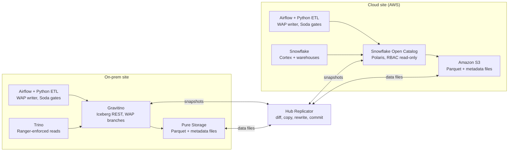
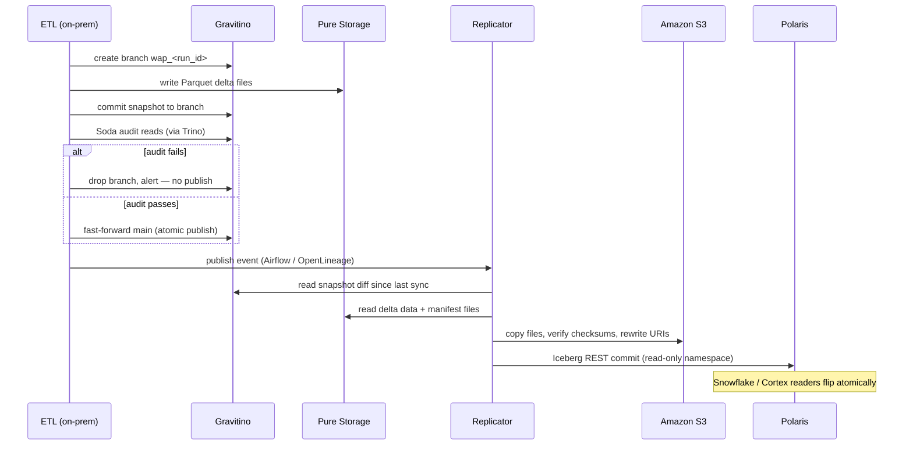
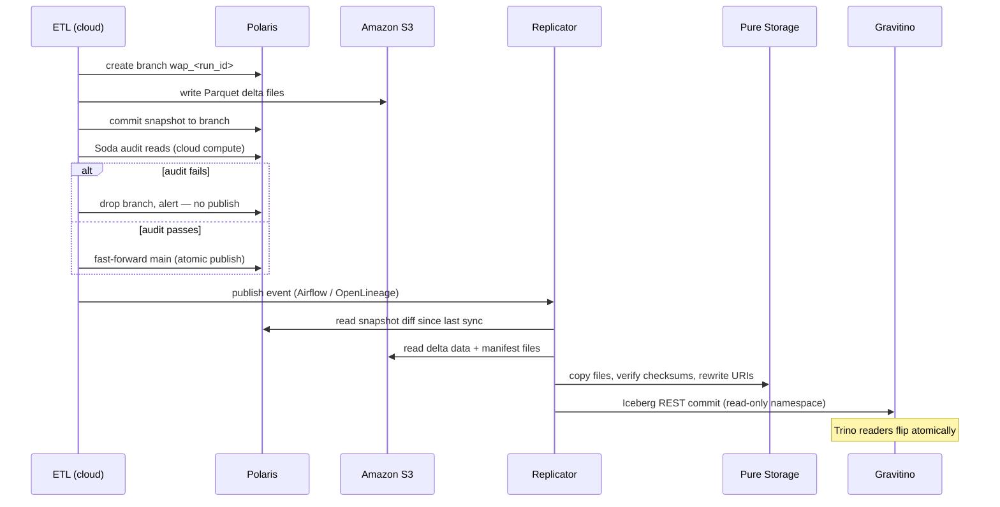
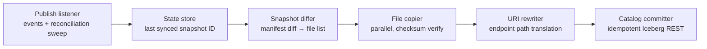

# Dual-Site WAP — Architecture and Sequence Reference

Companion to [ADR-019](../adr/019-dual-site-data-hub-hosting.md). Every data hub has one
designated writer site; the opposite site hosts a read-only Iceberg replica synchronized
per WAP publish. The WAP contract and the replicator codepath are identical in both
directions — only the cast changes.

## Architecture

## Sequence — on-prem writer hub

## Sequence — cloud writer hub

## Replicator internals

Design properties:

- **Commit-last ordering.** All side effects visible to readers happen in the final step.
  A crash anywhere earlier leaves only orphaned files on the replica object store (swept
  by a cleanup job) and zero visible change.
- **Idempotent.** Re-running a partially completed replication resumes from state and
  lands the same snapshot; committing an already-present snapshot is a no-op.
- **State is a cache, not a correctness dependency.** The replica catalog's current
  snapshot lineage is the ground truth; the state store can be rebuilt from it.
- **Multi-snapshot catch-up.** The differ spans the full lineage range between last-synced
  and the current main head, so a lagging replica catches up in one run.
- **Three URI locations.** Absolute paths live in `metadata.json`, the manifest list, and
  each manifest file — the rewriter must translate all three for the target endpoint.
- **Dual-mode triggering.** Event-driven per publish, plus a periodic reconciliation sweep
  comparing writer main heads against replica state, so a dropped event degrades to
  bounded lag rather than silent divergence.
- **Symmetric.** One codepath serves both directions; direction is a property of the hub
  registry, not the platform.
