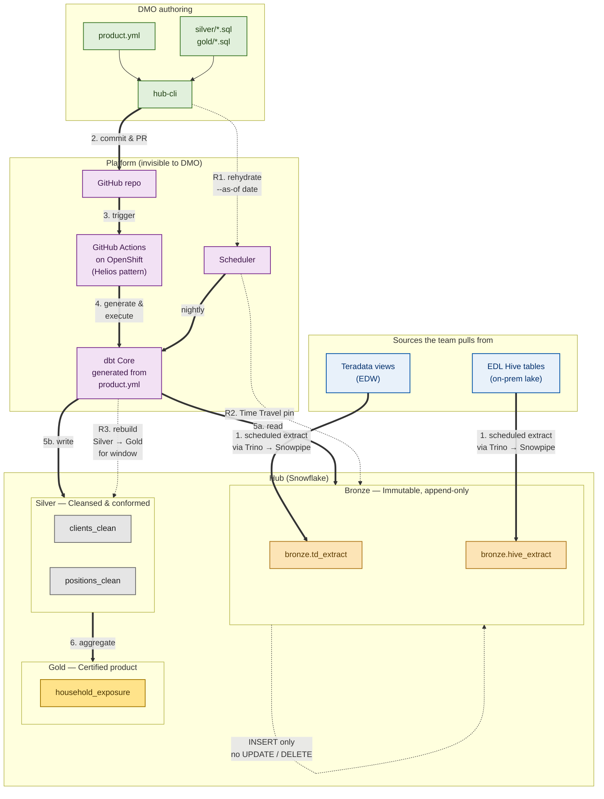

# 00 — Overview

## The design problem

Once data lands in Bronze, what does a DMO actually touch to take it from
Bronze through Silver into Gold, in a way that is reproducible, governed,
and reruns end-to-end without a platform engineer in the loop?

This is not a question about Helios. Helios solves landing — DataStage
jobs migrated to Python, deployed via GitHub Actions, run on Kubernetes,
land into Teradata and into Bronze. That pattern is in production and
working.

The hub self-service question is the next layer up: how the LOB-owned
authoring experience should look on top of that, given Snowflake as the
hub compute and the existing enterprise control plane.

## The commitment

Bronze is immutable and append-only. Silver and Gold are pure functions
of Bronze plus the methodology in Git. Together these two properties make
"rerun" a real feature instead of a nice idea — and they make
point-in-time rehydration a single command.

If anyone has `UPDATE` or `DELETE` on Bronze, ever, the whole architecture
collapses. This is enforced by Snowflake RBAC, not by policy. The
framework's load service principal is the only identity with INSERT;
DMOs get SELECT only.

## The wrap

DMOs do not author dbt projects. They author one structured artifact per
data product — `product.yml` — and write the SQL for the Silver and Gold
transforms. The framework compiles the artifact into a runnable dbt
project, executes it on the platform's existing GitHub Actions / OpenShift
infrastructure (the Helios pattern), emits lineage, runs the tests, and
registers the output as a certified data product.

dbt is the engine. The wrapper is what makes it self-service.

## Operating model at a glance

## Personas

| Persona | Approx % of users | Authoring tool | What they own |
| --- | --- | --- | --- |
| Analytics engineer | 5–15% | dbt Core, Git, full PR flow | The certified backbone of the hub: complex Silver and Gold models, framework extensions |
| DMO analyst / BI dev | 40–50% | Hub portal + `product.yml` + SQL files | The bulk of data products: Silver cleansing, Gold aggregates, tests, ownership metadata |
| Business user | 30–40% | Power BI, Fabric Data Agent, certified Gold tables | Consumes published products. Authors analyses, not data products. |

The wrapper is designed for the middle tier. The other two tiers fall
out naturally — analytics engineers can drop down into raw dbt for
escape cases (in `framework/` only), and business users only see Gold.

## What this design is not

It is not a replacement for the EDW pipelines. Helios continues to land
data into Teradata and into Bronze unchanged.

It is not a new orchestrator. Scheduled hub runs use the same GitHub
Actions self-hosted runners on OpenShift that Helios uses.

It is not a vendor lock-in. dbt Core runs on the platform's own
infrastructure, against Snowflake. The same pattern would run against
Iceberg-on-Trino or Fabric with only the dbt adapter changing.

It is not a free pass on governance. Every product passes through the
same enterprise control plane — classification, lineage, audit,
catalog certification — wired into CI, not bolted on after.

## Design philosophy in one sentence

**dbt under the hood, product definition on top, immutable Bronze as
the foundation, and the same CI/CD pattern as Helios so the platform
team supports one model instead of two.**

## Read next

- [01 — Experience flow](01-experience-flow) — day-by-day from scaffold to rehydrate
- [04 — Source selection](04-source-selection) — how a DMO picks a Teradata view or Hive table
- [05 — Rehydration](05-rehydration) — how point-in-time rebuild works
- [11 — Open questions](11-open-questions) — what still needs to close before Phase 1
