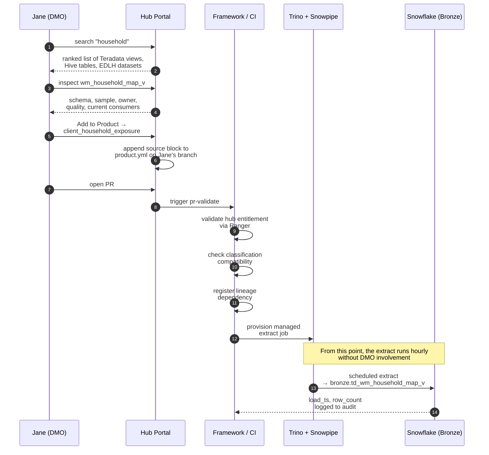

# 04 — Source selection: how a DMO picks a Teradata view or Hive table

This is one of the two moments where the experience either feels
seamless or feels like a bureaucratic mess. Walked through end-to-end
with Jane (WM DMO analyst building `client_household_exposure`) as the
running example.

## Step 1 — Open the source browser

Jane opens the hub portal and clicks **Sources**. The portal shows a
unified search across three source types:

- Teradata views (EDW) she has access to or could request
- Hive tables in the EDL
- EDLH conformed datasets

She types `household` and gets back a ranked list:

| Source | Type | Rows | Last refresh | Owner | Quality |
| --- | --- | --- | --- | --- | --- |
| `teradata.wm_household_map_v` | view | 4.2M | 2h ago | WM Data Engineering | A |
| `teradata.wm_household_history_v` | view | 38M | 6h ago | WM Data Engineering | A |
| `hive.wm_household_archive` | Hive table | 142M | yesterday | EDL Operations | B |
| `edlh.dim_household` | EDLH conformed | 4.1M | 1h ago | Enterprise Data | A+ |

Each result shows: classification (confidential/restricted), PII flag,
owner, last refresh, row count, and a quality score.

## Step 2 — Inspect the source

Jane clicks `wm_household_map_v` to see the detail page:

- Schema (column names, types, descriptions)
- Sample data (with PII masked unless she has the entitlement)
- Refresh cadence
- Current downstream consumers
- Known issues
- **Who else is using this source for hub products today** — if three
  other hubs already pull from this view, she knows it's battle-tested

If she has access already, she sees a green **Available** badge. If she
doesn't, she sees **Request Access** — which routes through the existing
access request flow with the right approver auto-populated.

## Step 3 — Declare the source in `product.yml`

Once she has access, she adds it to her product. There are two ways:

**Portal way** — She clicks **Add to Product**, picks
`client_household_exposure` from her in-flight products, and the portal
appends the source declaration to her `product.yml` automatically. She
doesn't hand-edit.

**Code way** (for analytics-engineer-tier users) — They hand-edit. Same
outcome:

```yaml
sources:
  - name: td_household_map
    ref: teradata.wm_household_map_v
    version: latest
    access: federated
```

The `access: federated` line is the one that matters. It tells the
framework: do not require the DMO to copy this manually. The framework
will manage the extract.

## Step 4 — The framework wires it up

When CI runs on Jane's PR, the framework does several things she never
sees:

1. **Validates entitlement.** The hub's `hub.yml` declares which Trino
   catalogs the hub is bound to, and Ranger policies are checked
   against the hub's service principal. If the hub doesn't have access,
   CI fails with a clear message: *"WM hub is not entitled to read
   `teradata.wm_household_map_v`. Open access request via portal."*

2. **Checks classification compatibility.** If the source is classified
   `restricted` and her product is classified `confidential`, CI
   refuses — you cannot downgrade classification implicitly.

3. **Registers the source dependency in the lineage graph.** The
   catalog now knows that any change to `wm_household_map_v` should
   notify the WM hub.

4. **Generates the actual extract job.** This is what turns "I declared
   a federated source" into "data shows up in Bronze." See Step 5.

## Step 5 — Where the data actually comes from at run time

This is the design decision worth being explicit about, because it is
where most hub designs go sideways.

There are two options for Teradata and Hive sources:

### Option A — Federated at query time (rejected as default)

Every time the hub product runs, dbt issues a query that joins
Snowflake Bronze tables with a federated read against Teradata or Hive
through Trino. The data never lands in Snowflake.

- **Pro:** No copy.
- **Con:** The source can change between runs, so the same dbt run on
  Monday and Tuesday can produce different results — reproducibility
  is broken.
- **Con:** A regulatory query against Teradata at hub run time is a
  much harder OSFI conversation than a controlled extract.

### Option B — Extract on a schedule into Bronze (default)

A platform-managed extract job runs (hourly or nightly), pulls from
Teradata via Trino, lands the result in Bronze with a load timestamp,
and Bronze becomes the only thing the hub product reads.

- **Pro:** Reproducible, governed, auditable.
- **Pro:** Same access pattern for the DMO regardless of source — they
  always read Bronze.
- **Con:** Brief lag between source change and Bronze update.

**Default is Option B.** Option A is available only for sources flagged
as `reference data` (small, slow-changing, joined for context) where
the latency cost outweighs the reproducibility benefit.

## Step 6 — What the framework actually does for `access: federated`

When Jane declares `access: federated` on her Teradata view, the
framework provisions a managed extract job:

```
Source:    teradata.wm_household_map_v   (via Trino catalog)
Target:    bronze.td_wm_household_map_v
Schedule:  hourly  (or per the freshness contract)
Load mode: full snapshot, partitioned by load_ts
Audit:     every extract logged with row count, source query timestamp
```

Jane declared a federated source. The framework gave her a managed
Bronze table that's always fresh. Her dbt models reference Bronze, not
Teradata directly. Reproducibility is preserved.

## The DMO's view of all this

She searched, she clicked, she added a source to her product. That's
it. She doesn't know the extract runs hourly. She doesn't know it goes
through Trino. She doesn't know about the Ranger check or the catalog
registration. The framework absorbed all of that.

## Sequence at a glance


