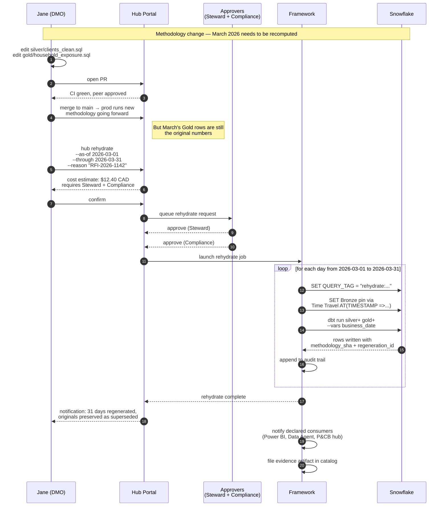

# 05 — Rehydration: how point-in-time rebuild works

This is the second of the two moments that make or break the hub
architecture. Done right, it is a one-command operation. Done wrong,
recomputing historical data is a multi-week archaeological project.

The whole feature rests on Bronze immutability and Silver/Gold being
pure functions of Bronze. If those two properties hold, rehydration is
mechanical.

## The scenario

Six months after Jane shipped `client_household_exposure`, she gets a
request:

> "Compliance is asking us to recompute household exposure for March
> 2026 under the updated methodology, because the original numbers are
> now contested in an audit."

Most BI environments fail this test — they have overwritten history,
the source data has moved on, and reconstructing March is painful.
With the immutability discipline in Bronze, it becomes a one-command
operation.

## Step 1 — Update the methodology

Jane edits `silver/clients_clean.sql` and `gold/household_exposure.sql`
to reflect the corrected methodology. Opens a PR. CI runs. Tests pass.
Peer reviews. Merge to `main`.

The new methodology is now in `main`. Production picks it up and uses
it for all new daily runs.

**Critical:** merging does not automatically rewrite history. March's
Gold rows still hold the original numbers. We have to ask for the
rebuild explicitly.

## Step 2 — Trigger rehydration

From the portal (or the CLI):

```
hub rehydrate client_household_exposure \
  --as-of 2026-03-01 \
  --through 2026-03-31 \
  --reason "Compliance request RFI-2026-1142, methodology update"
```

The portal asks for a reason because rehydration is a privileged
operation. It also shows a cost estimate before submission:

> Estimated runtime: 18 minutes
> Estimated cost: 12.40 CAD
> Approver required: Hub Steward + Compliance

She submits. It enters the approval queue.

## Step 3 — Approval

The Hub Steward sees the rehydrate request in their portal queue. They
see:

- Who requested it
- What window
- What methodology change (the diff between the previous prod commit
  and the current prod commit)
- The cost
- The reason

They click approve. For products tagged with `regulatory_tags`, a
second approver is required — in this case, Compliance. Both approvals
are recorded with timestamps and identities. This becomes part of the
audit record.

## Step 4 — The framework executes

The rehydrate job runs as a one-shot Kubernetes job on OpenShift,
separate from the scheduled production runs (so it does not interfere
with daily operations).

For each business date in the window:

```
For 2026-03-01:

1. Set Snowflake session query tag:
   "lumina|hub=wm|product=client_household_exposure|
    rehydrate|target_date=2026-03-01|approver=maria.garcia|
    rfi=RFI-2026-1142"

2. Calculate the Bronze pin:
   Bronze for 2026-03-01 was loaded by 2026-03-02 morning.
   Pin timestamp: 2026-03-02 06:00:00 ET

3. Rewrite source references in the dbt models:
   FROM bronze.helios_positions
   →
   FROM bronze.helios_positions
        AT (TIMESTAMP => '2026-03-02 06:00:00')

   This is Snowflake Time Travel. Same table, but read as of that
   point in time. Rows added after that timestamp are invisible to
   this query.

4. Set the business_date variable:
   --vars '{business_date: 2026-03-01}'

5. Run dbt build for Silver and Gold models only:
   dbt build --select silver+ gold+

6. Write results to Gold with audit columns:
   - load_ts:          2026-05-05 14:32:00  (when this rehydrate ran)
   - business_date:    2026-03-01           (the day being recomputed)
   - regeneration_id:  rehydrate-RFI-2026-1142
   - methodology_sha:  a3f9c2d              (Git commit of the SQL used)

7. Log the run to the audit trail:
   product, target_date, source_pin, methodology_sha,
   row_count_before, row_count_after, requester, approvers,
   reason, runtime, cost
```

The job loops through `2026-03-02`, `2026-03-03`, ..., `2026-03-31`.
Thirty-one one-day rebuilds, each pinned to the right historical
Bronze state, each using the new methodology.

## Step 5 — How results land in Gold

This is a real design choice with a regulatory implication.

### Option A — Overwrite (`merge`)

The new rows replace the old March rows in `household_exposure`.
Simple, clean, but the original numbers are gone. The audit trail
records they existed but they are no longer queryable.

### Option B — Versioned coexistence (recommended for regulatory products)

The new rows land alongside the old, distinguished by `methodology_sha`
and `regeneration_id`. Queries can filter to "current methodology
only" by default, but the original numbers are still there for
reproducibility and for the auditor who asks "show me what we reported
in March 2026 originally, vs. what we reported after the rehydrate."

For BCBS-239 products, Option B is the right answer. We never delete
history; we supersede it.

The product schema gains:

```yaml
gold:
  schema:
    - name: methodology_sha
      type: string
      description: Git SHA of the methodology used to compute this row
    - name: regeneration_id
      type: string
      description: Null for original runs; populated for rehydrated rows
    - name: superseded_by
      type: string
      description: Pointer to the regeneration that supersedes this row, if any
```

The default view that dashboards consume filters to `superseded_by IS
NULL` — i.e., "current truth." The auditor's view shows everything,
with full lineage.

## Step 6 — Notification and lineage

Once the rehydrate completes, the framework:

- Notifies declared consumers (Power BI dashboard owner, Fabric Data
  Agent owner, P&CB hub if subscribed) that March data has been
  regenerated, with a link to the diff
- Updates the lineage graph: every row now points to the methodology
  SHA that produced it
- Posts a completion record to the audit trail with final cost,
  runtime, row counts, and links to the approving identities
- Files an evidence artifact in the catalog: *"Product X was
  rehydrated for window Y on date Z, by requester R, approved by A
  and B, reason RFI-2026-1142"*

## Why this works — the three commitments

The whole design rests on three commitments. Break any of them and
rehydrate becomes fiction.

1. **Bronze is immutable.** If anyone has UPDATE on Bronze, ever, this
   collapses. Snowflake RBAC must enforce: DMOs get SELECT on Bronze;
   only the framework's load service principal gets INSERT. Period.

2. **Silver and Gold are pure functions of Bronze.** No manual data
   fixes, no one-off SQL, no `INSERT INTO household_exposure VALUES
   (...)`. Every Gold row is reproducible from Bronze + the methodology
   Git SHA. If you find a wrong number, you fix the SQL, not the data.

3. **Time Travel retention covers the rehydrate window.** Snowflake's
   default Time Travel is 1 day. For a hub like this, set it to 90 days
   on Bronze (Enterprise edition required). For windows beyond 90
   days, use Fail-safe + an external snapshot strategy: zero-copy
   clones tagged by month, or a periodic Iceberg snapshot of Bronze.
   Worth knowing the boundary; it bites the first time someone asks
   for "rebuild as of 14 months ago."

## The DMO's view

Jane edited two SQL files, opened a PR, and after it merged she clicked
one button in the portal with a reason. Two days later she got a
notification: *"Rehydrate complete. 31 days regenerated. Original rows
preserved as superseded. Auditor evidence filed."* That's it. The rest
happened in the framework.

## Sequence at a glance


