# Hub UX Flow — From "I Need Data" to "My Product Is Live"

**Author:** Enterprise Data leadership
**Purpose:** Visualize the end-to-end DMO journey through the hub. Use to validate that every step is necessary and every handoff is clean.
**Read this with:** `01-hub-design-session-bullets.md`, `03-product-yml-schema.md`

---

## The journey at a glance

```mermaid
flowchart TB

%% ===== STYLES =====
classDef dmo      fill:#E1F0DC,stroke:#3F7A2A,stroke-width:2px,color:#1F4012
classDef platform fill:#F2E1F4,stroke:#7A2C8E,stroke-width:2px,color:#3D154A
classDef data     fill:#FCE4B6,stroke:#B07A1F,stroke-width:2px,color:#5C3B00
classDef gate     fill:#FFE38A,stroke:#A37800,stroke-width:2px,color:#4A3500
classDef consume  fill:#E8F1FA,stroke:#0051A5,stroke-width:2px,color:#002F6C

%% ===== STAGE 1: ONBOARDING =====
subgraph S1["① Onboarding (one-time, ~2 hours)"]
  direction LR
  A1["DMO requests hub access<br/>via Lumina portal"]:::dmo
  A2["Platform provisions:<br/>• GitHub team membership<br/>• Snowflake dev role<br/>• Slack channel access"]:::platform
  A3["DMO runs<br/>hub-cli login"]:::dmo
  A1 --> A2 --> A3
end

%% ===== STAGE 2: DISCOVERY =====
subgraph S2["② Source discovery (~30 min)"]
  direction LR
  B1["Browse source catalog<br/>in hub portal"]:::dmo
  B2["Find EDL/EDW objects<br/>+ other hubs' Gold<br/>they're entitled to"]:::dmo
  B3["Request entitlement<br/>if needed → auto-routed<br/>to source owner"]:::platform
  B1 --> B2 --> B3
end

%% ===== STAGE 3: AUTHORING =====
subgraph S3["③ Authoring (the real work)"]
  direction TB
  C1["hub-cli init<br/>client_household_exposure"]:::dmo
  C2["Edit product.yml<br/>declare sources, schedule,<br/>tests, owner, SLA"]:::dmo
  C3["Write silver/*.sql<br/>cleanse and conform"]:::dmo
  C4["Write gold/*.sql<br/>business product"]:::dmo
  C5["hub-cli validate<br/>runs tests on dev Snowflake"]:::dmo
  C1 --> C2 --> C3 --> C4 --> C5
end

%% ===== STAGE 4: PIPELINE (invisible to DMO) =====
subgraph S4["④ Platform generates everything (invisible)"]
  direction LR
  D1["Helios extract jobs<br/>(one per source)"]:::platform
  D2["dbt project + profiles<br/>(silver/gold runs)"]:::platform
  D3["CI workflow<br/>(test + promote)"]:::platform
  D4["Snowflake DDL<br/>(Bronze immutable,<br/>Silver/Gold schemas)"]:::platform
  D5["OPA policies + catalog<br/>+ PagerDuty rotation"]:::platform
end

%% ===== STAGE 5: DATA FLOW =====
subgraph S5["⑤ Data flows daily"]
  direction TB
  E1["EDL / EDW sources"]:::data
  E2["BRONZE Iceberg<br/>immutable, append-only<br/>snapshots = history"]:::data
  E3["SILVER<br/>cleansed + conformed"]:::data
  E4["GOLD<br/>certified product"]:::data
  E1 -->|Helios scheduled extract| E2
  E2 -->|silver/*.sql via dbt| E3
  E3 -->|gold/*.sql via dbt| E4
end

%% ===== STAGE 6: PROMOTION =====
subgraph S6["⑥ Promotion (gated)"]
  direction LR
  F1["Open PR<br/>dev → main"]:::dmo
  F2["CI runs tests<br/>+ peer review<br/>= UAT deploy"]:::gate
  F3["Hub Steward review<br/>+ certification check<br/>= Prod deploy"]:::gate
  F1 --> F2 --> F3
end

%% ===== STAGE 7: PUBLISH =====
subgraph S7["⑦ Publish to hosting layer"]
  direction TB
  G1["hub-cli publish"]:::dmo
  G2["Hosting layer<br/>(Snowflake secure view +<br/>Fabric mirror +<br/>Iceberg external volume)"]:::consume
  G1 --> G2
end

%% ===== STAGE 8: CONSUME =====
subgraph S8["⑧ One Gold, many consumers"]
  direction LR
  H1["Power BI / Tableau<br/>(via Fabric mirror)"]:::consume
  H2["Lumina Gateway<br/>(AI agents)"]:::consume
  H3["Cortex Analyst<br/>(NL-to-SQL)"]:::consume
  H4["On-prem Trino<br/>(analyst queries)"]:::consume
end

%% ===== STAGE 9: OPERATE =====
subgraph S9["⑨ Operate & rehydrate"]
  direction LR
  I1["Monitor SLA dashboard<br/>(Soda + OpenLineage)"]:::dmo
  I2["hub-cli rehydrate<br/>--as-of 2026-03-15<br/>(one command)"]:::dmo
  I3["Incident response<br/>via PagerDuty"]:::dmo
end

%% ===== FLOWS BETWEEN STAGES =====
S1 --> S2 --> S3
S3 --> S4
S4 -.generates.-> S5
S3 --> S6
S6 --> S7
S7 --> S8
S7 --> S9
```

---

## Stage-by-stage narrative

### ① Onboarding — one time, ~2 hours

A new DMO joins their hub. Platform automation provisions:

- GitHub team membership (gates the hub repo)
- Snowflake dev role (gates the dev warehouse)
- Slack channel access (`<hub-dmo-channel>`)
- `hub-cli` installed and authenticated

**Friction budget:** under 2 hours. If onboarding takes longer than that, the design has failed and the platform team owes the DMO an apology.

---

### ② Source discovery — ~30 min

DMO opens the hub portal and browses the source catalog. They see:

- Every EDL Hive table they're entitled to
- Every EDW Teradata view they're entitled to
- Every certified Gold product from other hubs they're entitled to

For anything they're not yet entitled to, they request access in-portal. The request auto-routes to the source's owning team. No tickets, no email chains.

**Key UX move:** the catalog is the *only* way to find sources. If a DMO is asking a colleague over Slack "what's the table name for client master?" — the catalog has failed and we need to fix it.

---

### ③ Authoring — the real work

This is the only stage where the DMO writes anything. The loop:

1. `hub-cli init client_household_exposure` — scaffolds the folder, drops a starter `product.yml`, creates a feature branch.
2. Edit `product.yml` — declare sources, schedule, tests, owner, SLA.
3. Write `silver/*.sql` — cleansing, type normalization, deduplication.
4. Write `gold/*.sql` — business logic, aggregations, the actual product.
5. `hub-cli validate` — runs against dev Snowflake, executes all declared tests, returns pass/fail with line numbers.

**No dbt config. No Helios YAML. No CI workflows. No grants. No DDL.** If the DMO has to touch any of those, we've failed.

---

### ④ Platform generates everything (invisible)

The moment the DMO opens a PR, the platform generates:

- **Helios extract jobs** — one per source declared, scheduled per `sources[].schedule`.
- **dbt project structure** — `dbt_project.yml`, `profiles.yml`, sources file, schema tests.
- **CI workflow** — runs validate + tests on every PR.
- **Snowflake DDL** — Bronze tables with Iceberg immutability properties, Silver/Gold schemas, hosting views.
- **OPA policies** — entitlement rules from `publish.consumers`.
- **Catalog registration** — Purview entry, glossary linkage, lineage stubs.
- **PagerDuty rotation** — from `owner.team` and `sla.incident_response`.

The DMO sees none of this. They see green checks.

---

### ⑤ Data flows daily

Once promoted, daily data flow runs automatically:

- **Sources → Bronze:** Helios pulls per the declared schedule. Bronze is Iceberg, immutable, append-only. Each commit creates a snapshot. Snapshots ARE the change history.
- **Bronze → Silver:** dbt run scheduled per `build.silver.schedule`. Tests run. Failures alert the DMO via PagerDuty.
- **Silver → Gold:** dbt run scheduled per `build.gold.schedule`. Quality gates run at this boundary — uniqueness, not-null, freshness, accepted ranges. Failures block promotion next time and alert the owner.

**The architectural keystone:** Bronze is never rebuilt. Silver and Gold are always rebuildable from Bronze. This is what makes rehydration a real feature.

---

### ⑥ Promotion — gated, automated, no tickets

Two gates, no human tickets:

- **Dev → UAT:** Merged PR triggers automatic UAT deploy. DMO peer review on the PR is the only human in the loop.
- **UAT → Prod:** Hub Steward reviews + automated certification check runs (contract conformance, lineage captured, governance tags present, quality gates green, glossary terms valid). If all green, Prod deploy is one click. Cert check failures are explicit and actionable, not "talk to platform."

---

### ⑦ Publish to hosting layer

The DMO runs `hub-cli publish` and the product appears in three consumption surfaces simultaneously:

1. **Snowflake secure view** in `hosting.<hub>.<product>` — for SQL clients.
2. **Fabric mirror** — for Power BI and Tableau without ETL.
3. **Iceberg external volume** — for on-prem Trino, Lumina Gateway, and Cortex Analyst.

**One physical Gold table underneath all three.** No copies. No drift. No reconciliation.

The DMO does **not** grant access. They declared `publish.consumers` in `product.yml`; OPA/Ranger enforces it.

---

### ⑧ One Gold, many consumers

The same Gold table powers:

- **Power BI / Tableau** dashboards via Fabric mirror
- **Lumina Gateway** for AI agent consumption
- **Cortex Analyst** for natural-language-to-SQL
- **On-prem Trino** for analyst ad-hoc queries

This is the payoff of the design. The DMO ships once. Every consumption surface lights up.

---

### ⑨ Operate & rehydrate

Day-2 operations the DMO handles directly:

- **Monitor the SLA dashboard** — Soda quality scores, freshness, availability, error budget burn.
- **Rehydrate on demand** — `hub-cli rehydrate gold.household_exposure --as-of 2026-03-15` rebuilds Gold from Bronze at that point in time. Useful for audit, dispute resolution, model retraining.
- **Incident response** — PagerDuty rotates on the `owner.team` defined in `product.yml`.

If a DMO needs to call the platform team for day-2 operations on a healthy product, the design has failed.

---

## Where the design can break — failure modes to watch for

| Failure mode | Symptom | Mitigation |
|---|---|---|
| DMO has to edit framework files | Stack Overflow questions about `dbt_project.yml` | CODEOWNERS enforcement + better starter templates |
| Source catalog is incomplete | DMOs asking each other for table names in Slack | Auto-ingest catalog from EDL/EDW/hub registries; flag missing items |
| Certification check is opaque | "Why did my PR fail?" → "Ask platform" | Every cert failure must include the failing rule, the failing object, and the fix |
| Rehydration is slow or expensive | DMOs avoid using it → drift in Gold | Platform-owned rehydration warehouse, tracked cost back to hub budget |
| Hosting layer drift | Power BI shows different numbers than Trino | One physical Gold, three views. No "for performance" copies allowed |
| Two orchestration planes | Helios for extract, Airflow for dbt | One orchestration plane (Helios for both) — decided in this session |

---

## The success test (repeated, because it matters)

**A net-new DMO with SQL skills and zero dbt experience ships a certified Gold product end-to-end in under two weeks with no platform engineer in the loop after onboarding.**

If we design for that, the hubs will scale. If we don't, they'll need a permanent platform engineer per hub, and we'll have built nothing new.
